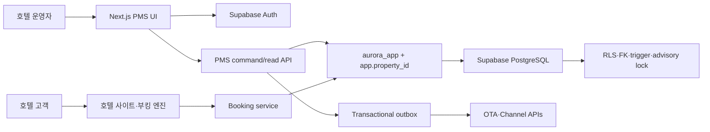

# Aurora PMS

Aurora PMS는 예약, 객실, 장기 재고·요금, Rate Plan, 프런트, 하우스키핑, 그룹, 폴리오, AR, 채널, 회계, 리포트, 야간 감사와 호텔 공식 홈페이지·직접 예약을 하나의 PostgreSQL 운영 원장으로 연결하는 호텔 관리 시스템입니다.

이 README는 빠른 시작과 운영 진입점입니다. 전체 화면 명세, 업무 규칙, 데이터 모델, API, 보안, QA 및 운영 절차는 [분리형 개발·운영 문서 지도](docs/README.md)를 참조하세요.

## 현재 릴리스 현황

| 항목 | 값 |
| --- | --- |
| 운영 PMS | [aurora-pms-gilt.vercel.app](https://aurora-pms-gilt.vercel.app) |
| 공개 호텔·예약 | [aurora-pms-gilt.vercel.app/hotel](https://aurora-pms-gilt.vercel.app/hotel) |
| 격리 스테이징 | [aurora-pms-staging.vercel.app](https://aurora-pms-staging.vercel.app) |
| 저장소 | [sksmsrkk-glitch/Aurora_PMS](https://github.com/sksmsrkk-glitch/Aurora_PMS) |
| 런타임 | Next.js 16, React 19, Vercel Functions `icn1` |
| 데이터 | Supabase PostgreSQL 17, Supavisor, native date/time·boolean·JSONB |
| 스키마 계약 | `202607170014_website_visual_editor` |
| 명령 계약 | action registry, capability 1:1, Zod 입력 검증, 멱등 mutation |
| 자동 지표 | [migration·table·RLS·action·test·CSS 자동 집계](docs/generated/project-metrics.md) |

현재 구현 범위:

- 예약 생성·편집·취소·노쇼·배정·체크인·룸 무브·체크아웃
- 최대 730일 재고 캘린더, 5,000셀 원자적 벌크 저장, MLOS·CTA·CTD·stop-sell
- 정규화된 Rate Plan, 객실 타입 매핑, 일자별 직판 요금과 홈페이지 실시간 가격·재고
- 폴리오 창·라우팅·분할·반대전표·수납·환불·AR 이관·후불 수납
- 그룹 블록·rooming list·pickup·cutoff, 채널 연결·계약·ARI·inbound·outbox
- 복식부기 journal, 채널 수수료/입금가 정산, P/L, 11종 리포트와 CSV/XLSX
- PMS 비주얼 에디터 기반 히어로·메뉴·호텔 소개·이미지·객실 소개·공개 여부와 직접 예약 엔진
- 호텔별 canonical/Open Graph, Hotel JSON-LD, sitemap, robots

`완료`는 저장소와 자동 QA 범위를 뜻합니다. 실제 영업 전에는 결제대행, 법정 회계, 개인정보 보유 정책, OTA 인증, 백업 복구 목표를 호텔별로 확정해야 합니다.

## 빠른 시작

요구 사항은 Node.js 24, npm, PostgreSQL 17입니다.

```bash
npm install
npm run db:supabase:migrate
npm run db:contract:verify
npm run dev
```

필수 서버 환경 변수:

```dotenv
DATABASE_URL=postgresql://...
DIRECT_URL=postgresql://...
SUPABASE_URL=https://PROJECT.supabase.co
SUPABASE_SECRET_KEY=...
PMS_SESSION_SECRET=32자_이상_무작위_값
PMS_RATE_LIMIT_SECRET=32자_이상_무작위_값
AURORA_PUBLIC_PROPERTY_ID=prop-seoul
AURORA_PUBLIC_SITE_URL=https://your-production-domain.example
```

실제 값은 커밋하지 않습니다. 운영과 스테이징은 Supabase 프로젝트, Vercel 프로젝트, 환경 변수를 물리적으로 분리합니다.

## 전체 아키텍처



핵심 경계:

1. `supabase/migrations/`만 스키마 원본입니다. 앱 부팅 시 DDL을 실행하지 않습니다.
2. 모든 테넌트 쿼리는 `scopePmsDatabase()`가 만든 트랜잭션 안에서 `SET LOCAL ROLE aurora_app`과 `app.property_id`를 설정합니다.
3. 루트 DB는 닫힌 `findActiveRoleAssignments(email)` capability 외 테넌트 테이블 SQL을 거부합니다.
4. 명령은 action registry가 capability, 도메인, Zod schema를 한 곳에서 연결합니다.
5. 폴리오·AR·회계 원장은 append-only이며 수정 대신 반대 기록을 추가합니다.
6. 객실 재고는 DB advisory lock과 capacity trigger가 마지막 1실의 병렬 초과 예약을 차단합니다.
7. 배포 빌드는 최신 migration, `aurora_app` 속성·membership, RLS 정책 수를 먼저 검증합니다.
8. 13개 URL workspace는 공통 레이아웃의 단일 PMS shell을 유지하며, 메뉴 intent 시 라우트·모듈·필요 projection을 선행 로드합니다.
9. 홈페이지 이미지는 DB 비노출 tombstone → Storage 삭제 → DB hard-delete 순서로 제거해 죽은 공개 URL을 방지합니다.

주요 코드 진입점:

| 책임 | 경로 |
| --- | --- |
| DB adapter·tenant scope | `db/pms-database.ts` |
| 배포 스키마 계약 | `db/schema-contract.ts` |
| action registry | `app/api/pms/action-registry.ts` |
| 명령 gateway | `app/api/pms/command-gateway.ts` |
| read models·dashboard | `app/api/pms/read-model.ts` |
| 재고·Rate Plan·회계 | `app/api/pms/extended.ts` |
| 직접 예약 | `app/api/booking/service.ts` |
| 홈페이지 CMS projection | `app/api/booking/website-service.ts` |
| PMS shell | `app/(pms)/_components/pms-shell.tsx` |
| 재고 캘린더 | `app/inventory-calendar.tsx` |
| 공개 호텔 SEO | `app/hotel/seo.ts` |

## 기능 및 데이터 계약

### 재고·요금

- `rate_plans`가 BAR, WEB-DIRECT, OTA, CORP 같은 상품 정책을 보관합니다.
- `rate_plan_room_types`가 판매 가능한 객실 타입을 연결합니다.
- `rate_plan_calendar`가 객실 타입·날짜별 판매가와 제한을 보관합니다.
- 공식 홈페이지는 WEB-DIRECT 일자 요금을 우선 사용하고, 같은 inventory capacity를 소비합니다.
- 벌크 변경은 단일 DB transaction으로 커밋되므로 중간 배치 실패가 일부 날짜만 남기지 않습니다.

### 대시보드

- 오늘/전일은 서버 시각이 아니라 property `business_date`를 기준으로 계산합니다.
- 도착, 재실, 점유율, 예상 객실 매출, ADR은 같은 SQL projection에서 계산합니다.
- 전일 분모가 0이면 허위 증감률 대신 비교 기준 없음을 반환합니다.

### 금전 처리

- 클라이언트는 모든 mutation에 `Idempotency-Key`를 보냅니다.
- 중복 키 등록과 금전 side effect는 같은 transaction에서 실행됩니다.
- 결제, 환불, 분할, 반대전표, AR 이관·수납은 원본 기록을 삭제하지 않습니다.

### 공개 호텔 사이트

- PMS의 호텔 소개, 연락처, 호텔·객실 이미지, 객실 공개 설정을 서버 projection으로 제공합니다.
- 비주얼 에디터에서 히어로 이미지·텍스트 배치·오버레이·높이·CTA·강조색과 메뉴 순서·라벨·노출을 실시간 미리보기 후 게시합니다.
- 공개 검색은 PMS 재고, 홈페이지 노출, Rate Plan 제한과 요금을 실시간으로 평가합니다.
- canonical URL은 요청 Host를 신뢰하지 않고 `AURORA_PUBLIC_SITE_URL`에서 만듭니다.
- 예약 검색 URL은 중복 색인을 막기 위해 `noindex,follow`입니다.

## 마이그레이션 카탈로그

`supabase/migrations/`가 유일한 적용 순서입니다. 적용된 파일을 수정하거나 생성 스크립트로 덮어쓰지 않습니다.

| 범위 | migration |
| --- | --- |
| 코어 PMS·데이터 API·history lock | `202607160001` ~ `202607160003` |
| 채널 수익·계약 snapshot | `202607160004` ~ `202607160005` |
| 관계 무결성·대형 atomic batch | `202607170001` ~ `202607170002` |
| 부킹 엔진·CMS·공개 시드 | `202607170003` ~ `202607170005` |
| 관리자 backdoor 제거 | `202607170006` ~ `202607170007` |
| 분산 rate limit·임의 SQL RPC 제거 | `202607170008` ~ `202607170009` |
| transaction tenant context/RLS | `202607170010_tenant_context_rls.sql` |
| native date/time/timestamptz | `202607170011_native_temporal_types.sql` |
| Rate Plan 도메인·FK | `202607170012_rate_plan_domain.sql` |
| native boolean·JSONB·예약 불변식 | `202607170013_native_flags_json_constraints.sql` |
| 홈페이지 비주얼 에디터 | `202607170014_website_visual_editor.sql` |

배포 순서:

```bash
npm run db:supabase:migrate
npm run db:contract:verify
npm run release:build
```

항상 스테이징에서 migration·role 전환·smoke·E2E를 통과한 다음 운영에 같은 순서를 적용합니다.

## API 상세 개발 명세

### `GET /api/pms`

- 인증·property assignment 필수
- `?view=core`: 첫 화면용 예약, 객실, 재고, 실제 대시보드 비교 지표
- 기본 view: 그룹, 재무, 채널을 포함한 전체 read model
- 응답은 `private, no-store`, gzip representation cache를 사용합니다.

### `POST /api/pms`

- Supabase session, 서버 capability, distributed rate limit, Zod action schema, idempotency를 순서대로 검증합니다.
- 성공 응답은 전체 snapshot이 아니라 변경 entity와 invalidation key를 담은 mutation receipt입니다.
- 오류는 안정적인 코드 매핑으로 변환하며 문자열 `includes()` 분기를 사용하지 않습니다.

### `GET /api/booking/availability`

- 입력: `arrival`, `departure`, `adults`, `children`
- 최대 숙박, 판매 중지, CTA/CTD, MLOS, 홈페이지 공개, 물리 재고, 확정 재고를 검증합니다.
- 응답: 객실별 nightly rate, 남은 수량, 평균가, 총액

### `POST /api/booking/reservations`

- 공개 분산 rate limit과 idempotency를 적용합니다.
- 예약과 night inventory, immutable rate snapshot을 한 transaction에서 기록합니다.
- 마지막 1실 병렬 요청은 DB에서 정확히 한 건만 성공합니다.

### `GET /api/health`

- 환경, DB 연결, schema version을 반환합니다.
- 최신 런타임 계약 미충족 시 503으로 fail closed 합니다.

## 개발자 가이드

```bash
npm run lint
npm run build
npm run test:unit

# 격리 PostgreSQL에서 실행
TEST_DATABASE_URL=postgresql://... AURORA_REQUIRE_POSTGRES_TESTS=true npm run test:integration

# 배포 대상 읽기 전용 계약 검증
npm run db:contract:verify
```

CSS는 cascade 순서를 보존한 다음 모듈로 나뉩니다.

| 파일 | 책임 |
| --- | --- |
| `app/globals.css` | Tailwind 및 모듈 import만 유지 |
| `app/styles/legacy-core.css` | 초기 PMS·리포트·마스터 호환 규칙 |
| `app/styles/flow-system.css` | Aurora Flow/Toss 계열 토큰과 shell |
| `app/styles/revenue-accounting.css` | 재고, Rate Plan, 채널 계약, 회계 |
| `app/styles/interaction-mobile.css` | 폰트, focus, dialog, 모바일 운용 |
| `app/styles/website-overlays.css` | 홈페이지 CMS, 검색, overlay 보정 |

변경 원칙:

- migration은 새 파일만 추가합니다.
- tenant table은 반드시 property-scoped adapter로 접근합니다.
- 새 action은 registry capability·domain·Zod contract와 행동 테스트를 함께 추가합니다.
- 금전·재고 변경은 하나의 transaction과 idempotency receipt 안에 둡니다.
- 날짜는 `YYYY-MM-DD` business date, 시각은 timezone 의미에 맞는 native PostgreSQL type을 사용합니다.
- 사용자 코드와 무관한 포맷 변경을 한 커밋에 섞지 않습니다.

CI는 PR과 main push에서 lint → build → unit → migration bootstrap → PostgreSQL integration → runtime contract 순으로 실패를 차단합니다.

## 장애 대응 Runbook

### 배포가 schema contract에서 중단됨

1. 앱을 우회 배포하지 않습니다.
2. 대상 DB의 `pms_schema_migrations`에서 `202607170014_website_visual_editor`를 확인합니다.
3. `aurora_app`가 `NOLOGIN`, `NOBYPASSRLS`인지와 연결 사용자의 membership을 확인합니다.
4. migration을 적용하고 `npm run db:contract:verify`를 재실행합니다.

### PMS API 503

1. `/api/health`의 `requiredSchemaVersion`과 실패 항목을 확인합니다.
2. DB URL이 운영/스테이징 환경과 일치하는지 확인합니다.
3. Supavisor transaction pooler에서 `SET LOCAL ROLE aurora_app` probe를 수행합니다.

### 예약 초과 판매 의심

1. `reservation_type_nights`와 inventory control을 property·room type·stay date로 조회합니다.
2. capacity trigger와 advisory-lock 함수가 최신 migration 정의인지 확인합니다.
3. 마지막 1실 20-way integration test를 재실행합니다.

### 중복 수납·환불 의심

1. 요청의 `Idempotency-Key`, `idempotency_keys`, audit log를 대조합니다.
2. 원장을 수정하지 말고 반대전표로 정정합니다.
3. 동일 키 replay가 기존 receipt를 반환하는지 스테이징에서 재현합니다.

### 채널 전송 실패

1. inbound revision, delivery attempts, outbox 상태를 확인합니다.
2. 원인 수정 뒤 DLQ/outbox 재처리 action을 사용합니다.
3. 예약 본 트랜잭션과 외부 전송 상태를 별도로 판단합니다.

### 롤백

코드 롤백과 데이터베이스 롤백은 분리합니다. 이미 기록된 재무·예약 데이터를 파괴적으로 되돌리지 않습니다. 호환 코드로 먼저 복구하고, 데이터 정정은 forward migration 또는 반대 기록으로 수행합니다.

## 상세 문서

- [상세 문서 지도](docs/README.md)
- [자동 생성 프로젝트 지표](docs/generated/project-metrics.md)
- [Supabase migration 원본](supabase/migrations)
- [GitHub Actions release gate](.github/workflows/ci.yml)

## 라이선스 및 브랜드

Aurora 브랜드 자산과 호텔 콘텐츠는 프로젝트 권리 정책을 따릅니다. Toss의 UX 원칙과 공식 배포 폰트 로딩 방식을 참고하지만 Toss 제품을 사칭하거나 해당 상표의 권리를 주장하지 않습니다.
