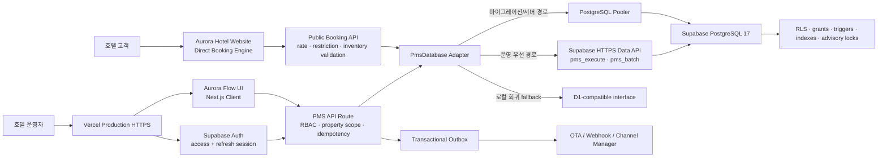
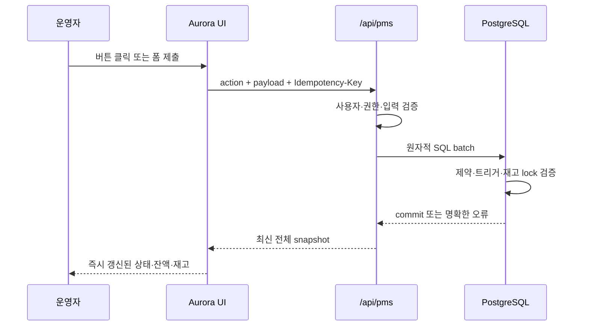
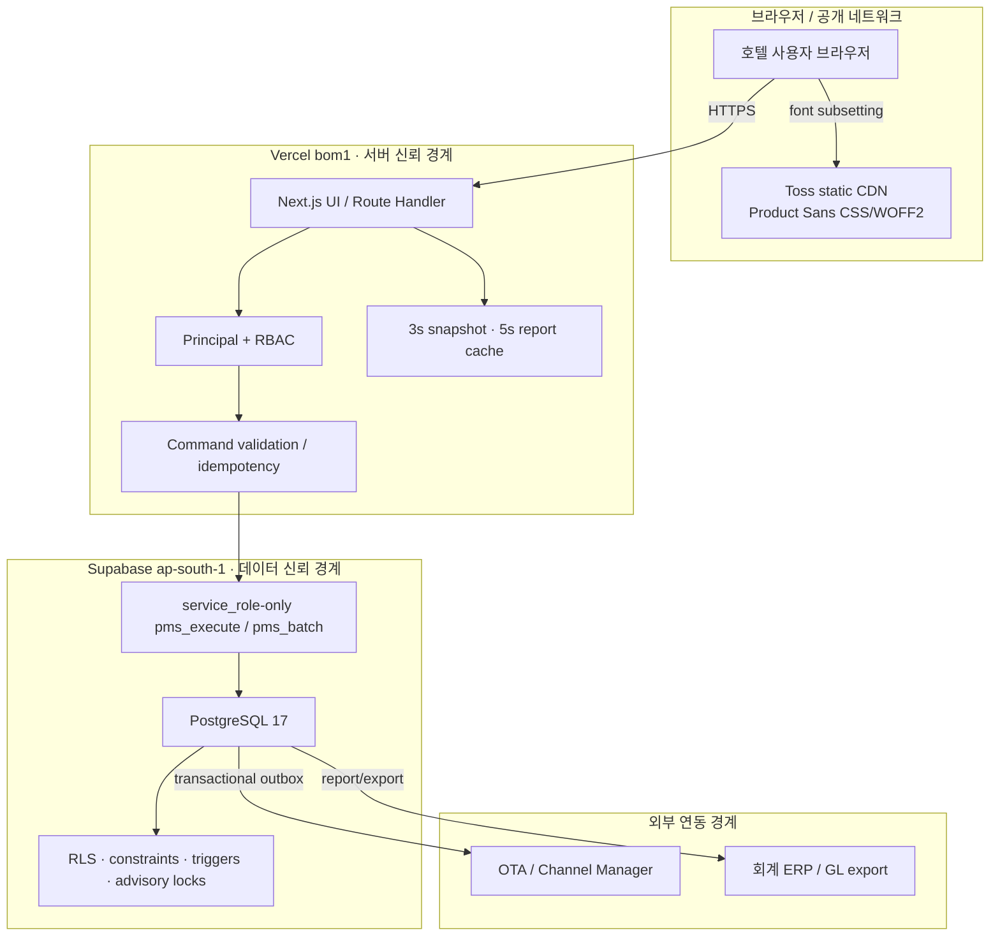
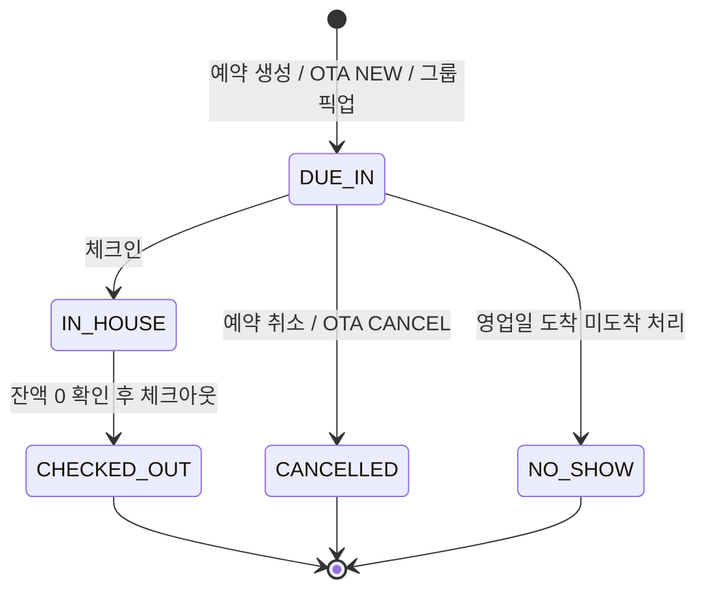
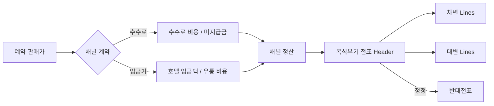
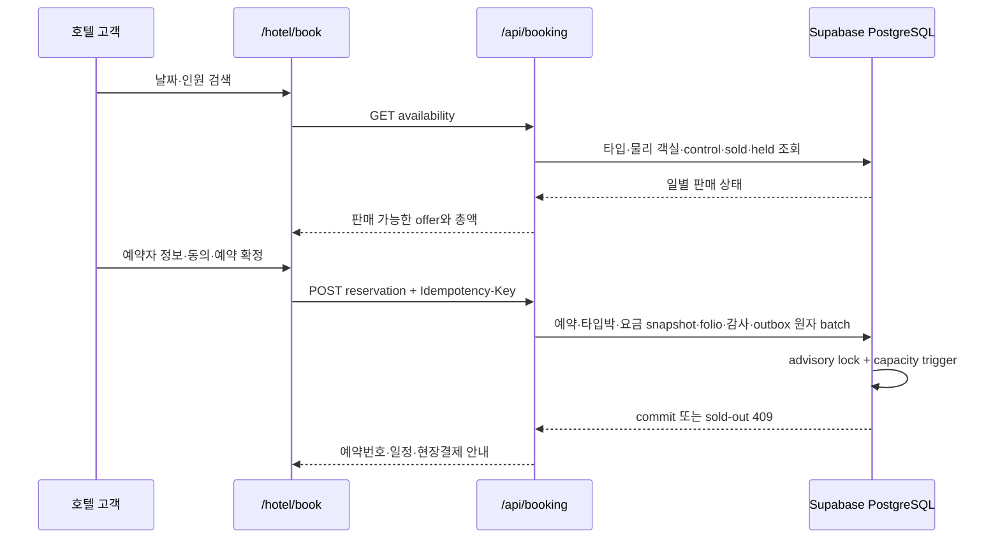

# Aurora Hotel PMS

Aurora는 예약, 장기 객실 재고·요금, 프런트 데스크, 하우스키핑, 그룹 블록, 폴리오, 매출채권, 채널 계약·정산, 호텔 회계·손익, 캐셔, 야간 감사와 운영 리포트를 하나의 운영 원장으로 연결하는 차세대 호텔 PMS(Property Management System)입니다.

단순한 대시보드 데모가 아니라 실제 상태 전이, 재고 차감, 정산 원장, 권한, 동시성, 감사 로그와 실패 복구를 데이터베이스 불변식으로 보호하는 것을 목표로 합니다.

> 현재 운영 구성: Next.js 16 + Vercel Functions + Supabase PostgreSQL 17 + HTTPS Data API

## 현재 릴리스 현황

| 항목 | 현재 값 |
| --- | --- |
| 운영 URL | [https://aurora-pms-gilt.vercel.app](https://aurora-pms-gilt.vercel.app) |
| GitHub 저장소 | [sksmsrkk-glitch/Aurora_PMS](https://github.com/sksmsrkk-glitch/Aurora_PMS) |
| 작업 브랜치 | `main` |
| 인증 | Supabase Auth password login, refreshable HttpOnly session, 서버 RBAC·property assignment |
| 데이터베이스 | Supabase 프로젝트 `tnbxreeidezidckemflb`, PostgreSQL 17 |
| Vercel 함수 리전 | Mumbai `bom1` — Supabase `ap-south-1` 데이터 플레인과 인접 배치 |
| 운영 스키마 | 47 tables, 34 triggers, 74 validated foreign keys, 47 RLS-enabled tables |
| 자동 테스트 | production build + 24 tests |
| 전체 업무 QA | local 24/24 workflow checkpoints, 26개 데이터 무결성 검사 0 violation |
| 핵심 API release gate | 100 requests, concurrency 10, 0 failures, 530.60 req/s, p50 18.48ms, p95 21.68ms |
| 공개 호텔·부킹 | `/hotel`, `/hotel/book`, PMS 실시간 재고·요금 기반 직접 예약·취소 |

### 구현 완료 범위

| 영역 | 상태 | 구현 수준 |
| --- | --- | --- |
| 예약·투숙 | 완료 | 생성, 수정, 배정, 체크인·아웃, 취소, 노쇼, 룸 무브, 낙관적 잠금 |
| 객실·하우스키핑 | 완료 | 타입/실물 객실, 최대 500실 대량 생성, 청소·점검·OOS |
| 재고·요금 | 완료 | 최대 730일 조회, 5,000셀 벌크 변경, MLOS/CTA/CTD/stop-sell |
| 그룹·세일즈 | 완료 | 프로필, 블록, 날짜별 할당, rooming list, pickup, cutoff |
| 폴리오·캐셔·AR | 완료 | 다중 창, 라우팅, 분할, 반대, 결제·환불, 회사 후불, 수납 |
| 채널 허브 | 완료 | 연결·매핑, ARI, inbound revision, DLQ, outbox, delivery attempt |
| 채널 계약·정산 | 완료 | 수수료/입금가 계약, 채널 판매가·호텔 입금가, 발생·지급 대사 |
| 호텔 회계·손익 | 완료 | 11개 기본 계정, 복식부기, 불변 journal, 반대전표, P/L KPI |
| 리포트·Excel | 완료 | 11종, 키워드·복합 필터, 마스킹, CSV/XLSX, export audit |
| 야간 감사 | 완료 | blocker, 객실료 전기, cutoff, 영업일 전환 |
| UI 시스템 | 완료 | Aurora Flow UI, Toss Product Sans 실제 CDN 로드, 반응형·접근성 상태 |
| 인증·테넌트 격리 | 완료 | Supabase Auth, access/refresh cookie, 역할·capability, assignment 기반 property scope |
| 호텔 홈페이지·부킹 엔진 | 완료 | 실시간 가용성, CTA/CTD/MLOS, 요금 snapshot, 멱등 예약, 온라인 취소·재고 복원 |
| 운영 배포 | 완료 | GitHub, Supabase migration, Vercel Production, `bom1` data locality |

`완료`는 현재 저장소의 구현과 자동 QA 범위를 의미합니다. 실제 호텔의 법정 회계, 결제대행, 개인정보 처리, OTA 인증, 장애복구 목표를 충족했다는 인증은 아니며, 운영 전 [프로덕션 전환 전 필수 작업](#프로덕션-전환-전-필수-작업)을 별도로 수행해야 합니다.

## 목차

- [제품 목표](#제품-목표)
- [현재 릴리스 현황](#현재-릴리스-현황)
- [핵심 설계 원칙](#핵심-설계-원칙)
- [전체 아키텍처](#전체-아키텍처)
- [아키텍처 결정 기록](#아키텍처-결정-기록)
- [화면 및 기능 명세](#화면-및-기능-명세)
- [업무 도메인 상세](#업무-도메인-상세)
- [호텔 홈페이지와 직접 예약 엔진](#호텔-홈페이지와-직접-예약-엔진)
- [리포트와 Excel 내보내기](#리포트와-excel-내보내기)
- [권한과 보안](#권한과-보안)
- [데이터 모델](#데이터-모델)
- [마이그레이션 카탈로그](#마이그레이션-카탈로그)
- [API 계약](#api-계약)
- [API 상세 개발 명세](#api-상세-개발-명세)
- [성능과 확장성](#성능과-확장성)
- [Aurora Flow UI](#aurora-flow-ui)
- [설치 및 Supabase 연결](#설치-및-supabase-연결)
- [개발자 가이드](#개발자-가이드)
- [테스트 및 Loop QA](#테스트-및-loop-qa)
- [프로젝트 구조](#프로젝트-구조)
- [운영 체크리스트](#운영-체크리스트)
- [장애 대응 Runbook](#장애-대응-runbook)
- [프로덕션 전환 전 필수 작업](#프로덕션-전환-전-필수-작업)
- [구현 변경 이력](#구현-변경-이력)

## 제품 목표

Aurora PMS는 호텔 운영자가 여러 시스템을 오가며 같은 정보를 반복 입력하는 문제를 줄이고, 다음 질문에 즉시 답할 수 있도록 설계했습니다.

- 오늘 도착·재실·출발 고객은 누구인가?
- 어떤 객실이 판매 가능하고 어떤 객실이 청소·점검·판매 중지 상태인가?
- 객실 타입별 날짜 재고와 판매 제한, 요금은 어떻게 설정되어 있는가?
- 개별 예약과 그룹 블록이 실제 하우스 재고에 어떤 영향을 주는가?
- 고객 폴리오와 회사 후불 매출채권의 잔액은 정확히 일치하는가?
- 누가 어떤 예약, 객실, 재고, 정산 데이터를 변경했는가?
- OTA 메시지나 Webhook 전송이 실패했을 때 안전하게 재처리할 수 있는가?
- 예약·점유율·ADR·RevPAR·정산·감사 데이터를 필터링하고 Excel로 받을 수 있는가?

## 핵심 설계 원칙

### 1. 데이터베이스가 마지막 방어선이다

UI 검증에만 의존하지 않습니다. 중복 객실, 초과 판매, 중복 픽업, 원장 수정, 중복 야간 전기처럼 재무·재고 무결성을 깨뜨릴 수 있는 동작은 PostgreSQL 제약조건, 트리거, 원자적 배치와 advisory lock으로 다시 검증합니다.

### 2. 기록은 수정하지 않고 반대 기록을 추가한다

폴리오와 AR 원장은 append-only입니다. 잘못된 전표를 `UPDATE`나 `DELETE`하지 않고 반대전표, 환불, 재전기 항목을 추가해 원인과 결과를 모두 보존합니다.

### 3. 모든 외부 연동은 재시도 가능해야 한다

OTA 메시지는 Message ID와 revision으로 순서를 검증하고, 처리 실패는 DLQ 성격의 수신 원장에 남깁니다. 코어 트랜잭션 이후 외부 전송은 transactional outbox에서 수행해 외부 장애가 예약 저장을 롤백시키지 않도록 분리합니다.

### 4. 역할과 권한은 서버에서 다시 확인한다

버튼 노출 여부는 편의 기능일 뿐입니다. 모든 쓰기 요청은 서버에서 현재 사용자의 역할과 capability를 검증합니다.

### 5. 사용자는 다음 행동을 고민하지 않아야 한다

각 화면은 현재 상태, 필요한 조치, 결과를 한 문장 안에서 설명합니다. 주요 행동은 강한 버튼, 보조 행동은 약한 버튼으로 구분하고 완료·실패·차단 상태를 즉시 보여줍니다.

## 전체 아키텍처



### 요청 처리 흐름



### 런타임 계층

| 계층 | 책임 |
| --- | --- |
| `app/login/page.tsx` | Supabase Auth 로그인, 실패·대기 상태, 세션 진입점 |
| `app/supabase-session.ts` | access token 검증, refresh, HttpOnly/Secure/SameSite cookie, logout |
| `app/page.tsx` | 12개 운영 화면, 예약 Drawer, 업무 Modal, 상태 기반 CTA |
| `app/hotel/page.tsx` | Aurora 호텔 공개 홈페이지, 객실·경험·위치·예약 검색 진입점 |
| `app/hotel/book/BookingClient.tsx` | 실시간 객실 검색, 예약자 입력, 멱등 예약 확정, 기존 예약 취소 |
| `app/inventory-calendar.tsx` | 최대 730일 캘린더, 타입·요일 벌크 재고, 호텔·채널 판매가와 입금가 |
| `app/accounting-center.tsx` | 매출·비용·손익, 복식부기 분개, 반대전표, 채널 정산 |
| `app/channel-contracts.tsx` | 수수료/입금가 채널 계약과 정산 조건 관리 |
| `app/reports-center.tsx` | 11개 리포트 카탈로그, 복합 필터, 페이지네이션, CSV/XLSX 다운로드 |
| `app/room-master.tsx` | 객실 타입과 실물 객실 생성·수정·대량 생성 |
| `app/api/pms/route.ts` | 인증 사용자 해석, RBAC, 명령 처리, 스냅샷 구성, 감사·Outbox 기록 |
| `app/api/booking/service.ts` | 공개 판매 타입, 투숙 제한, 일별 가용재고·요금 재계산, 예약·취소 원자 처리 |
| `app/api/booking/*/route.ts` | 공개 availability와 reservation HTTP 계약, rate limit·same-origin 방어 |
| `app/api/health/route.ts` | secret을 노출하지 않는 데이터베이스 readiness/latency probe |
| `app/api/pms/extended.ts` | 장기 벌크 재고, 채널 요금·계약·정산, 복식부기 회계 서비스 |
| `app/api/pms/reporting.ts` | 서버 사이드 리포트 쿼리, 필터, 요약, 마스킹, 행 제한 |
| `db/pms-database.ts` | D1 형태의 prepared statement API를 PostgreSQL/Data API로 변환 |
| `supabase/migrations/` | 운영 PostgreSQL 스키마, 함수, 보안, 트리거, 인덱스 |
| `scripts/qa-full-workflow.mjs` | 더미데이터 기반 전체 업무 Loop QA |

### 시스템 경계와 신뢰 경계



- 브라우저에는 Supabase Secret Key, DB URL, 직접 SQL 실행 권한을 제공하지 않습니다.
- `pms_execute`와 `pms_batch`는 `service_role`만 실행할 수 있고 `anon`/`authenticated`에는 revoke됩니다.
- UI에서 버튼을 숨기더라도 서버가 capability를 다시 검사하므로 클라이언트 변조가 권한 상승으로 이어지지 않습니다.
- 외부 채널 전송과 회계 ERP export는 코어 원장의 결과를 소비하는 경계이며, 코어 예약 트랜잭션을 외부 응답 성공 여부에 묶지 않습니다.

### 읽기 모델과 쓰기 모델

Aurora는 초기 운영 복잡도를 줄이기 위해 단일 API route를 사용하지만, 내부적으로 읽기와 쓰기의 책임을 분리합니다.

| 모델 | 진입점 | 특징 |
| --- | --- | --- |
| 기본 Snapshot | `GET /api/pms` | 오늘 운영에 필요한 예약·객실·재고·폴리오·채널 요약을 한 응답으로 제공 |
| 장기 재고 | `GET /api/pms?view=inventory` | 730일까지 선택 기간만 조회; 기본 Snapshot의 14일 경량 보기를 대체하는 전용 화면 |
| 회계 센터 | `GET /api/pms?view=accounting` | 기간별 journal, settlement, account, P/L summary를 별도 조회 |
| 리포트 | `GET /api/pms?view=report` | 필터·정렬·페이지네이션·마스킹이 적용된 서버 읽기 모델 |
| Command | `POST /api/pms` | action별 capability, 입력, 상태 전이, 멱등 키를 검증하고 원자 batch 실행 |

### 원자성 단위

- 예약 생성: guest + reservation + folio window + 타입/객실 night + audit + outbox가 하나의 batch입니다.
- 그룹 픽업: block pickup night + reservation night + rooming 상태가 같은 트랜잭션에서 이동합니다.
- AR 이관: invoice debit + folio direct-bill payment + window 상태 전이가 함께 commit됩니다.
- 회계 수기 전표: journal header + 모든 debit/credit line + audit + idempotency가 함께 commit됩니다.
- 채널 정산: settlement + 회계 journal + audit + idempotency가 함께 commit됩니다.
- 반대전표: 원전표 `REVERSED` 전환 + 반대 journal + audit가 함께 commit됩니다.

## 아키텍처 결정 기록

| ADR | 결정 | 이유 | 결과/트레이드오프 |
| --- | --- | --- | --- |
| ADR-001 | 모듈러 모놀리스와 단일 `/api/pms` command endpoint | 초기 PMS 업무는 강하게 연결되어 있어 분산 트랜잭션보다 한 배포 단위가 안전함 | 배포·원자성은 단순하지만 action이 증가하면 도메인 route 분리가 필요 |
| ADR-002 | `PmsDatabase` adapter로 D1 형태 API 유지 | 기존 로컬 invariant test와 PostgreSQL 운영 경로를 같은 prepared statement 계약으로 실행 | SQL 호환 계층이 필요하지만 테스트 재사용성이 높음 |
| ADR-003 | Vercel에서는 Supabase HTTPS Data API 우선 | serverless 연결 폭증과 pool exhaustion을 피하고 `pms_batch`로 트랜잭션 보장 | service-role RPC 보호가 핵심 보안 경계가 됨 |
| ADR-004 | `reservation_nights`와 `reservation_type_nights` 분리 | 실물 객실 중복과 객실 타입 overbooking은 서로 다른 제약 문제 | 저장량은 늘지만 배정 전 예약과 배정 후 객실을 모두 정확히 보호 |
| ADR-005 | 폴리오·AR·회계 line append-only | 재무 기록의 변경 이력을 없애지 않고 감사 가능하게 유지 | 정정은 반드시 reversal workflow를 사용 |
| ADR-006 | 채널 mapping과 commercial contract 분리 | 외부 Room/Rate ID 변경이 수수료·입금가 계산과 과거 정산을 훼손하지 않게 함 | 운영자가 기술 매핑과 계약 조건을 각각 관리해야 함 |
| ADR-007 | 계약 조건을 settlement에 snapshot | 계약 변경 뒤에도 과거 판매가·수수료·입금가 재현 | 중복 데이터가 생기지만 역사적 정확성이 우선 |
| ADR-008 | 장기 캘린더·회계를 전용 range view로 분리 | 기본 대시보드 payload와 장기 조회 비용을 분리 | 화면마다 별도 loading/error 상태가 필요 |
| ADR-009 | Snapshot gzip + 짧은 in-memory cache | 422KB 수준의 운영 응답을 동시 전송할 때 발생한 p95 병목 제거 | instance 간 cache는 공유되지 않지만 쓰기 직후 전체 invalidation 수행 |
| ADR-010 | Vercel `bom1` 단일 리전 | Supabase `ap-south-1`과의 왕복 지연 최소화 | 글로벌 사용자는 CDN에서 UI를 받지만 동적 API는 Mumbai로 이동 |
| ADR-011 | Toss Product Sans를 공식 CDN에서 runtime 로드 | 실제 Toss 타이포그래피를 적용하면서 폰트 파일을 저장소에 재배포하지 않음 | 외부 CDN 가용성과 사용 조건 확인이 필요 |

## 화면 및 기능 명세

### 1. 오늘의 오퍼레이션

- 오늘 도착 건수와 객실 배정 완료 수
- 현재 투숙 건수와 VIP 고객 수
- 물리 객실 기준 실시간 점유율
- 오늘 투숙 예약 기준 예상 객실 매출과 ADR
- ETA 기반 도착 플로우와 예약 상세 진입
- 청소/점검 완료, 청소 필요, 판매 중지 객실 현황
- 객실 준비 우선순위를 안내하는 운영 인사이트
- 알림 패널에서 도착, 객실, 인터페이스 문제 화면으로 즉시 이동

### 2. 프런트 데스크

- 고객명, 예약번호, 객실번호 통합 검색
- 전체/도착 예정/재실 상태 필터
- 예약 상세 Drawer
- 예약 일정·객실 타입·인원·요금·ETA 수정
- 미배정 예약의 객실 배정
- 체크인, 체크아웃, 노쇼, 예약 취소
- 재실 고객 룸 무브와 사유 기록
- 캐셔 세션이 열린 경우 비용 전기와 결제
- `Cmd/Ctrl + K`로 검색창 즉시 포커스

### 3. 재고 & 요금

- 30/90/180/365일 프리셋과 임의 시작·종료일을 지원하는 최대 730일 판매 캘린더
- 객실 타입·요일·기간을 선택하는 최대 5,000셀 벌크 변경
- 물리 객실, 예약, 그룹 hold를 반영한 가용 수량
- 날짜별 판매 한도(sell limit)
- 판매 중지(stop-sell)
- 최소 숙박(MLOS)
- CTA/CTD
- PMS 호텔 판매가와 날짜별 요금 override
- 채널 매핑별 고객 판매가와 호텔 입금가
- 수수료 계약의 판매가 대비 수수료율 동시 표시
- 날짜·객실 타입 sticky header와 가로 스크롤 캘린더
- 예약 수량 아래로 판매 한도를 내리는 잘못된 변경 차단

### 4. 그룹 & 세일즈

- 회사, 여행사, Source, 그룹 프로필 생성
- 현금/후불 승인 상태와 협상 요금 코드
- Tentative/Definite 비즈니스 블록 생성
- Deduct/Non-deduct 블록
- 날짜·객실 타입별 original/current/picked-up 수량
- Rooming list 등록
- Rooming entry를 실제 예약으로 원자 픽업
- Cutoff 시 미픽업 수량 자동 반환

### 5. 폴리오 & AR

- Guest ledger, AR ledger, gross revenue, net payments 요약
- 예약별 다중 폴리오 창
- 고객/회사/여행사/그룹 payee
- 거래 코드별 폴리오 라우팅
- 세금·봉사료 포함 금액 분해
- 전표 분할, 반대전표, 결제 환불
- 회사 후불 AR 이관과 청구서 생성
- 신용 한도 검증
- AR 부분/전액 수납과 완납 처리

### 6. 회계 & 손익

- 계정과목표(Chart of Accounts), 계정 코드, 부서·코스트센터
- 기간별 총매출, 총비용, 영업손익, 채널 미수금, 채널 유통 비용 KPI
- 한 전표 안에서 차변·대변 합계가 일치하는 복식부기 분개
- 객실 매출, 기타 매출, 운영 비용, 유통 비용, 현금, 미수금, 미지급금 기본 계정
- 수기 매출·비용·조정 전표와 거래처·적요 기록
- 확정 원장 line 수정·삭제 금지
- 잘못된 전표는 동일 금액의 차변·대변을 뒤집은 반대전표로만 정정
- 채널 정산 발생과 입금·지급 완료 시 회계 전표 자동 생성
- 전표별 상세 line drill-down과 원전표/반대전표 상태 추적

### 7. 채널 허브

- 샌드박스 채널 연결
- 연결별 수수료 계약/입금가 계약, 유효 기간, 정산 주기, 지급 조건
- 수수료형: 판매가 × 수수료율을 채널 유통 비용과 미지급금으로 인식
- 입금가형: 판매가 − 호텔 입금가를 채널 유통 비용으로 인식
- 예약별 총 판매가, 채널 비용, 호텔 입금가, 만기일, 지급 상태 대사
- 외부 Room/Rate ID와 내부 객실 타입/요금제 매핑
- 날짜별 ARI delta 생성
- `roomstosell`, closed, MLOS, CTA, CTD, rate payload
- ACK와 장애 주입
- NEW/MODIFY/CANCEL 예약 메시지
- Message ID 멱등 처리와 revision 순서 검증
- 실패 메시지 격리와 DLQ 재처리
- Outbox 전송 실패와 재전송

### 8. 룸 & 하우스키핑

- 전체/청소 필요/청소 완료/점검 완료 필터
- 공실·재실 상태와 하우스키핑 상태 동시 표시
- 담당자와 작업 상태 표시
- 청소 완료, 점검 완료 처리
- 체크아웃·룸 무브 발생 시 출발 객실 자동 Dirty 처리
- 판매 중지 객실의 예약 배정 차단

### 9. 리포트 센터

- 표준 리포트 11종
- 키워드, 기간, 상태, 채널, 객실 타입 복합 필터
- 서버 페이지네이션과 요약 KPI
- 권한에 따른 개인정보 마스킹
- CSV와 실제 `.xlsx` 워크북 다운로드
- 감사 가능한 export history 기록

### 10. 객실 마스터

- 객실 타입 생성·수정·활성화
- 실물 객실 생성·수정·활성화
- 연속 객실번호 최대 500실 대량 생성
- 중복 객실번호가 하나라도 있으면 전체 작업 차단
- 미래 예약이 연결된 타입/객실의 위험한 비활성화 차단
- 재실 객실 비활성화 차단
- 편집 모달 높이를 뷰포트에 제한하고 입력 영역만 스크롤
- 저장·취소 action bar를 하단 고정해 작은 화면에서도 항상 노출

### 11. 매출 & 인사이트

- 7일 객실료 순매출
- 반대전표 반영
- 예약 채널별 생산 비중
- 원장과 동일한 데이터를 사용한 시각화

### 12. 야간 감사

- 미처리 도착, 열린 캐셔, 실패 인터페이스, 판매 중지 객실 검증
- 차단 항목에서 해당 업무 화면으로 이동
- 재실 객실의 미전기 객실료 미리보기
- 영업일별 중복 객실료 전기 차단
- 조건 충족 시 객실료 전기, 블록 cutoff, 영업일 전환을 원자 실행

## 업무 도메인 상세

### 예약 상태 모델



예약 변경, 객실 배정과 룸 무브는 `expectedVersion`을 사용합니다. 다른 운영자가 먼저 변경한 경우 `409 Conflict`를 반환하고 최신 화면으로 다시 확인하도록 안내합니다.

### 객실 타입 재고 계산

날짜별 판매 가능 수량은 다음 의미를 갖습니다.

```text
물리 판매 객실 = active 객실 - OUT_OF_SERVICE 객실
하우스 재고 사용 = 확정 예약 객실박 + deduct 블록 미픽업 hold
판매 가능 = closed ? 0 : max(0, sellLimit - 하우스 재고 사용)
```

예약과 블록이 동시에 같은 마지막 객실을 가져가는 경쟁 조건은 PostgreSQL advisory lock과 트리거에서 직렬화합니다.

### 그룹 블록과 픽업

- Rooming list 등록만으로 예약 재고를 추가 차감하지 않습니다.
- Deduct 블록은 `current_rooms - picked_up`만큼 이미 하우스 재고를 hold합니다.
- 픽업 시 block hold가 감소하고 예약 객실박이 증가하므로 전체 하우스 사용량은 보존됩니다.
- 예약 취소 시 그룹 픽업 박과 예약 박을 함께 해제합니다.
- Cutoff는 `current_rooms = picked_up`으로 만들어 미픽업 hold만 반환합니다.

### 폴리오 계산 규칙

| 종류 | Guest ledger 영향 |
| --- | ---: |
| `CHARGE` | `+amount` |
| `PAYMENT` | `-amount` |
| `CHARGE_REVERSAL` | `-amount` |
| `PAYMENT_REVERSAL` | `+amount` |
| `REFUND` | `+amount` |

체크아웃은 위 합계의 절대값이 `0.01` 이하인 경우에만 허용됩니다.

### AR 원장

- 폴리오 창 잔액이 양수이고 계정이 `DIRECT_BILL` 승인 상태여야 합니다.
- 기존 AR 잔액과 신규 이관액이 신용 한도를 초과하면 차단합니다.
- AR 이관 시 invoice debit과 폴리오 `DIRECT_BILL` payment를 같은 트랜잭션으로 기록합니다.
- AR 수납은 ledger credit을 추가하고 남은 잔액이 0이면 invoice를 `PAID`로 전환합니다.

### OTA 및 Outbox

| 계약 | 보호 장치 |
| --- | --- |
| ARI | 날짜·매핑별 revision, Delta 전송, ACK/FAILED 기록 |
| Inbound NEW | 외부 Room/Rate 매핑 검증 후 예약 생성 |
| Inbound MODIFY | 기존 링크와 증가 revision 검증 후 예약 변경 |
| Inbound CANCEL | 예약·객실박·타입박 해제 |
| Message ID | 연결별 유일성으로 중복 수신 멱등 처리 |
| Revision | 현재 revision 이하 메시지 거부 |
| DLQ | payload와 오류를 보존하고 동일 계약으로 재처리 |
| Outbox | 코어 commit 이후 PENDING/FAILED/PUBLISHED 상태로 전달 |

### 채널 상업 계약과 가격 모델

채널 매핑은 기술적인 Room/Rate ID 연결이고, 채널 계약은 금액 계산 규칙입니다. 두 개를 분리해 외부 ID 변경이 과거 계약·정산 금액을 훼손하지 않도록 했습니다.

| 계약 | 계산 | 회계 인식 |
| --- | --- | --- |
| `COMMISSION` | `채널 비용 = 총 판매가 × 수수료율`, `호텔 순액 = 총 판매가 - 채널 비용` | 채널 미수금·객실 매출과 유통 비용·수수료 미지급금 |
| `NET_RATE` | `채널 비용 = 총 판매가 - 투숙일별 호텔 입금가 합계` | 호텔 입금액만 채널 미수금, 차액은 유통 비용 |

- 계약에는 유효 시작/종료일, 건별/주간/월간 주기, 지급 조건 일수와 버전을 저장합니다.
- `channel_rate_overrides`는 채널 매핑·투숙일별 고객 판매가와 호텔 입금가를 보존합니다.
- 입금가 계약의 예약 정산은 모든 투숙일에 입금가가 있어야만 확정됩니다.
- 예약·채널 조합별 정산은 한 번만 발생하며 `ACCRUED → PAID` 상태를 추적합니다.
- 계약을 나중에 편집해도 이미 확정한 `gross_sell_amount`, `channel_cost_amount`, `hotel_net_amount`는 다시 계산하거나 덮어쓰지 않습니다.

### 호텔 회계 원장



- `accounting_journal_entries`는 전표번호, 영업일, 유형, 출처, 적요, 거래처, 상태를 저장합니다.
- `accounting_journal_lines`는 계정과목별 차변 또는 대변 한쪽만 양수로 기록합니다.
- 서버는 전표 확정 전에 차변 합계와 대변 합계의 0.01원 단위 균형을 검증합니다.
- PostgreSQL trigger가 line의 `UPDATE`/`DELETE`를 금지하고, header는 `POSTED → REVERSED` 상태 전이 외 변경을 거부합니다.
- 수기 비용 예: `차변 호텔 운영 비용 / 대변 현금 및 예금`.
- 입금가 정산 발생 예: `차변 채널 미수금 + 채널 유통 비용 / 대변 객실 매출`.
- 수수료 정산 발생 예: `차변 채널 미수금 + 채널 유통 비용 / 대변 객실 매출 + 수수료 미지급금`.
- 지급 완료 시 현금·채널 미수금과, 수수료 계약이면 미지급금·현금을 함께 대체합니다.

## 호텔 홈페이지와 직접 예약 엔진

Aurora 공개 호텔 사이트는 PMS와 별도 재고를 유지하지 않습니다. `/hotel`의 검색 조건은 `/hotel/book`으로 전달되고, 공개 API가 매 조회·확정 시점에 PMS의 물리 객실, 판매 제한, 확정 예약, deduct block hold와 일별 요금을 다시 계산합니다.



### 공개 판매 계산

각 객실 타입과 숙박일의 가용 수량은 다음 식을 사용합니다.

```text
physical = active rooms excluding OUT_OF_SERVICE
effective sell limit = min(physical, configured sell_limit) or physical
available = max(0, effective sell limit - confirmed type nights - deduct block holds)
stay availability = minimum available across all stay nights
```

서버는 최대 30박, 객실 기준 인원, 영업일 이전 날짜, stop-sell, MLOS, 도착일 CTA, 출발일 CTD를 검증합니다. 요금은 날짜별 `price_override`가 있으면 이를, 없으면 객실 타입 기준가를 사용하며 브라우저가 보낸 금액은 신뢰하지 않습니다. 현재 공개 판매 객실은 운영 master의 `DLX`, `TWN`, `STE`로 명시해 QA용 타입이 노출되지 않도록 했습니다.

### 예약 원자성·재시도·초과 판매 방지

- 모든 예약 확정은 8~200자의 `Idempotency-Key`가 필요합니다.
- `booking_requests(property_id,idempotency_key)` unique index가 브라우저 재시도와 동시 중복 제출을 하나의 예약으로 수렴시킵니다.
- 고객, 예약, 기본 folio window, `reservation_type_nights`, `reservation_rate_nights`, booking request, 감사 로그, Outbox event를 하나의 `pms_batch` 트랜잭션으로 commit합니다.
- 동일 객실 타입·날짜의 insert는 `pms_lock_inventory` advisory lock과 `pms_reservation_capacity_guard`를 거치므로 서로 다른 고객의 동시 확정도 물리·판매 재고를 초과할 수 없습니다.
- 예약 당시 일별 판매가는 `reservation_rate_nights`에 immutable snapshot으로 남고 야간 감사 객실료는 snapshot을 우선 사용합니다.

### 온라인 취소

웹 예약 취소는 예약번호, 예약 이메일 SHA-256 검증값, 성을 함께 확인합니다. `DUE_IN`이고 호텔 영업일 기준 도착일 전인 예약만 허용합니다. 취소 상태 전이, 타입박·객실박 반환, 감사 로그와 Outbox를 원자 처리하며 일별 요금 snapshot은 감사 근거로 보존합니다. 반복 취소 요청은 이미 취소된 동일 결과를 반환합니다.

### 결제 경계

현재 부킹 엔진은 결제대행사 자격증명이 없으므로 `현장 결제`만 명시합니다. 카드번호·CVV를 수집하거나 성공한 것처럼 가장하지 않습니다. 향후 PG를 연결할 때는 PMS가 카드 원문을 저장하지 않는 hosted/tokenized checkout과 payment webhook idempotency를 사용해야 합니다.

### 공개 Booking API

| Method | Route | 책임 |
| --- | --- | --- |
| `GET` | `/api/booking/availability?arrival&departure&adults&children` | 안전한 공개 필드만 포함한 실시간 offer 반환, IP별 read rate limit |
| `POST` | `/api/booking/reservations` | same-origin·payload 제한·write rate limit·멱등 예약 확정 |
| `DELETE` | `/api/booking/reservations` | 예약번호·이메일·성 검증 후 온라인 취소·재고 복원 |

## 리포트와 Excel 내보내기

### 표준 리포트

| Key | 리포트 | 주요 데이터 |
| --- | --- | --- |
| `reservations` | 예약 상세 | 고객, 일정, 객실, 상태, 채널, 요금, 잔액 |
| `occupancy` | 점유율·ADR·RevPAR | 날짜/타입별 판매 객실, 점유율, 객실 매출 |
| `financials` | 정산·전표 | charge, payment, refund, reversal, 세금 |
| `accounting_journal` | 회계 분개장·손익 | 계정과목, 부서, 차변, 대변, 매출, 비용, 반대전표 |
| `channel_settlements` | 채널 판매가·입금가 | 계약 유형, 판매가, 채널 비용, 호텔 입금, 만기, 상태 |
| `ar` | 매출채권·미수금 | 거래처, 청구서, 만기일, 수납, 잔액 |
| `housekeeping` | 객실·하우스키핑 | 객실 상태, 청소 상태, 담당자, 작업 |
| `groups` | 그룹·블록 | 일정, 할당, 픽업, 잔여 수량, 요금 |
| `channels` | 채널·인터페이스 | inbound/outbound, provider, 시도, 오류 |
| `audit` | 감사 로그 | actor, action, entity, before/after |
| `room_inventory` | 객실 마스터 | 객실 타입, 객실번호, 층, 운영/청소 상태 |

### 조회 제한

- 한 번의 조회 기간: 최대 367일
- 화면 페이지 크기: 최대 100행
- 내보내기: 최대 25,000행
- 검색어: 최대 120자
- 개인정보: `REPORT_EXPORT` 권한이 없는 사용자는 고객명·이메일·전화번호 마스킹
- Excel: 숫자, 통화, 백분율, 날짜 열 형식과 요약 시트 포함

## 권한과 보안

### 역할

| 역할 | 핵심 권한 |
| --- | --- |
| `PROPERTY_ADMIN` | 전체 운영, 재고, 그룹, 정산, 회계, 연동, 리포트, 마스터 |
| `NIGHT_AUDITOR` | 폴리오, AR, 캐셔, 야간 마감, 리포트 |
| `FRONT_DESK` | 예약, 체크인/아웃, 폴리오, 캐셔, 그룹 픽업 |
| `CASHIER` | 폴리오, AR, 캐셔, 리포트 |
| `HOUSEKEEPING` | 객실 조회, 청소·점검 상태 변경 |
| `REVENUE_MANAGER` | 재고·요금, 그룹, 채널, 리포트 |
| `SALES_MANAGER` | 예약, 그룹·블록·픽업, 리포트 |
| `ACCOUNTANT` | 폴리오, AR, 호텔 회계·손익, 채널 정산, 리포트 |
| `VIEWER` | 읽기 전용 |

### Capability

`READ`, `RESERVATION_WRITE`, `STAY_WRITE`, `FOLIO_WRITE`, `AR_WRITE`, `HOUSEKEEPING_WRITE`, `CASHIER_WRITE`, `EOD_RUN`, `INVENTORY_WRITE`, `GROUP_WRITE`, `GROUP_PICKUP`, `INTEGRATION_WRITE`, `ACCOUNTING_WRITE`, `REPORT_EXPORT`, `ADMIN`

### 보안 계층

1. Vercel Production HTTPS와 암호화 환경 변수
2. Supabase Auth password login과 ES256/RS256 access token의 JWKS 서명·issuer·audience·만료 검증; legacy HS256 또는 JWKS 장애 시 `/auth/v1/user` 검증 fallback
3. 만료 access token은 server-side refresh token 교환으로 갱신
4. access/refresh token은 JavaScript가 읽을 수 없는 `HttpOnly`, Production `Secure`, `SameSite=Lax` cookie에만 저장
5. `role_assignments`의 활성 email/property/role을 서버에서 조회하고 capability를 매 요청에 적용
6. 사용자가 선택한 `x-aurora-property-id`는 실제 assignment에 포함된 경우에만 허용
7. scoped database adapter가 모든 `'prop-seoul'` query literal을 검증된 현재 property로 치환
8. 모든 PMS 쓰기 요청의 same-origin, action capability, 입력·상태 전이와 `Idempotency-Key` 검증
9. 공개 부킹 API의 IP rate limit, same-origin write, 16KB payload limit, server-side 가격 재계산
10. Supabase RLS 활성화, `anon`/`authenticated` table 권한 제거, service secret 전용 SQL RPC
11. CSP, HSTS, frame deny, nosniff, strict referrer, permissions policy, COOP 보안 헤더
12. 미분류 서버 오류는 UUID 오류 ID만 응답하고 원인은 server log에 남기는 오류 마스킹
13. 감사 로그, reservation mutation/transition, immutable 원장, transactional outbox
14. 카드 원문·CVV 미수집·미저장

`PMS_DEMO_USER_EMAIL` fallback은 Production에서 실행되지 않습니다. 로컬 회귀 외의 개발 환경에서도 `PMS_ALLOW_DEMO_AUTH=true`를 함께 명시해야만 활성화됩니다. 운영 인증은 Supabase Auth 사용자와 DB 역할 할당이 모두 있어야 성립합니다.

`SUPABASE_SECRET_KEY`, `DATABASE_URL`, `DIRECT_URL`은 Git에 커밋하지 않습니다. 로컬 `.env.local` 또는 배포 플랫폼의 암호화 환경 변수에만 저장합니다.

## 데이터 모델

운영 스키마는 47개 테이블을 10개 도메인으로 구성합니다. 74개 property-aware 외래키는 모두 validated 상태입니다.

| 도메인 | 테이블 |
| --- | --- |
| 프로퍼티·권한 | `properties`, `role_assignments` |
| 객실·재고 | `room_types`, `rooms`, `inventory_controls`, `housekeeping_tasks` |
| 예약·투숙 | `guests`, `reservations`, `reservation_nights`, `reservation_type_nights`, `reservation_transitions`, `reservation_mutations`, `room_moves` |
| 그룹·세일즈 | `account_profiles`, `business_blocks`, `block_inventory`, `rooming_list_entries`, `block_pickup_nights` |
| 폴리오 | `folio_windows`, `folio_entries`, `folio_entry_details`, `folio_routing_rules`, `transaction_codes` |
| AR·캐셔·EOD | `ar_accounts`, `ar_invoices`, `ar_ledger_entries`, `cashier_sessions`, `night_audits` |
| 채널·전달 | `channel_connections`, `channel_mappings`, `channel_contracts`, `channel_rate_overrides`, `channel_settlements`, `ari_updates`, `channel_reservation_links`, `inbound_channel_messages`, `integration_delivery_attempts`, `outbox_events` |
| 회계·손익 | `accounting_accounts`, `accounting_journal_entries`, `accounting_journal_lines` |
| 직접 예약 | `booking_requests`, `reservation_rate_nights` |
| 감사·운영 | `audit_logs`, `idempotency_keys`, `report_exports`, `pms_schema_migrations` |

### 주요 불변식

- 프로퍼티별 객실번호 유일
- 프로퍼티별 객실 타입 코드 유일
- 객실별 날짜 예약 유일
- 예약별 타입·날짜 유일
- 연결별 Message ID 유일
- 연결별 외부 예약 ID 유일
- 예약별 폴리오 창 번호 유일
- 예약·거래 코드별 활성 라우팅 유일
- 영업일별 야간 감사 유일
- 폴리오와 AR 원장 핵심 열 수정·삭제 금지
- 회계 journal line 수정·삭제 금지, header는 반대 상태 전이만 허용
- 회계 전표 차변·대변 합계 일치
- 채널·예약별 정산 유일성과 `판매가 - 채널 비용 = 호텔 입금가`
- 채널 입금가는 채널 판매가 이하
- 블록 current 수량은 picked-up 수량 아래로 감소 금지
- 활성 재고를 초과하는 예약·블록 생성 금지
- 같은 원전표의 반대 회계 전표는 한 번만 생성
- 같은 정산 source의 회계 전표는 한 번만 생성
- 직접 예약 요청 key와 연결된 예약은 프로퍼티별 유일
- 예약·투숙일별 판매가 snapshot은 수정·삭제 금지

## 마이그레이션 카탈로그

마이그레이션은 파일명 순서대로 한 번만 적용되며 `pms_schema_migrations`에 기록됩니다. 적용 기록 테이블 자체도 RLS와 revoke로 보호합니다.

| Migration | 책임 | 주요 산출물 |
| --- | --- | --- |
| `202607160001_aurora_pms.sql` | PMS 코어 스키마 | 예약, 객실, 재고, 그룹, 폴리오, AR, 채널, 감사, 리포트 39개 테이블과 기본 인덱스·트리거 |
| `202607160002_pms_data_api.sql` | HTTPS SQL adapter | `pms_render_sql`, `pms_execute_statement`, `pms_execute`, `pms_batch`; service-role 전용 grant |
| `202607160003_lock_migration_history.sql` | migration 기록 보호 | `pms_schema_migrations` RLS, `anon`/`authenticated` revoke |
| `202607160004_channel_revenue_accounting.sql` | 채널 수익·호텔 회계 | 계약, 날짜별 채널 요금, 정산, 계정과목, journal header/line 6개 테이블과 불변 원장 트리거 |
| `202607160005_settlement_contract_snapshot.sql` | 역사적 정산 조건 고정 | `contract_type`, `commission_percent` snapshot과 열린 정산이 있는 계약 변경 guard |
| `202607170001_relational_integrity.sql` | 관계 무결성·회계 경쟁 보호 | property/id composite key, 70개 validated FK, 반대전표·source journal unique index |
| `202607170002_large_atomic_batch.sql` | 대량 원자 명령 | `pms_batch` 상한 600 statement, 500객실+감사+멱등키 단일 transaction 지원 |
| `202607170003_booking_engine.sql` | PMS 직접 예약 | `booking_requests`, immutable `reservation_rate_nights`, 4개 validated FK, RLS/revoke |

### 핵심 PostgreSQL 함수와 트리거

| 이름 | 역할 |
| --- | --- |
| `pms_lock_inventory` | 프로퍼티·객실타입·투숙일 단위 advisory lock 획득 |
| `pms_reservation_capacity_guard` | 예약 타입박 insert 시 예약+deduct block 사용량이 판매 재고를 넘는지 확인 |
| `pms_block_inventory_guard` | block original/current/picked-up 수량과 하우스 capacity 검증 |
| `pms_block_pickup_guard` | rooming entry 픽업 가능 수량과 날짜 검증 |
| `pms_block_pickup_apply` | pickup insert/delete에 따라 block `picked_up`을 증감 |
| `pms_inventory_control_guard` | sell limit을 기존 확정 예약 아래로 내리는 변경 차단 |
| `pms_immutable_guard` | 폴리오·AR·전달 시도·회계 line의 update/delete 거부 |
| `pms_accounting_line_guard` | debit/credit 한쪽만 양수인지, 활성 계정인지 검증 |
| `pms_accounting_header_guard` | journal header는 `POSTED → REVERSED` 이외 변경을 거부 |
| `pms_channel_settlement_contract_snapshot` | 정산 insert 시 계약 유형·수수료율을 복사 |
| `pms_channel_contract_open_settlement_guard` | `ACCRUED` 정산이 있으면 계약 유형·수수료율 변경 차단 |
| `pms_booking_rate_immutable_guard` | 예약 당시 투숙일별 판매가 snapshot의 update/delete 거부 |

### 마이그레이션 작성 규칙

1. 이미 배포된 migration 파일은 수정하지 않고 새 번호의 additive migration을 추가합니다.
2. 테이블 생성과 함께 조회 패턴에 필요한 index, RLS, revoke, trigger를 같은 migration에서 정의합니다.
3. destructive DDL은 사전 backup, staging 검증, 명시적 운영 승인 없이 실행하지 않습니다.
4. 새 테이블은 `property_id`를 포함하고 server query는 항상 property scope를 적용합니다.
5. 원장·감사 테이블에는 delete cascade를 사용하지 않습니다.
6. migration 후 `npm run db:supabase:smoke`로 table/trigger/RLS/Data API를 다시 검증합니다.

## API 계약

### Snapshot

```http
GET /api/pms
```

응답은 현재 사용자의 권한을 반영한 `property`, `reservations`, `rooms`, `metrics`, `controls`, `inventory`, `groups`, `finance`, `integrations`를 포함합니다.

장기 캘린더와 회계처럼 기간에 따라 응답량이 크게 달라지는 화면은 전용 조회를 사용합니다.

```http
GET /api/pms?view=inventory&from=2026-07-16&to=2027-07-15
GET /api/pms?view=accounting&from=2026-07-01&to=2026-07-31
GET /api/pms?view=report&report=channel_settlements&from=2026-07-01&to=2026-07-31
```

### Command

```http
POST /api/pms
Content-Type: application/json
Idempotency-Key: <unique-key>

{
  "action": "create_reservation",
  "firstName": "Aurora",
  "lastName": "Guest"
}
```

성공하면 최신 snapshot을 반환합니다. 리포트 export처럼 전용 응답이 필요한 명령은 리포트 데이터와 `exportId`를 반환합니다.

### 쓰기 Action

| 도메인 | Action |
| --- | --- |
| 예약 | `create_reservation`, `edit_reservation`, `assign_room`, `move_room`, `cancel_reservation`, `mark_no_show`, `check_in`, `check_out` |
| 객실·재고 | `create_room_type`, `update_room_type`, `create_room`, `bulk_create_rooms`, `update_room`, `update_inventory_control`, `bulk_update_inventory_controls`, `housekeeping` |
| 그룹 | `create_account_profile`, `create_business_block`, `update_block_inventory`, `add_rooming_entry`, `pickup_rooming_entry`, `cutoff_block` |
| 폴리오 | `post_charge`, `post_payment`, `create_folio_window`, `create_routing_rule`, `split_folio_entry`, `reverse_folio_entry`, `refund_payment` |
| AR | `transfer_to_ar`, `post_ar_payment` |
| 채널 | `create_channel_connection`, `create_channel_mapping`, `upsert_channel_contract`, `queue_ari_delta`, `dispatch_ari_update`, `ingest_channel_message`, `replay_channel_message`, `dispatch_outbox_event` |
| 회계·정산 | `post_accounting_entry`, `reverse_accounting_entry`, `accrue_channel_settlement`, `mark_channel_settlement_paid` |
| 영업일 | `open_cashier`, `close_cashier`, `run_night_audit` |
| 리포트 | `export_report` |

### 대표 상태 코드

| 코드 | 의미 |
| --- | --- |
| `200` | 처리 완료 또는 멱등 replay |
| `400` | 입력 형식·범위·지원 Action 오류 |
| `401` | 로그인 사용자 정보 없음 |
| `403` | 역할에 필요한 capability 없음 |
| `409` | 재고, 상태 전이, version, 캐셔, 원장 조건 충돌 |
| `413` | 리포트 export 최대 행 또는 벌크 재고 5,000셀 초과 |

## API 상세 개발 명세

### 인증·권한 해석 순서

1. `Authorization: Bearer` 또는 `aurora-pms-access` cookie의 access token header를 읽습니다. ES256/RS256이면 Supabase JWKS로 서명·`iss`·`aud=authenticated`·`exp`를 서버에서 검증하고, legacy HS256 또는 JWKS 장애일 때만 `/auth/v1/user`로 검증합니다.
2. access token이 만료됐고 bearer 요청이 아니라면 HttpOnly refresh cookie로 새 session을 발급하고 두 cookie를 rotation합니다.
3. Production에서는 검증된 Supabase identity가 없으면 `401`입니다.
4. localhost는 회귀 테스트를 위해 `frontdesk@aurora.hotel` local principal을 사용할 수 있습니다.
5. Production이 아닌 환경에서만 `PMS_ALLOW_DEMO_AUTH=true`와 `PMS_DEMO_USER_EMAIL`이 함께 설정된 경우 explicit demo fallback이 허용됩니다.
6. `role_assignments`에서 해당 email의 활성 property/role을 조회합니다. `x-aurora-property-id`가 있으면 assignment에 포함된 property인지 확인합니다.
7. access token identity와 역할/property assignment는 각각 30초 cache하며 키는 token hash 또는 `email + requested property`로 격리합니다. 같은 Vercel instance에 동시에 도착한 동일 token/assignment 검증은 하나의 in-flight Promise로 병합합니다.
8. action에 연결된 capability가 없거나 사용자에게 capability가 없으면 `403`입니다.
9. 검증된 property ID만 scoped database adapter에 전달되며 `[A-Za-z0-9_-]{1,64}` 형식을 벗어나면 실행하지 않습니다.

### GET query parameter

| View | 필수/선택 parameter | 반환 |
| --- | --- | --- |
| `core` | 없음 | 초기 shell용 property, principal, 핵심 metrics·controls·reservations·rooms·14일 inventory |
| 기본 | 없음 | `property`, `principal`, `metrics`, `controls`, `reservations`, `rooms`, `inventory`, `groups`, `finance`, `integrations` |
| `inventory` | `from`, `to` (`YYYY-MM-DD`, 최대 730일) | dates, room types, physical/reserved/held/available, inventory controls, mappings, contracts, channel rate overrides |
| `accounting` | `from`, `to` (최대 367일) | accounts, journals, lines, settlements, contracts, eligible reservations, P/L summary |
| `report` | `report`, `from`, `to`, `q`, `status`, `source`, `roomTypeId`, `page`, `pageSize` | catalog, definition, filters, columns, rows, summary, pagination, export policy |

### Command 공통 규칙

- Content type은 `application/json`입니다.
- 현재 UI 호환을 위해 action payload의 많은 값은 문자열로 전송하며 서버가 숫자·boolean·JSON 배열을 명시적으로 파싱합니다.
- 모든 PMS 변경 명령은 고유한 `Idempotency-Key`를 반드시 보냅니다. 형식은 영문·숫자와 `:._-`, 최대 200자입니다.
- 중복 키가 확인되면 같은 업무를 다시 실행하지 않고 `X-Idempotent-Replay: true`와 최신 Snapshot을 반환합니다.
- DB commit이 끝난 뒤 snapshot/report cache를 모두 비웁니다.
- 상태 충돌은 정상적인 업무 결과이므로 `409`로 처리하고 UI가 최신 Snapshot을 다시 읽도록 합니다.

### Action 입력 계약 요약

| Action | 주요 payload | 핵심 서버 검증 |
| --- | --- | --- |
| `create_reservation` | 고객명, 연락처, `roomTypeId`, 선택 `roomId`, arrival/departure, 인원, source/ratePlan/nightlyRate | 날짜, 타입 활성, CTA/CTD/MLOS, 타입 capacity, 객실 중복 |
| `edit_reservation` | `reservationId`, `expectedVersion`, 일정·타입·인원·요금 | `DUE_IN`, group pickup 제외, optimistic version, 새 일정 재고 |
| `assign_room` | `reservationId`, `roomId`, `expectedVersion` | 예약 타입 일치, OOS 제외, 객실 night 유일성 |
| `move_room` | `reservationId`, `roomId`, `expectedVersion`, `reason` | `IN_HOUSE`, 공실·청소/점검 완료, 남은 숙박일, 기존 객실 Dirty |
| `check_in` / `check_out` | `reservationId` | 상태 전이, 체크인 객실 준비, 체크아웃 folio 잔액 0 |
| `cancel_reservation` / `mark_no_show` | `reservationId`, `reason` | `DUE_IN`, 타입/객실 nights와 group pickup 복원 |
| `update_inventory_control` | `roomTypeId`, `stayDate`, sellLimit, closed, minStay, CTA/CTD, priceOverride | 물리 객실·확정 예약 이하 sell limit 금지 |
| `bulk_update_inventory_controls` | `from`, `to`, `roomTypeIds`, `weekdays`, 재고 필드, 선택 mapping/channel sell/net | 730일, 5,000셀, 타입 유효, 입금가≤판매가, 계약 존재 |
| `create_business_block` | 프로필, block code/name, 일정, status, deduct flag, cutoff | 일정·코드·프로필 검증 |
| `update_block_inventory` | `blockId`, 타입·날짜별 original/current/rate | picked-up 이하 감소 금지, 하우스 capacity |
| `add_rooming_entry` / `pickup_rooming_entry` | block, 고객, 일정, 타입, 요금 | block 일정·할당, 중복 pickup, 예약 재고 원자 전환 |
| `cutoff_block` | `blockId` | 미픽업 hold만 반환하고 pickup 수량 보존 |
| `post_charge` / `post_payment` | 예약, window, 거래코드/수단, amount | open cashier, open window, 양수 금액, routing |
| `split_folio_entry` | source entry, target window, amount | 원전표 잔액 안에서 reversal+재전기 |
| `reverse_folio_entry` / `refund_payment` | entry, amount/reason | append-only 반대 기록, 중복·초과 정정 금지 |
| `transfer_to_ar` | folio window, account profile | direct-bill 승인, 양수 잔액, credit limit, invoice+folio 원자 처리 |
| `post_ar_payment` | `invoiceId`, amount, method | open cashier, invoice 잔액 이하, 완납 상태 전환 |
| `create_channel_connection` | provider, name, external property ID | provider/property 유일성 |
| `create_channel_mapping` | connection, external room/rate IDs, internal type/rate plan | 활성 connection, 외부 mapping 유일성 |
| `upsert_channel_contract` | connection, `COMMISSION`/`NET_RATE`, percent, cycle, terms, validity | 0~100%, 유효 기간, open settlement 계약 변경 guard |
| `queue_ari_delta` | `mappingId`, start/end date | 활성 mapping, 날짜별 revision 증가, inventory payload 구성 |
| `dispatch_ari_update` | `ariId`, success/failure simulation | immutable delivery attempt 추가, 상태·attempt 증가 |
| `ingest_channel_message` | connection/message/external reservation IDs, revision, NEW/MODIFY/CANCEL payload | message 멱등, revision 증가, mapping, 예약 상태·재고 |
| `replay_channel_message` | 실패 inbound message ID | 원 payload 보존, 같은 검증 경로 재실행 |
| `dispatch_outbox_event` | event ID, success/failure simulation | PENDING/FAILED만 재시도, attempt와 오류 보존 |
| `post_accounting_entry` | date, REVENUE/EXPENSE/ADJUSTMENT, debit/credit account, amount, description, vendor, department | 서로 다른 활성 계정, 양수 금액, 차대 균형 |
| `reverse_accounting_entry` | `entryId`, `reason` | POSTED 원전표, line debit/credit 반전, 원전표 REVERSED |
| `accrue_channel_settlement` | `connectionId`, `reservationId` | 활성 계약, 예약별 유일성, 투숙일 rate coverage, 정산 공식 |
| `mark_channel_settlement_paid` | `settlementId` | ACCRUED 상태, 현금·미수금·미지급금 전표 |
| `open_cashier` / `close_cashier` | opening amount / counted amount | 사용자별 단일 open session, expected/variance 계산 |
| `run_night_audit` | 없음 | 미처리 도착·open cashier·failed outbox blocker 0, 일별 중복 전기 차단 |
| `export_report` | report filters, `CSV`/`XLSX` | `REPORT_EXPORT`, 최대 25,000행, export/audit 기록 |

### 장기 재고 벌크 예시

```json
{
  "action": "bulk_update_inventory_controls",
  "from": "2026-08-01",
  "to": "2026-10-31",
  "roomTypeIds": "[\"room-type-deluxe\",\"room-type-suite\"]",
  "weekdays": "[1,2,3,4,5]",
  "sellLimit": "12",
  "priceOverride": "185000",
  "minStay": "2",
  "closed": "false",
  "cta": "false",
  "ctd": "false",
  "mappingId": "channel-mapping-id",
  "channelSellRate": "195000",
  "channelNetRate": "158000"
}
```

### 채널 계약과 정산 예시

```json
{
  "action": "upsert_channel_contract",
  "connectionId": "channel-connection-id",
  "contractType": "COMMISSION",
  "commissionPercent": "12.5",
  "settlementCycle": "PER_STAY",
  "paymentTermsDays": "30",
  "validFrom": "2026-07-16",
  "validTo": ""
}
```

```json
{
  "action": "accrue_channel_settlement",
  "connectionId": "channel-connection-id",
  "reservationId": "reservation-id"
}
```

### 회계 전표 예시

```json
{
  "action": "post_accounting_entry",
  "businessDate": "2026-07-16",
  "entryType": "EXPENSE",
  "debitAccountId": "hotel-operating-expense-account-id",
  "creditAccountId": "cash-account-id",
  "amount": "25000",
  "description": "세탁 외주 비용",
  "vendor": "Aurora Linen",
  "department": "HOUSEKEEPING"
}
```

### Snapshot 응답 축약 구조

```json
{
  "property": { "id": "prop-seoul", "business_date": "2026-07-16" },
  "principal": { "email": "...", "role": "PROPERTY_ADMIN", "capabilities": [] },
  "metrics": { "arrivals": 0, "inHouse": 0, "occupancy": 0, "roomRevenue": 0 },
  "controls": { "blockers": [], "openCashier": null, "audit": null },
  "reservations": [],
  "rooms": [],
  "inventory": { "dates": [], "types": [] },
  "groups": { "accounts": [], "blocks": [], "inventory": [], "rooming": [] },
  "finance": { "windows": [], "entries": [], "arAccounts": [], "arInvoices": [], "trialBalance": {} },
  "integrations": { "connections": [], "contracts": [], "mappings": [], "ari": [], "inbound": [], "attempts": [], "outbox": [] }
}
```

## 성능과 확장성

### 현재 최적화

- 준비된 SQL과 bind parameter 사용
- 로그인 직후에는 heavy group/finance/channel 데이터를 제외한 `view=core`를 먼저 로드하고 필요한 모듈 진입 시 full snapshot 지연 로드
- Core/full Snapshot을 property·사용자별 3초 short cache로 분리
- 동일 사용자 동시 Snapshot 요청 Promise 병합 및 직렬화 결과 재사용
- `Accept-Encoding: gzip` 클라이언트에는 core/full JSON 직렬화와 gzip 결과를 각각 재사용
- Supabase asymmetric JWT의 JWKS local verification, access token identity·역할/property 할당 30초 short cache, 동일 검증 in-flight Promise 병합
- Vercel cold instance의 9개 schema probe·property seed·role seed 확인을 단일 `pms_batch` 왕복으로 병합
- Report 사용자·필터별 5초 short cache
- 쓰기 성공 시 snapshot/report cache 무효화
- 예약, 날짜, 객실 타입, 상태, 채널, 원장 중심 복합 인덱스
- HTTPS Data API를 통한 serverless Functions 친화적 연결
- Vercel Functions를 Supabase `ap-south-1`과 가까운 Mumbai `bom1`에 배치해 DB 왕복 지연 최소화
- `pms_batch` RPC로 다중 statement 원자 실행
- 최대 200개 report cache entry 유지 및 만료 청소
- Outbox와 외부 전달 분리
- 장기 캘린더를 기본 Snapshot과 분리해 선택한 기간만 지연 조회
- 날짜 범위·객실 타입·채널 매핑 복합 인덱스
- 500객실 생성은 500 room insert + 감사 + 멱등키, 총 502 statement를 하나의 `pms_batch` transaction으로 실행
- 장기 재고 5,000셀은 Data API payload를 고려해 안전한 하위 batch로 처리하며 각 셀은 유일키·검증 trigger로 보호

`npm run benchmark`는 요청 수·동시성·path를 환경 변수로 바꿀 수 있고 p95 250ms 미만과 오류 0건을 release gate로 사용합니다. Supabase Auth가 필요한 환경은 `PMS_TEST_EMAIL`과 `PMS_TEST_PASSWORD`를 함께 전달하면 먼저 로그인한 뒤 HttpOnly session cookie로 측정합니다. 2026-07-17 core snapshot 로컬 production 측정은 warm-up 10회 후 100요청/동시성 10에서 실패 0건, 530.60 req/s, p50 18.48ms, p95 21.68ms, p99 24.74ms였습니다. 쓰기 직후에는 core/full/report cache를 모두 비우므로 작업 결과가 오래된 Snapshot에 가려지지 않습니다.

500객실 실제 경쟁 검증은 동일 객실번호 500개를 두 요청이 동시에 생성하도록 실행했습니다. 결과는 한 요청 `200`, 경쟁 요청 `409`, 최종 생성 수 정확히 500, winner key 재실행 `X-Idempotent-Replay: true`였으며 500개 미만의 부분 commit은 없었습니다. 검증 데이터는 확인 직후 transaction으로 정리했습니다.

### 생성 한도

| 항목 | 제한 |
| --- | --- |
| 객실 타입 총수 | 데이터베이스 고정 상한 없음 |
| 실물 객실 총수 | 데이터베이스 고정 상한 없음 |
| 한 번의 대량 객실 생성 | 1~500실 |
| 객실 타입 기준 인원 | 1~20명 |
| 객실 타입 코드 | 영문·숫자·`_`·`-`, 2~12자 |
| 객실번호 | 최대 16자 |
| 층 | -10~250 |
| 객실 특성 | 최대 20개 token |
| 재고 캘린더 조회·제어 horizon | 한 요청 최대 730일 |
| 재고 벌크 변경 | 한 번에 최대 5,000 타입·일자 셀 |
| 회계·리포트 조회 | 한 요청 최대 367일 |

실제 운영 규모는 Supabase compute, connection/pooling 정책, 리포트 기간과 동시 사용자 수에 따라 capacity test로 결정해야 합니다. 객실 수 자체보다 날짜별 예약 객실박과 리포트 조회량이 주요 용량 지표입니다.

## Aurora Flow UI

Aurora Flow UI는 Toss Design System을 복제하지 않고, 공개된 Toss UX 원칙을 호텔 B2B 업무 화면에 맞게 해석한 디자인 레이어입니다. Aurora는 Toss와 제휴하거나 Toss의 공식 제품이 아닙니다.

### 적용 원칙

- Toss Blue 계열의 명확한 primary action
- `#191F28` 중심의 높은 텍스트 가독성
- `#F2F4F6`, `#E5E8EB` 기반의 가벼운 레이어
- Toss 공식 CDN의 `Toss Product Sans` Regular/Bold 웹폰트 로드와 시스템 fallback
- fill/weak 버튼으로 주요·보조 행동 구분
- 12~24px 라운드와 최소한의 그림자
- 로딩·비활성·선택·오류 상태의 시각적 일관성
- `Cmd/Ctrl + K`, `Escape`, `aria-current`, `aria-pressed`, `focus-visible`
- `prefers-reduced-motion` 존중
- 모바일 하단 가로 스크롤 업무 내비게이션
- 가치와 결과를 먼저 설명하는 한국어 마이크로카피

### 참고한 공개 자료

- [Toss Design System Button](https://tossmini-docs.toss.im/tds-mobile/components/button/)
- [Toss Design System Colors](https://tossmini-docs.toss.im/tds-mobile/foundation/colors/)
- [토스 디자이너가 제품에만 집중할 수 있는 방법](https://toss.tech/article/toss-design-system)
- [토스 디자인 원칙: Value first, Cost later](https://toss.tech/article/value-first-cost-later)
- [토스 디자인 원칙: Easy to answer](https://toss.tech/article/insurance-claim-process)
- [Supabase JSON Web Token 검증](https://supabase.com/docs/guides/auth/jwts): 프로젝트 JWKS endpoint, asymmetric token 서명 검증, issuer와 표준 claim
- [Supabase JWT Signing Keys](https://supabase.com/docs/guides/auth/signing-keys): ES256 공개키, Edge 10분 cache와 key rotation 주의사항

### PMS·회계 벤치마크 근거

- [Oracle OPERA Cloud Commission Codes](https://docs.oracle.com/en/industries/hospitality/opera-cloud/25.3/ocsuh/c_configuration_codes_commission_codes.htm): checkout 이후 적격 매출 기반 비율/정액 수수료 계산 모델
- [Oracle OPERA Cloud Process Commission Payments](https://docs.oracle.com/en/industries/hospitality/opera-cloud/23.5/ocsuh/t_commissions_processing_commission_payments.htm): 수수료 hold, 지급과 처리 상태
- [Oracle OPERA Cloud Channel Negotiated Rates](https://docs.oracle.com/en/industries/hospitality/opera-cloud/25.5/ocsuh/t_managing_profile_channel_negotiated_rates.htm): 채널별 rate code와 유효 기간
- [Oracle OPERA Cloud Channel Rate Mapping](https://docs.oracle.com/en/industries/hospitality/opera-cloud/25.1/ocsuh/t_admin_financial_configuring_channel_rate_mapping.htm): 내부 요금과 채널 요금 매핑 분리
- [Oracle OPERA Cloud Transaction Codes](https://docs.oracle.com/en/industries/hospitality/opera-cloud/25.2/ocsuh/c_admin_financial_cashiering_about_transaction_codes.htm): 매출·비매출·세금·결제 분류와 ledger 연결
- [Oracle OPERA Cloud End of Day Reports](https://docs.oracle.com/en/industries/hospitality/opera-cloud/25.4/ocsuh/c_reports_end_of_day.htm): guest/AR/deposit/package ledger와 trial balance
- [Oracle OPERA Cloud Financial Reports](https://docs.oracle.com/en/industries/hospitality/opera-cloud/24.1/ocsuh/c_reports_financials.htm): journal, transaction summary, net/VAT/gross 보고
- [Mews Accounting Report](https://help.mews.com/s/article/accounting-report): 기간별 불변 원장, 매출·결제·예치금, net/VAT/gross
- [Mews Accounting Categories](https://help.mews.com/s/article/create-an-accounting-category?Language=en_US&language=en_US): ledger account code, cost center, external code 구조
- [Cloudbeds Custom Accounting Codes](https://myfrontdesk.cloudbeds.com/hc/en-us/articles/36722395474843-Custom-accounting-codes-overview): PMS transaction과 GL grouping/export

Aurora의 `COMMISSION`/`NET_RATE` 이중 계약은 위 상용 PMS의 채널 rate mapping과 수수료 원장 원칙을 바탕으로, 국내 호텔 실무의 판매가·입금가 대사를 하나의 정산 모델로 확장한 것입니다. 회계 원장은 상용 PMS의 append-only journal과 trial balance 개념을 구현하되, 운영 ERP로 전송할 수 있도록 계정 코드·부서·외부 코드를 분리했습니다.
- [Toss Product Sans 소개](https://toss.im/simplicity-21/sessions/3-3)

## 설치 및 Supabase 연결

### 요구사항

- Node.js `24.x` (`package.json#engines`와 동일)
- npm
- Supabase 프로젝트
- GitHub CLI는 게시 작업에만 필요

### 설치

```bash
npm install
npm run dev
```

기본 개발 주소는 `http://localhost:3000`입니다.

### 환경 변수

`.env.local`에 다음 값을 저장합니다. 실제 키를 README나 Git에 기록하지 마세요.

```dotenv
SUPABASE_URL=https://<project-ref>.supabase.co
SUPABASE_SECRET_KEY=<server-secret-key>
DATABASE_URL=postgresql://<user>:<password>@<pooler-host>:6543/postgres?sslmode=require
DIRECT_URL=postgresql://<user>:<password>@<session-or-direct-host>:5432/postgres?sslmode=require
# 개발 회귀에서만 선택적으로 사용
PMS_ALLOW_DEMO_AUTH=false
# PMS_DEMO_USER_EMAIL=frontdesk@aurora.hotel
```

- `SUPABASE_URL`: Project API URL
- `SUPABASE_SECRET_KEY`: 서버 런타임 전용이며 브라우저에 노출하지 않음
- `DATABASE_URL`: 애플리케이션/마이그레이션용 pooler URL
- `DIRECT_URL`: 세션 또는 직접 DB 연결 URL
- Project URL과 Database URL은 서로 다른 값입니다.
- `PMS_ALLOW_DEMO_AUTH`, `PMS_DEMO_USER_EMAIL`: Production에서는 무시됩니다. 로컬이 아닌 비운영 회귀에서만 두 값을 함께 사용합니다.
- 운영 로그인은 Supabase Auth user와 같은 email의 활성 `role_assignments`가 모두 필요합니다.

### Vercel 배포

Vercel은 표준 `next build`와 Node.js Functions 런타임을 사용합니다. Supabase 연결에는 serverless 환경에 적합한 `SUPABASE_URL`과 `SUPABASE_SECRET_KEY`만 필요하며, 직접 PostgreSQL 연결 문자열은 배포하지 않아도 됩니다.

```bash
vercel link
vercel env add SUPABASE_URL production
vercel env add SUPABASE_SECRET_KEY production --sensitive
vercel --prod
```

`.vercelignore`는 `.env*`, 로컬 빌드 결과, 작업 디렉터리와 Sites 설정이 Vercel source upload에 포함되지 않도록 차단합니다.

현재 `vercel.json`은 다음과 같이 동적 함수를 Mumbai 한 리전에 배치합니다.

```json
{
  "$schema": "https://openapi.vercel.sh/vercel.json",
  "regions": ["bom1"]
}
```

정적 JS/CSS/이미지는 Vercel CDN에서 사용자와 가까운 POP으로 전달되고, DB를 호출하는 Next.js Function은 `bom1`에서 실행됩니다. 응답 헤더의 `x-vercel-id`가 `접속 POP::함수 리전::request` 형태로 표시되므로 한국에서 호출하면 예를 들어 `icn1::bom1::...`으로 확인할 수 있습니다.

### Toss Product Sans 로딩

`app/layout.tsx`가 Toss 공식 CDN에 preconnect한 뒤 `https://static.toss.im/tps/main.css`를 로드합니다. 이 stylesheet는 Regular 400과 Bold 700을 유니코드 범위별 WOFF2 subset으로 제공합니다.

`app/globals.css` 마지막의 `--aurora-font-product`와 `html,body,body *` 규칙이 과거 Georgia 숫자 스타일, 제목, KPI, 폼, 표, modal까지 모두 같은 제품 폰트로 통일합니다. CDN 요청이 실패하면 Apple/system/Pretendard/Noto Sans KR 순서로 fallback합니다.

### 마이그레이션

```bash
npm run db:supabase:generate
npm run db:supabase:migrate
npm run db:supabase:smoke
```

| 명령 | 역할 |
| --- | --- |
| `db:supabase:generate` | D1 호환 스키마에서 PostgreSQL migration 생성 |
| `db:supabase:migrate` | migration history lock 후 미적용 migration 실행 |
| `db:supabase:smoke` | 테이블·트리거·RLS·Data API·동시성 보호 검증 |

## 개발자 가이드

### 기술 스택

| 분류 | 기술 | 선택 이유 |
| --- | --- | --- |
| Web | Next.js 16 App Router, React 19, TypeScript 5.9 | SSR/route handler와 client 업무 UI를 한 코드베이스에서 운영 |
| Auth | Supabase Auth + `jose` remote JWKS verifier | Auth 서버를 매 요청 hot path에 두지 않고 asymmetric JWT를 검증하며 key rotation을 추적 |
| Style | 단일 `globals.css`, Tailwind PostCSS import, Aurora Flow tokens | 외부 컴포넌트 런타임 없이 세밀한 B2B 화면 제어 |
| DB access | `postgres` + Supabase HTTPS RPC adapter | migration은 direct/pooler, Vercel은 Data API 사용 |
| Schema | PostgreSQL migration + Drizzle schema mirror | 운영 DDL을 명시적으로 관리하면서 로컬 invariant test에 schema 재사용 |
| Excel | `fflate` 기반 직접 Open XML writer | 무거운 `xlsx` runtime dependency 없이 실제 `.xlsx` 생성 |
| Test | Node test runner + SQLite/D1-compatible invariant harness + live workflow | 빠른 불변식과 실제 Supabase 업무 흐름을 함께 검증 |
| Hosting | Vercel Production `bom1` | Supabase data locality와 표준 Next.js runtime |

### npm 명령 전체 목록

| 명령 | 설명 | 외부 상태 변경 |
| --- | --- | --- |
| `npm run dev` | Next 개발 서버 | 없음 |
| `npm run build` | production bundle과 TypeScript 검증 | 없음 |
| `npm start` | 빌드 결과 실행 | 없음 |
| `npm run lint` | ESLint 전체 검사 | 없음 |
| `npm test` | production build 후 모든 Node test | 없음 |
| `npm run benchmark` | 기본 Snapshot 30 warm-up + 300 요청 성능 gate | 읽기 요청 |
| `npm run qa:workflow` | 24 checkpoint end-to-end 업무 QA | 연결 DB에 QA 레코드 생성 |
| `npm run qa:booking` | 공개 조회·예약·동일 key replay·취소·재고 원복·same-origin 방어 E2E | 취소 상태의 QA 예약 생성 |
| `npm run db:generate` | Drizzle migration 생성 | 로컬 파일 생성 |
| `npm run db:supabase:generate` | Supabase용 migration 생성 | 로컬 파일 생성 |
| `npm run db:supabase:migrate` | 미적용 SQL migration 실행 | DB schema 변경 |
| `npm run db:supabase:smoke` | Supabase 구조·RLS·Data API·원장 검증 | 소량의 검증 트랜잭션 |

### 새 Command 추가 절차

1. `app/api/pms/route.ts`의 `actionCapability`에 action과 최소 capability를 등록합니다.
2. 코어 예약·폴리오 action이면 `route.ts`, 재고·채널·회계 action이면 `extended.ts`에 handler를 구현합니다.
3. 숫자, 날짜, enum, 길이, 현재 상태, expected version을 서버에서 검증합니다.
4. 업무 데이터 + audit + idempotency + 필요한 outbox를 하나의 `db.batch`에 넣습니다.
5. 재무·재고 불변식은 UI/TypeScript만이 아니라 migration의 constraint/trigger로도 추가합니다.
6. `scripts/qa-full-workflow.mjs`에 정상 경로와 대표 차단 경로를 추가합니다.
7. `tests/pms-invariants.test.mjs`에 경쟁 조건 또는 불변 원장 회귀 테스트를 추가합니다.
8. 이 README의 Action 표, 데이터 모델, QA 범위를 같이 갱신합니다.

### 새 Report 추가 절차

1. `app/api/pms/reporting.ts`의 `reportCatalog`에 key, label, group, description을 추가합니다.
2. 모든 사용자 입력은 bind parameter로 전달하고 property/date scope를 포함합니다.
3. count query와 rows query가 같은 filter를 사용하도록 작성합니다.
4. `columns`, `rows`, `summary`를 반환하고 개인정보 열의 마스킹 정책을 결정합니다.
5. `app/reports-center.tsx` fallback catalog와 상태 filter를 추가합니다.
6. CSV/XLSX export에서 숫자·통화·날짜 형식과 최대 25,000행을 확인합니다.
7. workflow QA의 표준 report 목록과 rendered test를 갱신합니다.

### 데이터베이스 adapter 계약

`PmsDatabase`는 다음 네 동작만 도메인 코드에 노출합니다.

```ts
interface PmsDatabase {
  readonly dialect: "d1" | "postgres";
  prepare(query: string): PmsPreparedStatement;
  batch(statements: PmsPreparedStatement[]): Promise<PmsResult[]>;
}

interface PmsPreparedStatement {
  bind(...values: unknown[]): PmsPreparedStatement;
  first<T>(): Promise<T | null>;
  all<T>(): Promise<PmsResult<T>>;
  run<T>(): Promise<PmsResult<T>>;
}
```

- PostgreSQL 직접 경로는 `?` placeholder를 `$1...$n`으로 변환하고 `sql.begin` 안에서 batch를 실행합니다.
- Supabase Data API 경로는 SQL과 bind value를 JSON으로 `pms_execute`/`pms_batch` RPC에 전달합니다.
- SQL 문자열 안의 작은따옴표·큰따옴표 내부 `?`는 placeholder로 변환하지 않습니다.
- prepared bind를 우회한 사용자 입력 문자열 연결은 금지합니다.

### 코드 변경 원칙

- 기존 dirty worktree의 관련 없는 사용자 변경을 덮어쓰지 않습니다.
- 금액은 UI 표시 값이 아니라 원장 합계에서 계산합니다.
- 날짜는 호텔 영업일과 투숙일을 구분하고 API에서는 `YYYY-MM-DD`를 사용합니다.
- 확정 원장은 update/delete하지 않고 reversal action을 추가합니다.
- 외부 전달은 코어 transaction 안에서 직접 HTTP 호출하지 않고 outbox를 기록합니다.
- 새 UI 버튼은 `onClick`, submit contract 또는 의도된 disabled 상태 중 하나를 가져야 합니다.
- 긴 modal은 `100dvh` 안에서 body만 scroll하고 action bar는 sticky로 유지합니다.
- 기능 구현과 README 업데이트를 같은 commit/PR에 포함합니다.

## 테스트 및 Loop QA

### 빠른 검증

```bash
npm run lint
npm test
npm run db:supabase:smoke
```

`npm test`는 production build와 Node test suite를 실행합니다.

현재 자동 suite는 24개 test로 구성됩니다.

| Suite | 검증 내용 |
| --- | --- |
| `pms-invariants.test.mjs` | 객실 중복, 단일 open cashier, 단일 EOD, 타입 overbooking, block hold/pickup, append-only folio/AR/channel/accounting, report export 계약 |
| `rendered-html.test.mjs` | 제품 shell, 12개 화면, API action 존재, Toss font stylesheet/전역 적용, 모든 button의 action/submit/disabled 계약 |
| `security-and-scale.test.mjs` | Supabase Auth, property scope, 500객실 atomic batch, FK·회계 경합, 보안 header, 직접 예약 계약 |
| `api-benchmark.mjs` | 동시성 30, 총 300 Snapshot, 실패 0, p95 250ms 미만 |

### 전체 더미데이터 Workflow QA

개발 서버를 실행한 상태에서:

```bash
npm run dev
npm run qa:workflow
```

다른 주소를 검사하려면:

```bash
PMS_BASE_URL=http://localhost:3000 npm run qa:workflow
```

Production처럼 demo 인증이 꺼진 환경은 비밀번호를 파일에 기록하지 말고 현재 shell의 환경 변수로만 전달합니다.

```bash
PMS_BASE_URL=https://example.vercel.app PMS_TEST_EMAIL=qa@example.com PMS_TEST_PASSWORD='<temporary-secret>' npm run qa:workflow
PMS_BASE_URL=https://example.vercel.app npm run qa:booking
```

> `qa:workflow`는 연결된 데이터베이스에 `QA...` 이름의 실제 테스트 레코드와 감사 로그를 생성합니다. 운영 DB가 아니라 전용 staging/QA 프로젝트에서 실행하는 것을 권장합니다.

2026-07-17 검증 결과:

| 환경 | 결과 |
| --- | --- |
| 로컬 Next.js + 실제 Supabase | 24/24 checkpoints 통과 |
| Node test suite | 24/24 tests 통과, production build·TypeScript 포함 |
| Supabase smoke | 47 tables, 34 triggers, 74 validated FK, 47 RLS tables, Data API 정상 |
| 데이터 감사 | 26개 관계·재고·원장·상태 검사, violation 0 |
| Auth E2E | login 200, access/refresh HttpOnly·Secure·SameSite=Lax, `PROPERTY_ADMIN`, cross-property 401, logout 200 |
| 500객실 경쟁 | 동시 응답 200/409, 최종 500실, 부분 commit 0, replay header true, QA 객실 정리 완료 |
| 직접 예약 E2E | 실시간 조회, 예약 201, 동일 key 200, 취소 200, 중복 취소 200, 재고 원복 |
| 반응형 브라우저 QA | 1440px desktop·390px mobile, 가로 scroll 0, 객실 선택 drawer 390px, 필수 입력 5개 노출 |
| Core benchmark | 100 requests, concurrency 10, 실패 0, p50 18.48ms, p95 21.68ms |
| Security | health 200, CSP/HSTS/DENY/nosniff, cross-origin write 403, production dependency vulnerability 0 |

### Loop QA 범위

기존 25개 운영 요구사항은 실행 스크립트에서 관련 업무를 묶어 24개의 checkpoint로 보고하며, 인증·대량 경쟁·보안·직접 예약은 별도 E2E와 invariant test에서 검증합니다.

1. 대시보드와 Snapshot 로딩
2. 리포트 11종 조회와 필터
3. CSV/XLSX export
4. 객실 타입 생성·수정·멱등 replay
5. 단일/대량 객실 생성과 수정
6. 하우스키핑 청소·점검 전환
7. 판매 한도·MLOS·CTA·요금
8. 회사·그룹 프로필
9. 블록·할당·rooming·pickup·cutoff
10. 캐셔 개시·마감
11. 예약 생성·수정·배정·체크인·룸 무브
12. 폴리오 창·라우팅·분할·반대전표·결제·환불
13. 체크아웃 후 housekeeping 생성
14. AR 이관·청구·수납·완납
15. 노쇼·취소·재고 복원
16. 채널 연결·매핑·ARI·NEW/MODIFY/CANCEL
17. Message ID 멱등·DLQ replay
18. Outbox 장애 주입·재전송
19. 야간 감사 blocker
20. 감사 로그 추적
21. 최대 730일 재고 조회와 타입·요일·기간 벌크 변경
22. 수수료/입금가 채널 계약과 날짜별 판매가·입금가
23. 채널 정산 발생·지급 완료와 판매가/비용/입금가 보존
24. 수기 복식전표·차대 균형·반대전표·원장 불변성
25. 회계 분개장과 채널 정산 리포트·XLSX export

### Loop Engineering 완료 조건

```text
기능 목록화
  → 정상 경로 실행
  → 오류/차단 경로 실행
  → 데이터베이스 결과 확인
  → 결함 수정
  → build/lint/unit/invariant/workflow 재실행
  → Git commit/push
  → 운영 배포
  → 배포 상태 확인
```

## 프로젝트 구조

```text
Aurora_PMS/
├─ app/
│  ├─ api/auth/              # Supabase login/logout session routes
│  ├─ api/booking/           # Public availability + reservation/cancellation
│  ├─ api/health/            # Database readiness probe
│  ├─ api/pms/
│  │  ├─ route.ts              # Command + snapshot API
│  │  ├─ extended.ts           # Inventory/channel/accounting service
│  │  └─ reporting.ts          # 11개 report query
│  ├─ accounting-center.tsx    # Hotel accounting & P/L
│  ├─ channel-contracts.tsx    # Commission/net-rate contracts
│  ├─ globals.css               # Aurora Flow UI tokens/components/font override
│  ├─ hotel/                     # Public hotel website + direct booking UI
│  ├─ inventory-calendar.tsx   # 730-day bulk rate/inventory calendar
│  ├─ layout.tsx               # Metadata + Toss Product Sans CDN loading
│  ├─ login/page.tsx            # Supabase Auth login screen
│  ├─ page.tsx                 # PMS 업무 화면
│  ├─ reports-center.tsx       # Report center
│  ├─ room-master.tsx          # Room master
│  ├─ supabase-session.ts      # Verified access/refresh cookie session
│  └─ xlsx-export.ts           # XLSX workbook writer
├─ db/
│  ├─ pms-database.ts          # D1/Postgres/Data API adapter
│  └─ schema.ts                # Drizzle/D1 compatible schema
├─ scripts/
│  ├─ qa-full-workflow.mjs     # 전체 dummy workflow QA
│  ├─ qa-booking-engine.mjs    # 공개 예약·취소·멱등 E2E
│  ├─ migrate-supabase.mjs
│  ├─ smoke-supabase.mjs
│  └─ generate-supabase-migration.mjs
├─ supabase/
│  ├─ migrations/
│  │  ├─ 202607160001_aurora_pms.sql
│  │  ├─ 202607160002_pms_data_api.sql
│  │  ├─ 202607160003_lock_migration_history.sql
│  │  ├─ 202607160004_channel_revenue_accounting.sql
│  │  ├─ 202607160005_settlement_contract_snapshot.sql
│  │  ├─ 202607170001_relational_integrity.sql
│  │  ├─ 202607170002_large_atomic_batch.sql
│  │  └─ 202607170003_booking_engine.sql
│  └─ seed.sql
├─ tests/
│  ├─ pms-invariants.test.mjs
│  ├─ rendered-html.test.mjs
│  ├─ security-and-scale.test.mjs
│  └─ api-benchmark.mjs
├─ vercel.json                 # Vercel Function region bom1
├─ .vercelignore              # secret/local artifact upload exclusion
└─ worker/index.ts
```

## 운영 체크리스트

### 배포 전

- [ ] `.env.local`과 Vercel Production env key 일치
- [ ] Secret Key가 Git diff에 없음
- [ ] migration과 migration history 일치
- [ ] `npm run lint`
- [ ] `npm test`
- [ ] `npm run db:supabase:smoke`
- [ ] staging에서 `npm run qa:workflow`
- [ ] RLS와 browser role grant 재검증

### 매일 운영

- [ ] 도착 예정 미처리 건 확인
- [ ] 캐셔 세션 마감
- [ ] 실패 inbound/outbox/ARI 확인
- [ ] 판매 중지 객실 확인
- [ ] 야간 감사 blocker 해소
- [ ] 영업일 마감 실행

## 장애 대응 Runbook

### 1. API 전체 장애 또는 500 증가

1. Vercel deployment 상태와 최근 build log를 확인합니다.
2. `/api/health`의 `status`, `database`, `latencyMs`와 HTTP 200/503을 먼저 확인합니다. 응답에는 연결 문자열이나 DB 오류가 포함되지 않습니다.
3. `/api/pms` 응답 status, `x-vercel-id`, cold/warm latency와 응답의 `errorId`를 기록하고 같은 UUID를 Vercel server log에서 찾습니다.
4. Supabase Project Health와 Data API 상태를 확인합니다.
5. `npm run db:supabase:smoke`로 `pms_execute`, `pms_batch`, RLS, trigger를 분리 검증합니다.
6. Secret 환경 변수 이름이 `SUPABASE_URL`, `SUPABASE_SECRET_KEY`와 정확히 일치하는지 확인합니다. 값 자체를 log에 출력하지 않습니다.
7. 최근 migration이 실패했다면 migration history와 실제 catalog를 비교하고 새 corrective migration을 작성합니다.
8. 애플리케이션 회귀라면 Vercel에서 직전 정상 deployment를 promote합니다. DB migration은 애플리케이션 rollback과 자동으로 되돌아가지 않습니다.

### 2. 재고 불일치 또는 예약 409

1. `reservation_type_nights`, `reservation_nights`, `block_inventory`, `block_pickup_nights`, `inventory_controls`를 같은 room type/date로 조회합니다.
2. 물리 판매 객실, 확정 예약, deduct hold, sell limit 공식을 다시 계산합니다.
3. `room type sold out`, `room type closed`, `reservation_type_night_uq`, `room_night_uq` 중 어떤 DB guard가 차단했는지 확인합니다.
4. 사용자에게 최신 Snapshot을 다시 읽게 하고 같은 expected version을 재사용하지 않습니다.
5. night row를 직접 삭제해 해결하지 않습니다. 예약 취소·일정 수정·block cutoff 같은 도메인 action을 사용합니다.

### 3. OTA inbound 또는 ARI 장애

1. `channel_connections.status`와 `channel_mappings.active`를 확인합니다.
2. inbound는 `message_id`, `external_reservation_id`, `revision`, `status`, `error_message`를 확인합니다.
3. mapping 오류를 수정한 뒤 `replay_channel_message`를 실행합니다.
4. ARI는 날짜·mapping별 최신 revision과 `integration_delivery_attempts`를 확인합니다.
5. outbox는 `PENDING`/`FAILED`, attempts, last error를 확인한 뒤 `dispatch_outbox_event`로 재전송합니다.
6. 이미 `ACKED`/`PUBLISHED`인 전달을 새 ID로 임의 재생성하지 않습니다.

### 3-A. 공개 부킹 검색·확정 장애

1. `/api/health`와 `/api/booking/availability`를 같은 날짜·인원으로 확인합니다.
2. 객실 타입의 물리 객실, `inventory_controls`, `reservation_type_nights`, deduct `block_inventory`를 같은 투숙일로 대조합니다.
3. `OFFER_CHANGED`/`SOLD_OUT` 409는 정상 경쟁 결과이므로 새 availability를 읽고 다시 선택하게 합니다.
4. 고객이 네트워크 오류 후 재시도했다면 같은 `Idempotency-Key`의 `booking_requests`와 연결 예약번호를 확인합니다. 새 예약을 임의 생성하지 않습니다.
5. 예약 당시 금액은 `reservation_rate_nights`로 확인하고 직접 update/delete하지 않습니다.
6. 온라인 취소가 차단되면 호텔 영업일, 도착일과 예약 상태가 `DUE_IN`인지 확인합니다.

### 4. 폴리오·AR·회계 불일치

1. 예약별 folio entry를 kind 규칙으로 다시 합산합니다.
2. AR invoice는 `SUM(debit-credit)`, 회계 journal은 entry별 `SUM(debit)=SUM(credit)`를 확인합니다.
3. channel settlement는 `gross_sell_amount - channel_cost_amount = hotel_net_amount`를 확인합니다.
4. 확정 line을 update/delete하지 말고 reversal/refund action을 사용합니다.
5. 수수료 계약의 비용·미지급금과 입금가 계약의 판매가·입금가 차이를 혼동하지 않습니다.
6. cashier variance와 business date를 함께 확인합니다.

### 5. 야간 감사 차단

| Blocker | 조치 |
| --- | --- |
| `UNRESOLVED_ARRIVALS` | 도착 예약을 체크인·취소·노쇼 처리 |
| `OPEN_CASHIERS` | 각 cashier의 counted amount 입력 후 마감 |
| failed outbox/interface | 실패 원인 수정 후 재전송 또는 운영 승인 절차 수행 |
| 미전기 객실료 | audit preview 확인; 정상 audit 실행 시 일별 중복 없이 자동 전기 |

### 6. 성능 저하

1. cold start와 warm request를 구분합니다.
2. Vercel 응답의 function region이 `bom1`인지 확인합니다.
3. Snapshot 크기, gzip header, cache invalidation 빈도를 확인합니다.
4. 장기 inventory/accounting/report를 기본 Snapshot에서 요청하고 있지 않은지 확인합니다.
5. query plan과 복합 index 사용을 Supabase SQL editor에서 확인합니다.
6. `npm run benchmark`를 같은 데이터 크기와 동시성으로 다시 실행합니다.

### 감사·관찰 데이터

| 데이터 | 질문 |
| --- | --- |
| `audit_logs` | 누가 어떤 entity를 어떤 before/after로 변경했는가? |
| `reservation_transitions` | 예약 상태가 누가 언제 전이했는가? |
| `reservation_mutations` | 어떤 expected version으로 수정 경쟁이 있었는가? |
| `integration_delivery_attempts` | 외부 전달의 각 시도가 성공/실패했는가? |
| `outbox_events` | 코어 commit 이후 발행 대기·실패·완료 상태는 무엇인가? |
| `report_exports` | 누가 어떤 필터로 몇 행을 내보냈는가? |
| `cashier_sessions` | expected/count/variance와 마감자는 누구인가? |
| `night_audits` | 영업일 blocker와 마감 결과는 무엇인가? |

### 백업과 복구 원칙

- migration은 schema 재현 수단이며 예약·원장 business data의 backup이 아닙니다.
- Supabase의 자동 backup/PITR 활성 여부와 보존 기간은 프로젝트 요금제·Dashboard에서 별도로 확인해야 합니다.
- 운영 전 RPO/RTO를 정하고 restore rehearsal를 수행합니다.
- 위험 migration 전 logical backup 또는 PITR restore point를 확보합니다.
- append-only 원장 문제를 backup restore로 덮기 전에 reversal로 해결 가능한지 먼저 판단합니다.

## 프로덕션 전환 전 필수 작업

현재 URL은 기능 검증용 완성형 확장 버전입니다. 실제 호텔 고객·결제·법정 회계 데이터를 처리하기 전 다음 항목이 남아 있습니다.

### 인증과 조직

- [x] Production demo identity 비활성화
- [x] Supabase Auth login, token 검증, refreshable HttpOnly session 연결
- [x] email/role/property assignment와 capability 기반 서버 권한 적용
- [x] 할당되지 않은 property 접근 차단과 scoped query adapter 적용
- [ ] 사용자 초대·비활성화·비밀번호/세션 정책 구축
- [ ] 역할 변경 audit와 최소 권한 정기 검토

### 개인정보·결제·보안

- [ ] 개인정보 처리방침, 보존·삭제 정책, 접근 기록 정책 확정
- [ ] 민감 필드 암호화/토큰화와 데이터 분류
- [ ] 실제 PG 연동 시 카드번호·CVV를 PMS에 저장하지 않는 hosted/tokenized payment flow 적용
- [ ] Secret rotation, Vercel/Supabase 접근자 MFA, incident response 확정
- [ ] service-role SQL RPC에 대한 정기 침투·권한 검토
- [ ] Toss Product Sans 상업 사용 조건과 사용 권한 확인

### 호텔 운영 설정

- [ ] 호텔별 timezone, currency, business date, 세금·봉사료·거래코드 구성 UI
- [ ] 객실 타입·객실·요금제·회사·채널 master data migration
- [ ] 취소·노쇼·보증·deposit 정책
- [ ] fiscal invoice, VAT, local tourism tax 요구사항
- [ ] 실제 채널 manager/OTA certification과 서명된 webhook
- [ ] 실제 ERP/GL mapping, batch export, 월 마감 대사

### 신뢰성·운영

- [ ] 별도 staging Supabase/Vercel 프로젝트 분리
- [ ] production QA에서 생성된 `QA-*` 레코드 정리 정책
- [ ] Supabase backup/PITR와 정기 restore rehearsal
- [ ] Vercel/Supabase monitoring, alert, error tracking, uptime check
- [ ] 대량 데이터·동시 사용자 capacity test와 목표 SLA
- [ ] outbox/background dispatcher를 수동 simulation에서 scheduler/queue worker로 전환
- [ ] migration rollback/corrective migration runbook 승인

### 현재 알려진 경계

- PMS API는 Supabase Auth 사용자의 assignment에서 property context를 선택하고 모든 query를 그 scope로 치환합니다. 현재 seed와 공개 부킹 사이트가 판매하는 실제 호텔은 `prop-seoul` 한 곳이며, 다중 호텔 UI selector는 아직 제공하지 않습니다.
- 공개 부킹 엔진은 결제사 키가 없어 현장 결제만 지원하며 `DLX`, `TWN`, `STE` 세 운영 객실 타입만 판매합니다.
- 채널 전송 버튼은 실제 OTA 인증 endpoint가 아니라 ACK/FAILED를 검증하기 위한 sandbox delivery simulation입니다.
- 회계 모듈은 PMS operational subledger이며 국가별 법정 총계정원장이나 세무 신고 시스템을 대체하지 않습니다.
- in-memory cache는 Vercel instance 간 공유되지 않습니다. DB 무결성에는 영향을 주지 않지만 instance별 cold read 비용이 존재합니다.
- 외부 Toss font CDN 장애 시 fallback 폰트로 표시됩니다.

## 구현 변경 이력

| Commit | 작업 |
| --- | --- |
| 2026-07-17 release | Supabase Auth/RBAC/property scope, 74 FK, 회계 경쟁 guard, 500객실 원자 batch, core 성능, 보안·health, 호텔 홈페이지·직접 예약 엔진, 확장 QA 문서 |
| `aac1007` | Toss 공식 CDN stylesheet 연결, 모든 요소의 Product Sans 강제 통일, font delivery 회귀 테스트 |
| `c9989a9` | Vercel Node Functions를 Supabase에 가까운 `bom1` 리전으로 이동 |
| `56d7202` | 730일 재고 캘린더, 채널 수수료/입금가 계약, 정산, 호텔 회계·손익, 신규 리포트, room modal UX |
| `af50684` | 표준 Next.js 16 Vercel Production 배포와 환경 설정 |
| `377816c` | 전체 PMS workflow QA, Aurora Flow UI, README/운영 문서 1차 확장 |

릴리스 변경은 `main` 브랜치에 커밋하고 GitHub origin으로 push한 뒤 연결된 Vercel Production 프로젝트에 배포합니다. 배포 전후에는 같은 Supabase smoke, workflow, health, auth, booking 검증을 반복합니다.

## 라이선스 및 브랜드 고지

Aurora PMS는 독립 프로젝트입니다. Toss, Toss Design System, OPERA PMS 또는 기타 언급된 제품과 제휴하거나 그 공식 제품임을 의미하지 않습니다. 공개된 UX 원칙과 업계 운영 패턴을 참고했으며, 타사 로고·전용 컴포넌트 코드·비공개 자산은 포함하지 않습니다. `Toss Product Sans` 파일은 저장소나 배포 번들에 복제하지 않고 Toss 공식 CDN 스타일시트를 런타임에 참조합니다. 실제 상업 운영 전에는 해당 외부 폰트의 최신 사용 조건과 사용 권한을 별도로 확인해야 합니다.
