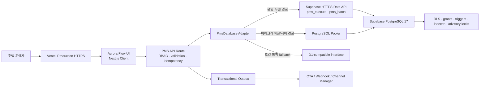
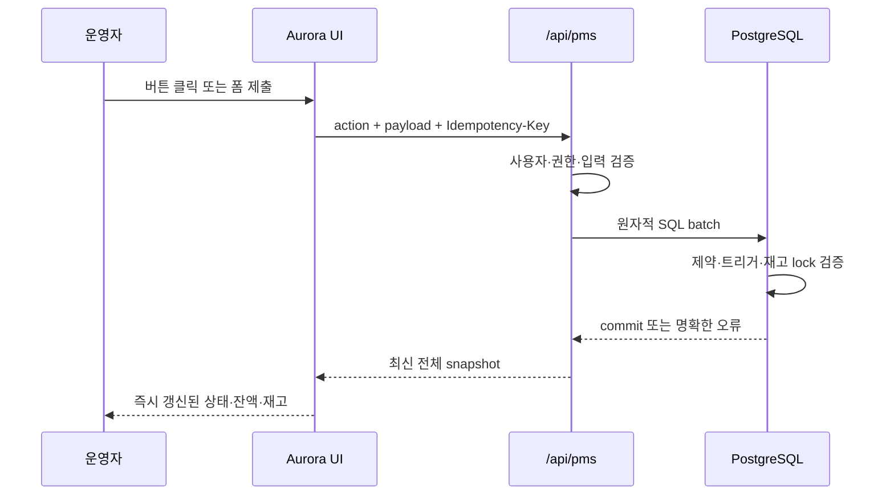
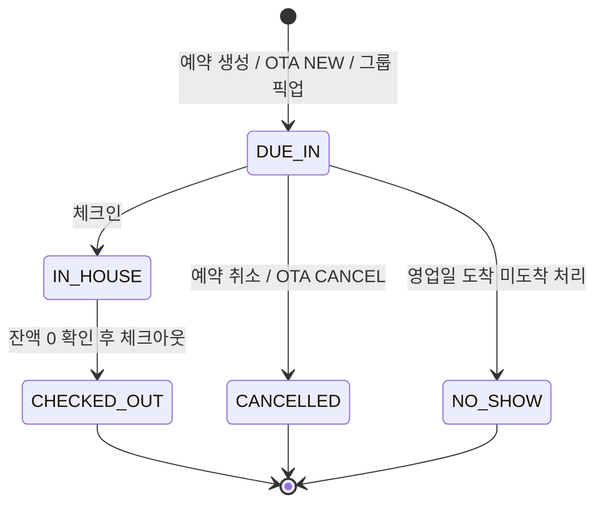

# Aurora Hotel PMS

Aurora는 예약, 객실 재고, 프런트 데스크, 하우스키핑, 그룹 블록, 폴리오, 매출채권, 캐셔, 야간 감사, OTA 연동과 운영 리포트를 하나의 운영 원장으로 연결하는 차세대 호텔 PMS(Property Management System)입니다.

단순한 대시보드 데모가 아니라 실제 상태 전이, 재고 차감, 정산 원장, 권한, 동시성, 감사 로그와 실패 복구를 데이터베이스 불변식으로 보호하는 것을 목표로 합니다.

> 현재 운영 구성: Next.js 16 + Vercel Functions + Supabase PostgreSQL 17 + HTTPS Data API

## 목차

- [제품 목표](#제품-목표)
- [핵심 설계 원칙](#핵심-설계-원칙)
- [전체 아키텍처](#전체-아키텍처)
- [화면 및 기능 명세](#화면-및-기능-명세)
- [업무 도메인 상세](#업무-도메인-상세)
- [리포트와 Excel 내보내기](#리포트와-excel-내보내기)
- [권한과 보안](#권한과-보안)
- [데이터 모델](#데이터-모델)
- [API 계약](#api-계약)
- [성능과 확장성](#성능과-확장성)
- [Aurora Flow UI](#aurora-flow-ui)
- [설치 및 Supabase 연결](#설치-및-supabase-연결)
- [테스트 및 Loop QA](#테스트-및-loop-qa)
- [프로젝트 구조](#프로젝트-구조)
- [운영 체크리스트](#운영-체크리스트)

## 제품 목표

Aurora PMS는 호텔 운영자가 여러 시스템을 오가며 같은 정보를 반복 입력하는 문제를 줄이고, 다음 질문에 즉시 답할 수 있도록 설계했습니다.

- 오늘 도착·재실·출발 고객은 누구인가?
- 어떤 객실이 판매 가능하고 어떤 객실이 청소·점검·판매 중지 상태인가?
- 객실 타입별 날짜 재고와 판매 제한, 요금은 어떻게 설정되어 있는가?
- 개별 예약과 그룹 블록이 실제 하우스 재고에 어떤 영향을 주는가?
- 고객 폴리오와 회사 후불 매출채권의 잔액은 정확히 일치하는가?
- 누가 어떤 예약, 객실, 재고, 정산 데이터를 변경했는가?
- OTA 메시지나 Webhook 전송이 실패했을 때 안전하게 재처리할 수 있는가?
- 예약·점유율·ADR·RevPAR·정산·감사 데이터를 필터링하고 Excel로 받을 수 있는가?

## 핵심 설계 원칙

### 1. 데이터베이스가 마지막 방어선이다

UI 검증에만 의존하지 않습니다. 중복 객실, 초과 판매, 중복 픽업, 원장 수정, 중복 야간 전기처럼 재무·재고 무결성을 깨뜨릴 수 있는 동작은 PostgreSQL 제약조건, 트리거, 원자적 배치와 advisory lock으로 다시 검증합니다.

### 2. 기록은 수정하지 않고 반대 기록을 추가한다

폴리오와 AR 원장은 append-only입니다. 잘못된 전표를 `UPDATE`나 `DELETE`하지 않고 반대전표, 환불, 재전기 항목을 추가해 원인과 결과를 모두 보존합니다.

### 3. 모든 외부 연동은 재시도 가능해야 한다

OTA 메시지는 Message ID와 revision으로 순서를 검증하고, 처리 실패는 DLQ 성격의 수신 원장에 남깁니다. 코어 트랜잭션 이후 외부 전송은 transactional outbox에서 수행해 외부 장애가 예약 저장을 롤백시키지 않도록 분리합니다.

### 4. 역할과 권한은 서버에서 다시 확인한다

버튼 노출 여부는 편의 기능일 뿐입니다. 모든 쓰기 요청은 서버에서 현재 사용자의 역할과 capability를 검증합니다.

### 5. 사용자는 다음 행동을 고민하지 않아야 한다

각 화면은 현재 상태, 필요한 조치, 결과를 한 문장 안에서 설명합니다. 주요 행동은 강한 버튼, 보조 행동은 약한 버튼으로 구분하고 완료·실패·차단 상태를 즉시 보여줍니다.

## 전체 아키텍처



### 요청 처리 흐름



### 런타임 계층

| 계층 | 책임 |
| --- | --- |
| `app/page.tsx` | 11개 운영 화면, 예약 Drawer, 업무 Modal, 상태 기반 CTA |
| `app/reports-center.tsx` | 9개 리포트 카탈로그, 복합 필터, 페이지네이션, CSV/XLSX 다운로드 |
| `app/room-master.tsx` | 객실 타입과 실물 객실 생성·수정·대량 생성 |
| `app/api/pms/route.ts` | 인증 사용자 해석, RBAC, 명령 처리, 스냅샷 구성, 감사·Outbox 기록 |
| `app/api/pms/reporting.ts` | 서버 사이드 리포트 쿼리, 필터, 요약, 마스킹, 행 제한 |
| `db/pms-database.ts` | D1 형태의 prepared statement API를 PostgreSQL/Data API로 변환 |
| `supabase/migrations/` | 운영 PostgreSQL 스키마, 함수, 보안, 트리거, 인덱스 |
| `scripts/qa-full-workflow.mjs` | 더미데이터 기반 전체 업무 Loop QA |

## 화면 및 기능 명세

### 1. 오늘의 오퍼레이션

- 오늘 도착 건수와 객실 배정 완료 수
- 현재 투숙 건수와 VIP 고객 수
- 물리 객실 기준 실시간 점유율
- 오늘 투숙 예약 기준 예상 객실 매출과 ADR
- ETA 기반 도착 플로우와 예약 상세 진입
- 청소/점검 완료, 청소 필요, 판매 중지 객실 현황
- 객실 준비 우선순위를 안내하는 운영 인사이트
- 알림 패널에서 도착, 객실, 인터페이스 문제 화면으로 즉시 이동

### 2. 프런트 데스크

- 고객명, 예약번호, 객실번호 통합 검색
- 전체/도착 예정/재실 상태 필터
- 예약 상세 Drawer
- 예약 일정·객실 타입·인원·요금·ETA 수정
- 미배정 예약의 객실 배정
- 체크인, 체크아웃, 노쇼, 예약 취소
- 재실 고객 룸 무브와 사유 기록
- 캐셔 세션이 열린 경우 비용 전기와 결제
- `Cmd/Ctrl + K`로 검색창 즉시 포커스

### 3. 재고 & 요금

- 객실 타입별 14일 판매 캘린더
- 물리 객실, 예약, 그룹 hold를 반영한 가용 수량
- 날짜별 판매 한도(sell limit)
- 판매 중지(stop-sell)
- 최소 숙박(MLOS)
- CTA/CTD
- 날짜별 요금 override
- 예약 수량 아래로 판매 한도를 내리는 잘못된 변경 차단

### 4. 그룹 & 세일즈

- 회사, 여행사, Source, 그룹 프로필 생성
- 현금/후불 승인 상태와 협상 요금 코드
- Tentative/Definite 비즈니스 블록 생성
- Deduct/Non-deduct 블록
- 날짜·객실 타입별 original/current/picked-up 수량
- Rooming list 등록
- Rooming entry를 실제 예약으로 원자 픽업
- Cutoff 시 미픽업 수량 자동 반환

### 5. 폴리오 & AR

- Guest ledger, AR ledger, gross revenue, net payments 요약
- 예약별 다중 폴리오 창
- 고객/회사/여행사/그룹 payee
- 거래 코드별 폴리오 라우팅
- 세금·봉사료 포함 금액 분해
- 전표 분할, 반대전표, 결제 환불
- 회사 후불 AR 이관과 청구서 생성
- 신용 한도 검증
- AR 부분/전액 수납과 완납 처리

### 6. 채널 허브

- 샌드박스 채널 연결
- 외부 Room/Rate ID와 내부 객실 타입/요금제 매핑
- 날짜별 ARI delta 생성
- `roomstosell`, closed, MLOS, CTA, CTD, rate payload
- ACK와 장애 주입
- NEW/MODIFY/CANCEL 예약 메시지
- Message ID 멱등 처리와 revision 순서 검증
- 실패 메시지 격리와 DLQ 재처리
- Outbox 전송 실패와 재전송

### 7. 룸 & 하우스키핑

- 전체/청소 필요/청소 완료/점검 완료 필터
- 공실·재실 상태와 하우스키핑 상태 동시 표시
- 담당자와 작업 상태 표시
- 청소 완료, 점검 완료 처리
- 체크아웃·룸 무브 발생 시 출발 객실 자동 Dirty 처리
- 판매 중지 객실의 예약 배정 차단

### 8. 리포트 센터

- 표준 리포트 9종
- 키워드, 기간, 상태, 채널, 객실 타입 복합 필터
- 서버 페이지네이션과 요약 KPI
- 권한에 따른 개인정보 마스킹
- CSV와 실제 `.xlsx` 워크북 다운로드
- 감사 가능한 export history 기록

### 9. 객실 마스터

- 객실 타입 생성·수정·활성화
- 실물 객실 생성·수정·활성화
- 연속 객실번호 최대 500실 대량 생성
- 중복 객실번호가 하나라도 있으면 전체 작업 차단
- 미래 예약이 연결된 타입/객실의 위험한 비활성화 차단
- 재실 객실 비활성화 차단

### 10. 매출 & 인사이트

- 7일 객실료 순매출
- 반대전표 반영
- 예약 채널별 생산 비중
- 원장과 동일한 데이터를 사용한 시각화

### 11. 야간 감사

- 미처리 도착, 열린 캐셔, 실패 인터페이스, 판매 중지 객실 검증
- 차단 항목에서 해당 업무 화면으로 이동
- 재실 객실의 미전기 객실료 미리보기
- 영업일별 중복 객실료 전기 차단
- 조건 충족 시 객실료 전기, 블록 cutoff, 영업일 전환을 원자 실행

## 업무 도메인 상세

### 예약 상태 모델



예약 변경, 객실 배정과 룸 무브는 `expectedVersion`을 사용합니다. 다른 운영자가 먼저 변경한 경우 `409 Conflict`를 반환하고 최신 화면으로 다시 확인하도록 안내합니다.

### 객실 타입 재고 계산

날짜별 판매 가능 수량은 다음 의미를 갖습니다.

```text
물리 판매 객실 = active 객실 - OUT_OF_SERVICE 객실
하우스 재고 사용 = 확정 예약 객실박 + deduct 블록 미픽업 hold
판매 가능 = closed ? 0 : max(0, sellLimit - 하우스 재고 사용)
```

예약과 블록이 동시에 같은 마지막 객실을 가져가는 경쟁 조건은 PostgreSQL advisory lock과 트리거에서 직렬화합니다.

### 그룹 블록과 픽업

- Rooming list 등록만으로 예약 재고를 추가 차감하지 않습니다.
- Deduct 블록은 `current_rooms - picked_up`만큼 이미 하우스 재고를 hold합니다.
- 픽업 시 block hold가 감소하고 예약 객실박이 증가하므로 전체 하우스 사용량은 보존됩니다.
- 예약 취소 시 그룹 픽업 박과 예약 박을 함께 해제합니다.
- Cutoff는 `current_rooms = picked_up`으로 만들어 미픽업 hold만 반환합니다.

### 폴리오 계산 규칙

| 종류 | Guest ledger 영향 |
| --- | ---: |
| `CHARGE` | `+amount` |
| `PAYMENT` | `-amount` |
| `CHARGE_REVERSAL` | `-amount` |
| `PAYMENT_REVERSAL` | `+amount` |
| `REFUND` | `+amount` |

체크아웃은 위 합계의 절대값이 `0.01` 이하인 경우에만 허용됩니다.

### AR 원장

- 폴리오 창 잔액이 양수이고 계정이 `DIRECT_BILL` 승인 상태여야 합니다.
- 기존 AR 잔액과 신규 이관액이 신용 한도를 초과하면 차단합니다.
- AR 이관 시 invoice debit과 폴리오 `DIRECT_BILL` payment를 같은 트랜잭션으로 기록합니다.
- AR 수납은 ledger credit을 추가하고 남은 잔액이 0이면 invoice를 `PAID`로 전환합니다.

### OTA 및 Outbox

| 계약 | 보호 장치 |
| --- | --- |
| ARI | 날짜·매핑별 revision, Delta 전송, ACK/FAILED 기록 |
| Inbound NEW | 외부 Room/Rate 매핑 검증 후 예약 생성 |
| Inbound MODIFY | 기존 링크와 증가 revision 검증 후 예약 변경 |
| Inbound CANCEL | 예약·객실박·타입박 해제 |
| Message ID | 연결별 유일성으로 중복 수신 멱등 처리 |
| Revision | 현재 revision 이하 메시지 거부 |
| DLQ | payload와 오류를 보존하고 동일 계약으로 재처리 |
| Outbox | 코어 commit 이후 PENDING/FAILED/PUBLISHED 상태로 전달 |

## 리포트와 Excel 내보내기

### 표준 리포트

| Key | 리포트 | 주요 데이터 |
| --- | --- | --- |
| `reservations` | 예약 상세 | 고객, 일정, 객실, 상태, 채널, 요금, 잔액 |
| `occupancy` | 점유율·ADR·RevPAR | 날짜/타입별 판매 객실, 점유율, 객실 매출 |
| `financials` | 정산·전표 | charge, payment, refund, reversal, 세금 |
| `ar` | 매출채권·미수금 | 거래처, 청구서, 만기일, 수납, 잔액 |
| `housekeeping` | 객실·하우스키핑 | 객실 상태, 청소 상태, 담당자, 작업 |
| `groups` | 그룹·블록 | 일정, 할당, 픽업, 잔여 수량, 요금 |
| `channels` | 채널·인터페이스 | inbound/outbound, provider, 시도, 오류 |
| `audit` | 감사 로그 | actor, action, entity, before/after |
| `room_inventory` | 객실 마스터 | 객실 타입, 객실번호, 층, 운영/청소 상태 |

### 조회 제한

- 한 번의 조회 기간: 최대 367일
- 화면 페이지 크기: 최대 100행
- 내보내기: 최대 25,000행
- 검색어: 최대 120자
- 개인정보: `REPORT_EXPORT` 권한이 없는 사용자는 고객명·이메일·전화번호 마스킹
- Excel: 숫자, 통화, 백분율, 날짜 열 형식과 요약 시트 포함

## 권한과 보안

### 역할

| 역할 | 핵심 권한 |
| --- | --- |
| `PROPERTY_ADMIN` | 전체 운영, 재고, 그룹, 정산, 연동, 리포트, 마스터 |
| `NIGHT_AUDITOR` | 폴리오, AR, 캐셔, 야간 마감, 리포트 |
| `FRONT_DESK` | 예약, 체크인/아웃, 폴리오, 캐셔, 그룹 픽업 |
| `CASHIER` | 폴리오, AR, 캐셔, 리포트 |
| `HOUSEKEEPING` | 객실 조회, 청소·점검 상태 변경 |
| `REVENUE_MANAGER` | 재고·요금, 그룹, 채널, 리포트 |
| `SALES_MANAGER` | 예약, 그룹·블록·픽업, 리포트 |
| `VIEWER` | 읽기 전용 |

### Capability

`READ`, `RESERVATION_WRITE`, `STAY_WRITE`, `FOLIO_WRITE`, `AR_WRITE`, `HOUSEKEEPING_WRITE`, `CASHIER_WRITE`, `EOD_RUN`, `INVENTORY_WRITE`, `GROUP_WRITE`, `GROUP_PICKUP`, `INTEGRATION_WRITE`, `REPORT_EXPORT`, `ADMIN`

### 보안 계층

1. Vercel Production HTTPS와 암호화 환경 변수
2. 테스트 배포는 `PMS_DEMO_USER_EMAIL`로 명시한 사용자만 서버 Principal로 사용
3. 정식 외부 공개 전 demo identity를 제거하고 SSO/OIDC 또는 신뢰 가능한 인증 프록시 연결
4. 서버 역할·capability 검증
5. 요청별 입력 검증과 상태 전이 검증
6. Supabase RLS 활성화와 browser role 권한 제거
7. 서버 전용 Secret Key로만 Data API 함수 호출
8. 감사 로그, reservation mutation, transition 기록
9. Idempotency-Key로 사용자 재클릭·네트워크 재시도 보호
10. 카드 원문·CVV 미저장

`SUPABASE_SECRET_KEY`, `DATABASE_URL`, `DIRECT_URL`은 Git에 커밋하지 않습니다. 로컬 `.env.local` 또는 배포 플랫폼의 암호화 환경 변수에만 저장합니다.

## 데이터 모델

운영 스키마는 39개 테이블을 8개 도메인으로 구성합니다.

| 도메인 | 테이블 |
| --- | --- |
| 프로퍼티·권한 | `properties`, `role_assignments` |
| 객실·재고 | `room_types`, `rooms`, `inventory_controls`, `housekeeping_tasks` |
| 예약·투숙 | `guests`, `reservations`, `reservation_nights`, `reservation_type_nights`, `reservation_transitions`, `reservation_mutations`, `room_moves` |
| 그룹·세일즈 | `account_profiles`, `business_blocks`, `block_inventory`, `rooming_list_entries`, `block_pickup_nights` |
| 폴리오 | `folio_windows`, `folio_entries`, `folio_entry_details`, `folio_routing_rules`, `transaction_codes` |
| AR·캐셔·EOD | `ar_accounts`, `ar_invoices`, `ar_ledger_entries`, `cashier_sessions`, `night_audits` |
| 채널·전달 | `channel_connections`, `channel_mappings`, `ari_updates`, `channel_reservation_links`, `inbound_channel_messages`, `integration_delivery_attempts`, `outbox_events` |
| 감사·운영 | `audit_logs`, `idempotency_keys`, `report_exports`, `pms_migration_history` |

### 주요 불변식

- 프로퍼티별 객실번호 유일
- 프로퍼티별 객실 타입 코드 유일
- 객실별 날짜 예약 유일
- 예약별 타입·날짜 유일
- 연결별 Message ID 유일
- 연결별 외부 예약 ID 유일
- 예약별 폴리오 창 번호 유일
- 예약·거래 코드별 활성 라우팅 유일
- 영업일별 야간 감사 유일
- 폴리오와 AR 원장 핵심 열 수정·삭제 금지
- 블록 current 수량은 picked-up 수량 아래로 감소 금지
- 활성 재고를 초과하는 예약·블록 생성 금지

## API 계약

### Snapshot

```http
GET /api/pms
```

응답은 현재 사용자의 권한을 반영한 `property`, `reservations`, `rooms`, `metrics`, `controls`, `inventory`, `groups`, `finance`, `integrations`를 포함합니다.

### Command

```http
POST /api/pms
Content-Type: application/json
Idempotency-Key: <unique-key>

{
  "action": "create_reservation",
  "firstName": "Aurora",
  "lastName": "Guest"
}
```

성공하면 최신 snapshot을 반환합니다. 리포트 export처럼 전용 응답이 필요한 명령은 리포트 데이터와 `exportId`를 반환합니다.

### 쓰기 Action

| 도메인 | Action |
| --- | --- |
| 예약 | `create_reservation`, `edit_reservation`, `assign_room`, `move_room`, `cancel_reservation`, `mark_no_show`, `check_in`, `check_out` |
| 객실·재고 | `create_room_type`, `update_room_type`, `create_room`, `bulk_create_rooms`, `update_room`, `update_inventory_control`, `housekeeping` |
| 그룹 | `create_account_profile`, `create_business_block`, `update_block_inventory`, `add_rooming_entry`, `pickup_rooming_entry`, `cutoff_block` |
| 폴리오 | `post_charge`, `post_payment`, `create_folio_window`, `create_routing_rule`, `split_folio_entry`, `reverse_folio_entry`, `refund_payment` |
| AR | `transfer_to_ar`, `post_ar_payment` |
| 채널 | `create_channel_connection`, `create_channel_mapping`, `queue_ari_delta`, `dispatch_ari_update`, `ingest_channel_message`, `replay_channel_message`, `dispatch_outbox_event` |
| 영업일 | `open_cashier`, `close_cashier`, `run_night_audit` |
| 리포트 | `export_report` |

### 대표 상태 코드

| 코드 | 의미 |
| --- | --- |
| `200` | 처리 완료 또는 멱등 replay |
| `400` | 입력 형식·범위·지원 Action 오류 |
| `401` | 로그인 사용자 정보 없음 |
| `403` | 역할에 필요한 capability 없음 |
| `409` | 재고, 상태 전이, version, 캐셔, 원장 조건 충돌 |
| `413` | 리포트 export 최대 행 초과 |

## 성능과 확장성

### 현재 최적화

- 준비된 SQL과 bind parameter 사용
- Snapshot 사용자별 3초 short cache
- 동일 사용자 동시 Snapshot 요청 Promise 병합 및 직렬화 결과 재사용
- 역할 할당 30초 short cache(신규 로그인 bootstrap 이후 권한 조회 부하 제거)
- Report 사용자·필터별 5초 short cache
- 쓰기 성공 시 snapshot/report cache 무효화
- 예약, 날짜, 객실 타입, 상태, 채널, 원장 중심 복합 인덱스
- HTTPS Data API를 통한 serverless Functions 친화적 연결
- `pms_batch` RPC로 다중 statement 원자 실행
- 최대 200개 report cache entry 유지 및 만료 청소
- Outbox와 외부 전달 분리

`npm run benchmark`는 전체 운영 Snapshot을 대상으로 warm-up 30회 후 300요청/동시성 30 조건을 검증하며, p95 250ms 미만과 오류 0건을 release gate로 사용합니다. 쓰기 직후에는 관련 cache를 즉시 비우므로 사용자 작업 결과가 오래된 Snapshot에 가려지지 않습니다.

### 생성 한도

| 항목 | 제한 |
| --- | --- |
| 객실 타입 총수 | 데이터베이스 고정 상한 없음 |
| 실물 객실 총수 | 데이터베이스 고정 상한 없음 |
| 한 번의 대량 객실 생성 | 1~500실 |
| 객실 타입 기준 인원 | 1~20명 |
| 객실 타입 코드 | 영문·숫자·`_`·`-`, 2~12자 |
| 객실번호 | 최대 16자 |
| 층 | -10~250 |
| 객실 특성 | 최대 20개 token |
| 재고 제어 horizon | 영업일 포함 365일 |

실제 운영 규모는 Supabase compute, connection/pooling 정책, 리포트 기간과 동시 사용자 수에 따라 capacity test로 결정해야 합니다. 객실 수 자체보다 날짜별 예약 객실박과 리포트 조회량이 주요 용량 지표입니다.

## Aurora Flow UI

Aurora Flow UI는 Toss Design System을 복제하지 않고, 공개된 Toss UX 원칙을 호텔 B2B 업무 화면에 맞게 해석한 디자인 레이어입니다. Aurora는 Toss와 제휴하거나 Toss의 공식 제품이 아닙니다.

### 적용 원칙

- Toss Blue 계열의 명확한 primary action
- `#191F28` 중심의 높은 텍스트 가독성
- `#F2F4F6`, `#E5E8EB` 기반의 가벼운 레이어
- `Toss Product Sans` 우선 폰트 스택과 라이선스 안전한 시스템 fallback
- fill/weak 버튼으로 주요·보조 행동 구분
- 12~24px 라운드와 최소한의 그림자
- 로딩·비활성·선택·오류 상태의 시각적 일관성
- `Cmd/Ctrl + K`, `Escape`, `aria-current`, `aria-pressed`, `focus-visible`
- `prefers-reduced-motion` 존중
- 모바일 하단 가로 스크롤 업무 내비게이션
- 가치와 결과를 먼저 설명하는 한국어 마이크로카피

### 참고한 공개 자료

- [Toss Design System Button](https://tossmini-docs.toss.im/tds-mobile/components/button/)
- [Toss Design System Colors](https://tossmini-docs.toss.im/tds-mobile/foundation/colors/)
- [토스 디자이너가 제품에만 집중할 수 있는 방법](https://toss.tech/article/toss-design-system)
- [토스 디자인 원칙: Value first, Cost later](https://toss.tech/article/value-first-cost-later)
- [토스 디자인 원칙: Easy to answer](https://toss.tech/article/insurance-claim-process)
- [Toss Product Sans 소개](https://toss.im/simplicity-21/sessions/3-3)

## 설치 및 Supabase 연결

### 요구사항

- Node.js `>=22.13.0`
- npm
- Supabase 프로젝트
- GitHub CLI는 게시 작업에만 필요

### 설치

```bash
npm install
npm run dev
```

기본 개발 주소는 `http://localhost:3000`입니다.

### 환경 변수

`.env.local`에 다음 값을 저장합니다. 실제 키를 README나 Git에 기록하지 마세요.

```dotenv
SUPABASE_URL=https://<project-ref>.supabase.co
SUPABASE_SECRET_KEY=<server-secret-key>
DATABASE_URL=postgresql://<user>:<password>@<pooler-host>:6543/postgres?sslmode=require
DIRECT_URL=postgresql://<user>:<password>@<session-or-direct-host>:5432/postgres?sslmode=require
PMS_DEMO_USER_EMAIL=frontdesk@aurora.hotel
```

- `SUPABASE_URL`: Project API URL
- `SUPABASE_SECRET_KEY`: 서버 런타임 전용이며 브라우저에 노출하지 않음
- `DATABASE_URL`: 애플리케이션/마이그레이션용 pooler URL
- `DIRECT_URL`: 세션 또는 직접 DB 연결 URL
- Project URL과 Database URL은 서로 다른 값입니다.
- `PMS_DEMO_USER_EMAIL`: Vercel 테스트 URL처럼 외부 인증 헤더가 없는 환경에서 사용할 명시적 테스트 사용자입니다. 공개 운영 전에는 제거하고 정식 인증을 연결하세요.

### Vercel 배포

Vercel은 표준 `next build`와 Node.js Functions 런타임을 사용합니다. Supabase 연결에는 serverless 환경에 적합한 `SUPABASE_URL`과 `SUPABASE_SECRET_KEY`만 필요하며, 직접 PostgreSQL 연결 문자열은 배포하지 않아도 됩니다.

```bash
vercel link
vercel env add SUPABASE_URL production
vercel env add SUPABASE_SECRET_KEY production --sensitive
vercel env add PMS_DEMO_USER_EMAIL production
vercel --prod
```

`.vercelignore`는 `.env*`, 로컬 빌드 결과, 작업 디렉터리와 Sites 설정이 Vercel source upload에 포함되지 않도록 차단합니다.

### 마이그레이션

```bash
npm run db:supabase:generate
npm run db:supabase:migrate
npm run db:supabase:smoke
```

| 명령 | 역할 |
| --- | --- |
| `db:supabase:generate` | D1 호환 스키마에서 PostgreSQL migration 생성 |
| `db:supabase:migrate` | migration history lock 후 미적용 migration 실행 |
| `db:supabase:smoke` | 테이블·트리거·RLS·Data API·동시성 보호 검증 |

## 테스트 및 Loop QA

### 빠른 검증

```bash
npm run lint
npm test
npm run db:supabase:smoke
```

`npm test`는 production build와 Node test suite를 실행합니다.

### 전체 더미데이터 Workflow QA

개발 서버를 실행한 상태에서:

```bash
npm run dev
npm run qa:workflow
```

다른 주소를 검사하려면:

```bash
PMS_BASE_URL=http://localhost:3000 npm run qa:workflow
```

> `qa:workflow`는 연결된 데이터베이스에 `QA...` 이름의 실제 테스트 레코드와 감사 로그를 생성합니다. 운영 DB가 아니라 전용 staging/QA 프로젝트에서 실행하는 것을 권장합니다.

### Loop QA 범위

1. 대시보드와 Snapshot 로딩
2. 리포트 9종 조회와 필터
3. CSV/XLSX export
4. 객실 타입 생성·수정·멱등 replay
5. 단일/대량 객실 생성과 수정
6. 하우스키핑 청소·점검 전환
7. 판매 한도·MLOS·CTA·요금
8. 회사·그룹 프로필
9. 블록·할당·rooming·pickup·cutoff
10. 캐셔 개시·마감
11. 예약 생성·수정·배정·체크인·룸 무브
12. 폴리오 창·라우팅·분할·반대전표·결제·환불
13. 체크아웃 후 housekeeping 생성
14. AR 이관·청구·수납·완납
15. 노쇼·취소·재고 복원
16. 채널 연결·매핑·ARI·NEW/MODIFY/CANCEL
17. Message ID 멱등·DLQ replay
18. Outbox 장애 주입·재전송
19. 야간 감사 blocker
20. 감사 로그 추적

### Loop Engineering 완료 조건

```text
기능 목록화
  → 정상 경로 실행
  → 오류/차단 경로 실행
  → 데이터베이스 결과 확인
  → 결함 수정
  → build/lint/unit/invariant/workflow 재실행
  → Git commit/push
  → 운영 배포
  → 배포 상태 확인
```

## 프로젝트 구조

```text
Aurora_PMS/
├─ app/
│  ├─ api/pms/
│  │  ├─ route.ts              # Command + snapshot API
│  │  └─ reporting.ts          # 9개 report query
│  ├─ globals.css              # Aurora Flow UI tokens/components
│  ├─ page.tsx                 # PMS 업무 화면
│  ├─ reports-center.tsx       # Report center
│  ├─ room-master.tsx          # Room master
│  └─ xlsx-export.ts           # XLSX workbook writer
├─ db/
│  ├─ pms-database.ts          # D1/Postgres/Data API adapter
│  └─ schema.ts                # Drizzle/D1 compatible schema
├─ scripts/
│  ├─ qa-full-workflow.mjs     # 전체 dummy workflow QA
│  ├─ migrate-supabase.mjs
│  ├─ smoke-supabase.mjs
│  └─ generate-supabase-migration.mjs
├─ supabase/
│  ├─ migrations/
│  └─ seed.sql
├─ tests/
│  ├─ pms-invariants.test.mjs
│  ├─ rendered-html.test.mjs
│  └─ api-benchmark.mjs
├─ .openai/hosting.json
└─ worker/index.ts
```

## 운영 체크리스트

### 배포 전

- [ ] `.env.local`과 Vercel Production env key 일치
- [ ] Secret Key가 Git diff에 없음
- [ ] migration과 migration history 일치
- [ ] `npm run lint`
- [ ] `npm test`
- [ ] `npm run db:supabase:smoke`
- [ ] staging에서 `npm run qa:workflow`
- [ ] RLS와 browser role grant 재검증

### 매일 운영

- [ ] 도착 예정 미처리 건 확인
- [ ] 캐셔 세션 마감
- [ ] 실패 inbound/outbox/ARI 확인
- [ ] 판매 중지 객실 확인
- [ ] 야간 감사 blocker 해소
- [ ] 영업일 마감 실행

### 장애 대응

- API 장애: Supabase Data API와 `pms_execute` RPC 확인
- 재고 충돌: reservation/block capacity trigger 오류와 해당 날짜 재고 확인
- OTA 장애: inbound status, delivery attempts, mapping, revision 확인
- Outbox 장애: 실패 원인 확인 후 재전송
- 정산 불일치: guest ledger, AR ledger, 반대전표, cashier variance 확인
- 동시 수정: `409` 후 최신 snapshot 재조회

## 라이선스 및 브랜드 고지

Aurora PMS는 독립 프로젝트입니다. Toss, Toss Design System, OPERA PMS 또는 기타 언급된 제품과 제휴하거나 그 공식 제품임을 의미하지 않습니다. 공개된 UX 원칙과 업계 운영 패턴을 참고했으며, 타사 로고·전용 컴포넌트 코드·비공개 자산은 포함하지 않습니다. `Toss Product Sans`는 우선 폰트 이름으로만 지정하며, 배포물에 타사 독점 폰트 파일을 재배포하지 않습니다.
