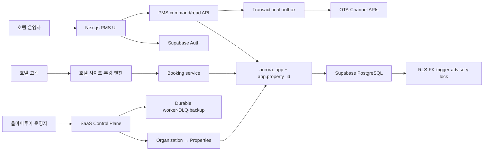

# Talos PMS

Talos PMS는 예약, 객실, 장기 재고·요금, Rate Plan, 프런트, 하우스키핑, 그룹, 폴리오, AR, 채널, 회계, 리포트, 야간 감사와 호텔 공식 홈페이지·직접 예약을 하나의 PostgreSQL 운영 원장으로 연결하는 호텔 관리 시스템입니다.

이 README는 빠른 시작과 운영 진입점입니다. 전체 화면 명세, 업무 규칙, 데이터 모델, API, 보안, QA 및 운영 절차는 [분리형 개발·운영 문서 지도](docs/README.md)를 참조하세요.

## 현재 릴리스 현황

| 항목 | 값 |
| --- | --- |
| 운영 PMS | [aurora-pms-gilt.vercel.app](https://aurora-pms-gilt.vercel.app) |
| 공개 호텔·예약 | [aurora-pms-gilt.vercel.app/hotel](https://aurora-pms-gilt.vercel.app/hotel) |
| 격리 스테이징 | [aurora-pms-staging.vercel.app](https://aurora-pms-staging.vercel.app) |
| 저장소 | [sksmsrkk-glitch/Aurora_PMS](https://github.com/sksmsrkk-glitch/Aurora_PMS) |
| 런타임 | Next.js 16, React 19, Vercel Functions `icn1` |
| 데이터 | Supabase PostgreSQL 17, Supavisor, native date/time·boolean·JSONB |
| 스키마 계약 | `202607230035_search_term_candidate_performance` |
| 명령 계약 | action registry, capability 1:1, Zod 입력 검증, 멱등 mutation |
| 자동 지표 | [migration·table·RLS·action·test·CSS 자동 집계](docs/generated/project-metrics.md) |

현재 구현 범위:

- 예약 생성·편집·취소·노쇼·배정·체크인·룸 무브·체크아웃
- 최대 730일 선택·벌크 범위를 유지하면서 14/30일 읽기 창만 렌더링하는 재고 캘린더, 5,000셀 원자적 벌크 저장, MLOS·CTA·CTD·stop-sell
- HotelStory형 판매 상품 Rate Plan, 부모 상품 요금 상속, 식사·패키지·판매기간·기준/최대 인원·인원별 요금, 예약 시 상품 snapshot, 객실 타입 매핑, 일자별 직판 요금과 홈페이지 실시간 가격·재고
- HotelStory형 예약 상세: 예약자/투숙자 분리, 고객요청·응답, 관리자/호텔 메모, 예약 확인, 시간 연장, PCI-safe Card Info, 연계·복사, 일자별 요금·취소정책과 4종 인라인 로그
- HotelStory형 예약 바우처: 국문/영문, 금액 표시/숨김, Noto Sans KR 임베딩 PDF, Excel, 인쇄, 제목·수신자 메일 queue와 중복 전송 방지
- HotelStory형 판매채널 카탈로그: 사용 가능/설정 목록, 연동·자체 배지, 드래그 등록·정렬, 활성/중지, 외부 호텔 ID·서플라이어·별도관리와 상품별 D-n 마감
- 객실×판매상품×채널×날짜 블럭요금 매트릭스: Today/1W/2W/4W/Month, 31일 조회, 최대 5,000셀 할당·판매가·입금가·MLOS·CTA·CTD 원자 저장과 ARI/Outbox 생성
- 호텔별 성수기·휴일·편의시설·유료 서비스·이미지 운영 카탈로그
- HotelStory형 연회장 월 캘린더와 행사 등록·편집, 수용 인원·상태·금액·메모, 동일 장소/일자 시간대의 DB 동시 충돌 차단
- 당일 체크인·체크아웃 전용 URL과 판매상품 복합필터, 객실×18일 점유 timeline, 예약 상세 딥링크
- 예약 Excel용 CSV 양식·2,000행 dry-run·오류 결과·원자 commit/replay·변경 감지 rollback, CSV 안의 고객 동시 생성
- 호텔·홈페이지 회원 코드·ID·연락처·회사·등급·관리유형·활성 관리, scrypt 비밀번호 해시와 지원 PII 마스킹
- 폴리오 창·라우팅·분할·반대전표·수납·환불·AR 이관·후불 수납
- 그룹 블록·rooming list·pickup·cutoff, 채널 연결·계약·ARI·inbound·outbox
- 복식부기 journal, 채널 수수료/입금가 정산, P/L, 16종 리포트와 CSV/XLSX; 리드타임·4개 시간대 예약곡선·월별 BOOK/REV YoY·후불 정산·입금/복구 원장·검색 품질 경보
- PMS 비주얼 에디터 기반 히어로·메뉴·호텔 소개·이미지·객실 소개·공개 여부와 직접 예약 엔진
- 호텔별 canonical/Open Graph, Hotel JSON-LD, sitemap, robots
- 호텔별 다중 직원 ID, 14개 페이지별 없음/조회/입력 권한, 별도 개인정보 export 권한과 계정 생명주기
- 조직→다중 호텔 계층, 안전한 호텔 전환, 구독·기능 entitlement, 객실·사용자 DB 한도
- 도메인 기반 호텔별 홈페이지·직접 예약, DNS 검증, JIT MFA 지원 접근과 개인정보 마스킹
- CSV dry-run·원자적 반영·안전 rollback, durable worker·lease reaper·제한형 DEAD 복구·백업 검증·사용량 집계
- 12px 보조정보·14px 업무본문·44px 조작영역을 하한으로 하는 전역 가독성 시스템, 모바일 예약 카드·하단 내비게이션·하단 시트
- 대형 호텔 룸 보드 행 가상화, arrival-day 이동의 전체 숙박 승격, CMS 이미지 CSS URL 안전 직렬화, 채널 연결·매핑 멱등 replay

### 현장 운영 UX 6단계 완료 계약

| 단계 | 구현 결과 | 완료 판정 |
| --- | --- | --- |
| 1. 업무 정보구조 | 직원 역할별로 `오늘 운영`, `판매·매출`, `정산·회계`, `호텔 설정` 메뉴를 재정렬하고 허용된 페이지만 표시 | 역할 템플릿의 14개 페이지 권한과 실제 메뉴가 행동 테스트에서 일치 |
| 2. 검색·프런트 | 모든 화면에서 `Cmd/Ctrl+K` 통합 검색, 로마자·오타·초성·한/영 키보드 교정, 최근/빈번 엔터티, 도메인별 서명 keyset 이어보기, 오늘 업무 큐, 서버 필터·정렬·20건 페이지네이션, 저장 보기와 7/14/30일 물리 객실 배정 보드를 제공 | 검색 문서·토큰은 tenant RLS와 trigger로 원본과 동기화되고 검색 도메인이 페이지 권한을 넘지 않으며, 17건 keyset 행동 테스트는 중복·누락 0건, 100,000실·8동시 benchmark는 exact/typo/broad 순차 p95 76.59/965.03/1,242.37ms와 동시 p95 2,135.61ms; 보드는 최대 31일 한 batch·내부 스크롤·sticky 축으로 제한되며 병렬 마지막 객실 배정은 1건만 성공 |
| 3. 예약 생성 | HotelStory형 목록/달력 전환 → 상품·일정·인원 → 실시간 가용 객실·요금 → 고객·배정 → 최종 검토; 목록의 객실종류·조식·기준/최대인원·총액 비교와 월 달력의 상품별 가격·잔여/전체 객실 | 목록·달력이 하나의 고정 배치 projection을 공유하고, DB가 정원·30박·재고·MLOS·CTA·CTD·판매/숙박기간·인원요금을 재검증한 뒤 매일의 상품 snapshot과 예약을 원자 확정 |
| 3-1. 예약 상세 | 좌측 예약/상품/일자요금/취소규정, 우측 예약자와 실제 투숙자/요청/응답/메모/확인/시간/Card Info, 하단 연동·수정·요금·블럭 로그 | 예약자≠투숙자 저장, 기대 버전 경쟁 차단, PCI 원문 거부, 취소정책 snapshot 불변, 감사·Outbox·멱등 영수증 원자 반영 |
| 4. 요금·재고 | 호텔 전체 재고 캘린더의 730일 선택·14/30일 창과 별도로, 채널 블럭요금은 객실×상품×채널×최대 31일 sticky 매트릭스로 제공 | 5,000셀 상한, 실제 객실 초과 할당 trigger, 활성 채널 gate, 같은 transaction의 ARI·Outbox·멱등 영수증으로 검증 |
| 5. 리포트 | 16종 업무 카탈로그, 즐겨찾기·최근 사용·저장 필터, 날짜 프리셋, 객실 타입 검색, 채널 미입금/현장결제 제외, 검색 품질 경보, 입금·복구, 25/50/100행, export 확인 | 리드타임과 4개 예약 시간대가 property timezone 원자료와 일치하고, 검색 품질은 원문·사용자 없이 최소 표본/지연/무결과를 판정하며, 입금·복구는 불변 사건·반대전표·멱등·경쟁 차단을 거치고 CSV/XLSX도 같은 서버 집계를 사용 |
| 6. 모바일·가독성·성능 | 역할별 4개 핵심 하단 내비게이션, 카드형 예약 큐, 전체폭 하단 시트, 12/14px·44px 하한, reduced motion | 390px에서 수평 root overflow 없이 핵심 업무와 팝업을 조작하고 core는 오늘 업무 예약만 전달 |

운영 배포 화면의 최종 검증도 이 계약에 포함한다. 통합 검색은 예약·객실뿐 아니라 AR 잔액을 원장 합계로 조회하며, NFKC·정확/접두/부분/유사도·최근성 랭킹, 한국어 성명 순서·초성·숫자형 전화번호·한/영 키보드 오입력·SQL 와일드카드 리터럴을 공통 처리한다. 객실/AR `focus` 딥링크는 실제 카드 포커스로 연결하고, 도메인별 query-bound cursor는 원문 검색어를 노출하지 않으면서 결과를 중복 없이 이어 읽는다. 최근/빈번 엔터티는 4시간 browser session·호텔·로그인 사용자별로만 보존하고 로그아웃 때 제거하며, 서버 품질 지표는 검색어·hash·사용자·entity 없이 길이/문자군/결과/지연 bucket만 일 단위 집계한다. 프런트·리포트 조건은 URL에 보존되고, 체크인·연회·회원 즉시검색은 debounce와 이전 요청 취소를 사용한다. 장애 시에는 무반응 대신 오류 안내를 표시한다. 모든 로컬 목록 검색도 `lib/pms-search.ts`의 도메인 검색 문서와 `lib/search.ts`의 단일 엔진을 사용해 전각문자, 구두점·공백, 한국어 이름 역순과 초성 검색을 동일하게 처리한다. 대시보드의 `오늘 도착`은 전체 도착 건수와 처리 완료·도착 대기를 함께 표시해 도착 플로우의 미처리 건수와 의미가 섞이지 않도록 한다.

핵심 구현은 `app/pms-navigation.ts`, `app/global-pms-search.tsx`, `app/frontdesk-workbench.tsx`, `app/reservation-wizard.tsx`, `app/inventory-window.ts`, `lib/search.ts`, `lib/pms-search.ts`, `lib/korean-keyboard.ts`, `lib/search-cursor.ts`, `lib/search-history.ts`에 분리했습니다. `tests/operations-workbench.test.mjs`가 역할 메뉴, 프런트 입력 경계, 장기 캘린더의 bounded read를 검증하고 `tests/pms-search-engine.test.mjs`가 9개 로컬 검색 도메인의 실제 필터 함수를, `tests/search-behavior.test.mjs`와 PostgreSQL integration이 교정·cursor·RLS·trigger·비식별 telemetry를 행동으로 검증합니다. 발견 결함·수정·재발 방지와 100,000실 결과는 [검색 무결성 검증 기록](docs/search-integrity.md)에 유지합니다.

`완료`는 저장소와 자동 QA 범위를 뜻합니다. 실제 영업 전에는 결제대행, 법정 회계, 개인정보 보유 정책, OTA 인증, 백업 복구 목표를 호텔별로 확정해야 합니다.

## 빠른 시작

요구 사항은 Node.js 24, npm, PostgreSQL 17입니다.

```bash
npm install
npm run db:supabase:migrate
npm run db:contract:verify
npm run dev
```

필수 서버 환경 변수:

```dotenv
DATABASE_URL=postgresql://...
DIRECT_URL=postgresql://...
SUPABASE_URL=https://PROJECT.supabase.co
SUPABASE_SECRET_KEY=...
PMS_SESSION_SECRET=32자_이상_무작위_값
SEARCH_CURSOR_SECRET=32자_이상_무작위_값
PMS_RATE_LIMIT_SECRET=32자_이상_무작위_값
AURORA_PUBLIC_PROPERTY_ID=prop-seoul
AURORA_PUBLIC_SITE_URL=https://your-production-domain.example
AURORA_PLATFORM_HOSTS=pms.example.com
AURORA_TENANT_BASE_DOMAIN=hotels.example.com
PMS_REQUIRE_PLATFORM_MFA=true
CRON_SECRET=32자_이상_무작위_값
TALOS_EMAIL_ENDPOINT=https://approved-mail-adapter.example/v1/messages
TALOS_EMAIL_SECRET=32자_이상_무작위_값
TALOS_EMAIL_FROM=talos@allmytour.com
```

실제 값은 커밋하지 않습니다. 운영과 스테이징은 Supabase 프로젝트, Vercel 프로젝트, 환경 변수를 물리적으로 분리합니다.

## 전체 아키텍처



핵심 경계:

1. `supabase/migrations/`만 스키마 원본입니다. 앱 부팅 시 DDL을 실행하지 않습니다.
2. 모든 테넌트 쿼리는 `scopePmsDatabase()`가 만든 트랜잭션 안에서 `SET LOCAL ROLE aurora_app`과 `app.property_id`를 설정합니다.
3. 운영 루트 DB는 닫힌 `findActiveRoleAssignments(authUserId, email)` capability로 Auth UUID와 이메일이 모두 일치하는 배정만 허용하고, 그 외 테넌트 테이블 SQL을 거부합니다.
4. 명령은 action registry가 capability, 도메인, Zod schema를 한 곳에서 연결합니다.
5. 폴리오·AR·회계 원장은 append-only이며 수정 대신 반대 기록을 추가합니다.
6. 객실 재고는 DB advisory lock과 capacity trigger가 마지막 1실의 병렬 초과 예약을 차단합니다.
7. 배포 빌드는 최신 migration, `aurora_app` 속성·membership, RLS 정책 수를 먼저 검증합니다.
8. 14개 URL workspace는 공통 레이아웃의 단일 PMS shell을 유지하며, 메뉴 intent 시 라우트·모듈·필요 projection을 선행 로드합니다.
9. 홈페이지 이미지는 DB 비노출 tombstone → Storage 삭제 → DB hard-delete 순서로 제거해 죽은 공개 URL을 방지합니다.
10. 호텔 전환은 assignment 재검증, HttpOnly 선택 쿠키, client cache 제거와 hard navigation을 함께 수행합니다.
11. 공개 홈페이지와 부킹 API는 요청 property ID를 신뢰하지 않고 ACTIVE domain의 Host mapping으로 scope를 결정합니다.
12. 외부 전송은 worker가 `SKIP LOCKED`로 한 번만 claim합니다. scheduler reaper와 별개로 모든 claim이 10분 지난 RUNNING lease와 미완료 attempt를 같은 transaction에서 회수하며, webhook·ARI의 DEAD는 새 attempt cycle로 제한 복구합니다.
13. source 재실패 enqueue는 RUNNING lease를 건드리지 않아 이중 전송을 막고, DEAD만 attempts·오류를 초기화한 새 cycle로 명시적으로 부활시킵니다.
14. 로그인 성공 뒤 활성 호텔·구독 배정을 다시 확인하고 과거 호텔 선택 쿠키를 만료시키며, 미인증 401과 정지·미배정 403을 분리해 로그인 redirect loop를 차단합니다.
15. 공개 CMS projection은 도메인 resolver와 별도로 구독을 재검증해 `SUSPENDED`·`CANCELLED` 호텔을 `published=false`로 강제합니다.
16. 객실 배정 보드는 타입 재고(`reservation_type_nights`)와 물리 호실 박(`reservation_nights`)을 섞지 않습니다. 전체 배정·부분 룸 무브·해제는 expected version, 물리 호실/일자 unique, OOS gate, 감사·Outbox·멱등 영수증을 같은 transaction에서 처리합니다.
17. 플랫폼·프런트 예약 CSV는 같은 Supabase AAL2 정책을 사용하고 commit/rollback에서 expected job kind를 SQL로 재검증합니다. 예약 import는 숙박일별 immutable rate ledger를 생성하며 rollback trigger는 같은 완료 job이 소유한 원장만 transaction-local 범위에서 삭제합니다.

주요 코드 진입점:

| 책임 | 경로 |
| --- | --- |
| DB adapter·tenant scope | `db/pms-database.ts` |
| 배포 스키마 계약 | `db/schema-contract.ts` |
| action registry | `app/api/pms/action-registry.ts` |
| 명령 gateway | `app/api/pms/command-gateway.ts` |
| read models·dashboard | `app/api/pms/read-model.ts` |
| 통합 검색·프런트·예약 가용성 projection | `app/api/pms/frontdesk-read.ts` |
| 물리 객실 배정 command | `app/api/pms/room-assignment-service.ts` |
| 재고·Rate Plan·회계 | `app/api/pms/extended.ts` |
| 예약 바우처 projection·문서 | `app/api/pms/voucher-service.ts`, `app/api/pms/voucher-document.ts` |
| 직접 예약 | `app/api/booking/service.ts` |
| 홈페이지 CMS projection | `app/api/booking/website-service.ts` |
| PMS shell | `app/(pms)/_components/pms-shell.tsx` |
| 역할별 메뉴·모바일 핵심 업무 | `app/pms-navigation.ts` |
| 프런트 업무대기열·룸 배정 보드·예약 마법사·상세 | `app/frontdesk-workbench.tsx`, `app/frontdesk-room-board.tsx`, `app/reservation-wizard.tsx`, `app/reservation-detail-panel.tsx` |
| 재고 캘린더 | `app/inventory-calendar.tsx` |
| 공개 호텔 SEO | `app/hotel/seo.ts` |
| 멀티호텔 Control Plane | `app/(pms)/platform`, `app/api/platform/route.ts` |
| 도메인 tenant resolver | `app/api/booking/property-resolver.ts` |
| 데이터 이관 | `app/api/platform/imports/route.ts`, `app/import-csv.ts` |
| 데이터 이관 MFA 정책 | `app/api/import-mfa-policy.ts` |
| durable worker | `app/api/internal/worker/route.ts` |
| 즉시 worker kick·5분 독립 scheduler | `app/worker-kick.ts`, `.github/workflows/worker-scheduler.yml` |
| SaaS 전체 운영 설계 | `docs/multihotel-saas.md` |

## 기능 및 데이터 계약

### 재고·요금

- `rate_plans`가 BAR, WEB-DIRECT, OTA, CORP 같은 상품 정책을 보관합니다.
- `rate_plan_room_types`가 판매 가능한 객실 타입을 연결합니다.
- `rate_plan_calendar`가 객실 타입·날짜별 판매가와 제한을 보관합니다.
- `channel_rate_overrides`가 채널 매핑·상품·객실·날짜별 할당, 판매가/입금가, Closed/MLOS/CTA/CTD를 보관합니다.
- 채널 블럭요금 저장은 일자별 왕복 대신 bounded fact query와 chunked multi-row upsert를 사용하고, ARI update와 Outbox를 같은 transaction에 생성합니다.
- 공식 홈페이지는 WEB-DIRECT 일자 요금을 우선 사용하고, 같은 inventory capacity를 소비합니다.
- 벌크 변경은 단일 DB transaction으로 커밋되므로 중간 배치 실패가 일부 날짜만 남기지 않습니다.

### 대시보드

- 오늘/전일은 서버 시각이 아니라 property `business_date`를 기준으로 계산합니다.
- 도착, 재실, 점유율, 예상 객실 매출, ADR은 같은 SQL projection에서 계산합니다.
- 전일 분모가 0이면 허위 증감률 대신 비교 기준 없음을 반환합니다.

### 금전 처리

- 클라이언트는 모든 mutation에 `Idempotency-Key`를 보냅니다.
- 중복 키 등록과 금전 side effect는 같은 transaction에서 실행됩니다.
- 결제, 환불, 분할, 반대전표, AR 이관·수납은 원본 기록을 삭제하지 않습니다.
- 채널 입금은 `channel_deposit_events`에 RECEIPT/RESTORE 사건을 append-only로 남기고, 현재 상태 projection과 복식 회계 전표를 한 transaction에서 바꿉니다. 복구는 원 전표를 `REVERSED`로 전환하고 반대전표를 추가하며, 행 잠금 trigger가 서로 다른 키의 동시 입금도 한 건만 허용합니다.

### 공개 호텔 사이트

- PMS의 호텔 소개, 연락처, 호텔·객실 이미지, 객실 공개 설정을 서버 projection으로 제공합니다.
- 비주얼 에디터에서 히어로 이미지·텍스트 배치·오버레이·높이·CTA·강조색과 메뉴 순서·라벨·노출을 실시간 미리보기 후 게시합니다.
- 공개 검색은 PMS 재고, 홈페이지 노출, Rate Plan 제한과 요금을 실시간으로 평가합니다.
- canonical URL은 요청 Host를 신뢰하지 않고 `AURORA_PUBLIC_SITE_URL`에서 만듭니다.
- 예약 검색 URL은 중복 색인을 막기 위해 `noindex,follow`입니다.

## 마이그레이션 카탈로그

`supabase/migrations/`가 유일한 적용 순서입니다. 적용된 파일을 수정하거나 생성 스크립트로 덮어쓰지 않습니다.

| 범위 | migration |
| --- | --- |
| 코어 PMS·데이터 API·history lock | `202607160001` ~ `202607160003` |
| 채널 수익·계약 snapshot | `202607160004` ~ `202607160005` |
| 관계 무결성·대형 atomic batch | `202607170001` ~ `202607170002` |
| 부킹 엔진·CMS·공개 시드 | `202607170003` ~ `202607170005` |
| 관리자 backdoor 제거 | `202607170006` ~ `202607170007` |
| 분산 rate limit·임의 SQL RPC 제거 | `202607170008` ~ `202607170009` |
| transaction tenant context/RLS | `202607170010_tenant_context_rls.sql` |
| native date/time/timestamptz | `202607170011_native_temporal_types.sql` |
| Rate Plan 도메인·FK | `202607170012_rate_plan_domain.sql` |
| native boolean·JSONB·예약 불변식 | `202607170013_native_flags_json_constraints.sql` |
| 홈페이지 비주얼 에디터 | `202607170014_website_visual_editor.sql` |
| 직원 계정·세부 권한 | `202607180015_staff_access_control.sql` |
| 멀티호텔 Control Plane·구독·지원·이관·worker·백업 | `202607190016_multihotel_saas_control_plane.sql` |
| worker lease reaper·attempt cycle·제한형 DEAD 복구 | `202607200017_worker_delivery_recovery.sql` |
| exhausted RETRY 회수 인덱스·조용한 전달 유실 차단 | `202607200018_exhausted_worker_retry_recovery.sql` |
| enqueue DEAD 새 cycle 초기화·RUNNING lease 보존 | `202607200019_worker_enqueue_revival_guards.sql` |
| HotelStory 판매 상품·인원별 요금·상품 snapshot | `202607210020_rate_product_catalog.sql` |
| 예약자/투숙자·운영 옵션·취소정책·연계예약 | `202607210021_reservation_operational_detail.sql` |
| 예약 바우처 immutable payload·메일 전달 queue | `202607210022_reservation_voucher_delivery.sql` |
| 채널 카탈로그·블럭요금·호텔 운영 카탈로그 | `202607210023_channel_rateblock_operational_catalogs.sql` |
| HotelStory 리포트·채널 입금/복구 불변 원장 | `202607210024_hotelstory_reporting_deposits.sql` |
| HotelStory 연회·당일 운영·예약 import·호텔/웹 회원 | `202607210025_hotelstory_final_operations.sql` |
| 예약 import 일자별 요금 원장·안전한 롤백 | `202607220026_reservation_import_rate_ledger.sql` |
| 카드 참조 PCI·채널 요금제·임포트 권한 무결성 | `202607220027_import_pci_rate_override_integrity.sql` |
| 채널 반제 금액·다단계 요금·예약 snapshot 불변성 | `202607220028_finance_rate_snapshot_integrity.sql` |
| 요금 부모 체인 종료·과거 수리 provenance 감사 | `202607220029_quality_integrity_closure.sql` |
| tenant 검색 문서·비식별 품질·keyset·인덱스 | `202607230030` ~ `202607230033` |
| 한국어 이름 로마자 별칭·전체 재색인 | `202607230034_korean_romanized_search_aliases.sql` |
| token-first 후보·exact BTREE 검색 성능 | `202607230035_search_term_candidate_performance.sql` |

배포 순서:

```bash
npm run db:saas:preflight
npm run db:supabase:migrate
npm run test:integration
npm run db:contract:verify
npm run release:build
```

항상 스테이징에서 migration·role 전환·smoke·E2E를 통과한 다음 운영에 같은 순서를 적용합니다.
`release:build`는 migration 파일과 런타임 계약 버전의 정적 동기화만 확인하므로 DB 점검이나 네트워크 장애에 결합되지 않습니다. 실제 DB 역할·RLS·migration 적용 여부는 앞 단계의 `db:contract:verify`와 배포 후 `/api/health`가 fail-closed로 검증합니다.

## API 상세 개발 명세

### `GET /api/pms`

- 인증·property assignment 필수
- `?view=core`: 첫 화면용 예약, 객실, 재고, 실제 대시보드 비교 지표
- `?view=groups|finance|channels`: 해당 화면만 위한 bounded projection(각 4/8/8 query)
- `?view=reservation_availability|reservation_calendar|reservation_detail`: 목록·월 달력·단건 상세 전용 bounded projection
- `?view=reservation_voucher`: 단건 예약의 권한·tenant 범위 내 KR/EN 확인서 projection; `format=json|html|pdf|xlsx`, 금액 표시 정책과 export 권한 적용
- `?view=channel_catalog`: 사용 가능/설정 채널, 외부 연결, 상품 마감과 Rate Plan을 한 번에 반환
- `?view=rateblock&from&to&connectionId&roomTypeId`: 최대 31일의 채널×상품×객실 블럭요금과 실제 객실·예약·그룹 hold 잔여량 반환
- `?view=hotel_catalogs`: 성수기·휴일·편의시설·서비스·홈페이지 이미지 카탈로그 반환
- `?view=stay_operations&mode=checkin|checkout|occupancy&date=YYYY-MM-DD`: 당일 queue 또는 18일 점유 projection; 고객·예약·전화·객실, 채널, 타입, 상품 필터
- `?view=banquet&month=YYYY-MM`: 월간 연회 예약과 연회장 master; 검색·장소·상태 필터
- `?view=hotel_members`: 호텔·웹 회원 500건 이하 서버 검색; 이름·전화·ID·회사·코드·가입일·활성·등급·관리유형 필터
- `?view=inventory|accounting|website`: 기간 또는 도메인 전용 projection
- `?view=report&report=...`: 최대 367일·25/50/100행의 16종 서버 리포트. 공통 `q/from/to/status/source/roomTypeId`와 채널 입금의 `scope=EXCLUDE_ONSITE`를 지원하고 lead time·예약곡선·YoY·후불·입금·비식별 검색 품질 집계를 반환합니다.
- 기본 view: 그룹, 재무, 채널을 포함한 전체 read model
- 응답은 `private, no-store`, gzip representation cache를 사용합니다.

### `POST /api/pms`

- Supabase session, 서버 capability, distributed rate limit, Zod action schema, idempotency를 순서대로 검증합니다.
- 성공 응답은 전체 snapshot이 아니라 변경 entity와 invalidation key를 담은 mutation receipt입니다.
- 오류는 안정적인 코드 매핑으로 변환하며 문자열 `includes()` 분기를 사용하지 않습니다.
- `mark_channel_settlement_paid`는 입금일·메모와 회계 전표를 확정하고, `restore_channel_settlement_payment`는 필수 사유로 반대전표를 생성해 미입금 상태로 복구합니다.
- 연회·회원 명령은 `GROUP_WRITE`/`USER_ADMIN`, Zod, optimistic version, audit, strict idempotency를 통과합니다. 연회 중복은 API가 아니라 PostgreSQL trigger가 최종 차단합니다.

### `GET/POST /api/pms/reservation-imports`

- `RESERVATION_WRITE`와 호텔의 `DATA_IMPORT` entitlement를 모두 요구하며 serverless 공유 rate limit과 same-origin 검사를 적용합니다.
- `dry_run`은 SHA-256 content hash, 필수 열, 숙박 범위, 객실타입, 활성 상품, 확인번호, 고객을 검증하고 행 오류를 저장합니다.
- `commit`은 오류 0건인 job만 guest·예약·folio·stay nights와 함께 전량 원자 반영합니다. 같은 파일 재요청은 기존 commit receipt를 반환합니다.
- `rollback`은 예약 상태·version·folio 전표가 이관 후 바뀌지 않은 경우만 생성 entity를 역순으로 삭제하고 증빙 job은 `ROLLED_BACK`으로 보존합니다.

### `GET /api/booking/availability`

- 입력: `arrival`, `departure`, `adults`, `children`
- 최대 숙박, 판매 중지, CTA/CTD, MLOS, 홈페이지 공개, 물리 재고, 확정 재고를 검증합니다.
- 응답: 객실별 nightly rate, 남은 수량, 평균가, 총액

### `POST /api/booking/reservations`

- 공개 분산 rate limit과 idempotency를 적용합니다.
- 예약과 night inventory, immutable rate snapshot을 한 transaction에서 기록합니다.
- 마지막 1실 병렬 요청은 DB에서 정확히 한 건만 성공합니다.

### `GET /api/health`

- 환경, DB 연결, schema version을 반환합니다.
- 최신 런타임 계약 미충족 시 503으로 fail closed 합니다.

## 개발자 가이드

```bash
npm run lint
npm run build
npm run test:unit

# 격리 PostgreSQL에서 실행
TEST_DATABASE_URL=postgresql://... AURORA_REQUIRE_POSTGRES_TESTS=true npm run test:integration

# 배포 대상 읽기 전용 계약 검증
npm run db:contract:verify

# 격리 스테이징에서 직원 생성→최초 PW 변경→권한 차단→비활성화 검증
QA_BASE_URL=https://aurora-pms-staging.vercel.app npm run qa:staff
```

CSS는 cascade 순서를 보존한 다음 모듈로 나뉩니다.

| 파일 | 책임 |
| --- | --- |
| `app/globals.css` | Tailwind 및 모듈 import만 유지 |
| `app/styles/legacy-core.css` | 초기 PMS·리포트·마스터 호환 규칙 |
| `app/styles/flow-system.css` | Talos Flow/Toss 계열 토큰과 shell |
| `app/styles/revenue-accounting.css` | 재고, Rate Plan, 채널 계약, 회계 |
| `app/styles/interaction-mobile.css` | 폰트, focus, dialog, 모바일 운용 |
| `app/styles/website-overlays.css` | 홈페이지 CMS, 검색, overlay 보정 |
| `app/styles/hotelstory-workspaces.css` | 채널 2열 설정, 블럭요금 sticky matrix, 운영 카탈로그와 모바일 sheet |

변경 원칙:

- migration은 새 파일만 추가합니다.
- tenant table은 반드시 property-scoped adapter로 접근합니다.
- 새 action은 registry capability·domain·Zod contract와 행동 테스트를 함께 추가합니다.
- 금전·재고 변경은 하나의 transaction과 idempotency receipt 안에 둡니다.
- 날짜는 `YYYY-MM-DD` business date, 시각은 timezone 의미에 맞는 native PostgreSQL type을 사용합니다.
- 사용자 코드와 무관한 포맷 변경을 한 커밋에 섞지 않습니다.

CI는 PR과 main push에서 dependency audit → lint → build → unit → migration bootstrap/upgrade → runtime contract/smoke → PostgreSQL integration → 2,000실 검색 → 인증 desktop/mobile UI 순으로 실패를 차단합니다. 별도 주간 workflow가 100,000실·8동시 검색 용량을 검증합니다.

## 장애 대응 Runbook

### 배포가 schema contract에서 중단됨

1. 앱을 우회 배포하지 않습니다.
2. 대상 DB의 `pms_schema_migrations`에서 `202607230035_search_term_candidate_performance`를 확인합니다.
3. `aurora_app`가 `NOLOGIN`, `NOBYPASSRLS`인지와 연결 사용자의 membership을 확인합니다.
4. migration을 적용하고 `npm run db:contract:verify`를 재실행합니다.

### PMS API 503

1. `/api/health`의 `requiredSchemaVersion`과 실패 항목을 확인합니다.
2. DB URL이 운영/스테이징 환경과 일치하는지 확인합니다.
3. Supavisor transaction pooler에서 `SET LOCAL ROLE aurora_app` probe를 수행합니다.

### 예약 초과 판매 의심

1. `reservation_type_nights`와 inventory control을 property·room type·stay date로 조회합니다.
2. capacity trigger와 advisory-lock 함수가 최신 migration 정의인지 확인합니다.
3. 마지막 1실 20-way integration test를 재실행합니다.

### 중복 수납·환불 의심

1. 요청의 `Idempotency-Key`, `idempotency_keys`, audit log를 대조합니다.
2. 원장을 수정하지 말고 반대전표로 정정합니다.
3. 동일 키 replay가 기존 receipt를 반환하는지 스테이징에서 재현합니다.

### 채널 전송 실패

1. inbound revision, delivery attempts, outbox 상태를 확인합니다.
2. 원인 수정 뒤 DLQ/outbox 재처리 action을 사용합니다.
3. 예약 본 트랜잭션과 외부 전송 상태를 별도로 판단합니다.

### 롤백

코드 롤백과 데이터베이스 롤백은 분리합니다. 이미 기록된 재무·예약 데이터를 파괴적으로 되돌리지 않습니다. 호환 코드로 먼저 복구하고, 데이터 정정은 forward migration 또는 반대 기록으로 수행합니다.

## 직원 계정과 페이지별 권한

한 호텔에는 제한 없이 여러 Supabase Auth 로그인 ID를 배정할 수 있습니다. `직원 & 권한` 화면에서 이메일 ID, 직원 이름, 임시 비밀번호, 직무 템플릿을 입력하고 14개 PMS 페이지마다 `접근 없음`, `조회`, `입력·수정` 중 하나를 저장합니다. 직무는 빠른 초기값일 뿐이며 실제 권한은 `role_assignments.workspace_permissions` JSONB가 결정합니다.

- `PROPERTY_ADMIN`, 프런트, 하우스키핑, 회계 등 9개 직무 템플릿을 제공하고 저장 전 페이지별 예외를 조정할 수 있습니다.
- `접근 없음` 페이지는 사이드바에서 숨겨지고 해당 GET projection도 `403`으로 차단됩니다.
- `입력·수정`은 페이지별 capability로 변환됩니다. 홈페이지와 객실 마스터는 더 이상 포괄적인 `ADMIN` 권한을 공유하지 않습니다.
- 개인정보가 포함된 CSV/XLSX는 페이지 권한과 별도의 `can_export`가 모두 있어야 출력됩니다.
- 신규 계정과 비밀번호 재설정 계정은 `must_change_password` 상태가 되며 최초 업무 진입 전에 12자 이상 새 비밀번호로 교체해야 합니다.
- 비밀번호는 Supabase Auth에만 전달되고 PMS DB·감사 로그·응답에는 저장되지 않습니다.
- 운영 권한 조회는 검증된 Supabase Auth user ID와 이메일이 모두 일치하는 assignment만 허용하므로, 연결되지 않은 레거시 이메일 행은 로그인 권한으로 승격되지 않습니다.
- 관리자 자신의 권한 박탈·접근 중지·임시 비밀번호 재설정은 차단하여 잠금 사고를 예방합니다. 다른 권한 관리자가 수행해야 합니다.
- 모든 계정 생성, 권한 변경, 접근 중지/활성화, 비밀번호 재설정 및 본인 비밀번호 교체는 `audit_logs`에 남습니다.
- 서버리스 인스턴스 간 권한 회수 전파를 제한하기 위해 assignment cache는 최대 5초이며, 변경을 처리한 인스턴스의 대상 사용자 cache는 즉시 제거합니다.

계정 생명주기 API는 브라우저에 Supabase Secret Key를 노출하지 않습니다. 서버가 Auth Admin API로 사용자를 만들고 DB assignment 저장이 실패하면 방금 만든 Auth 사용자를 삭제해 고아 계정을 방지합니다. 접근 중지는 Auth 사용자 전체 삭제가 아니라 현재 호텔의 assignment를 비활성화하므로, 동일 사용자가 다른 호텔에 배정된 경우 그 호텔 로그인에는 영향을 주지 않습니다.

## 상세 문서

- [상세 문서 지도](docs/README.md)
- [자동 생성 프로젝트 지표](docs/generated/project-metrics.md)
- [Supabase migration 원본](supabase/migrations)
- [GitHub Actions release gate](.github/workflows/ci.yml)

## 라이선스 및 브랜드

Talos PMS는 별도 심벌이나 이미지 BI/CI 없이 검정색(`#191f28`) 텍스트 워드마크만 사용합니다. PMS·플랫폼·공개 호텔·예약 화면의 공용 푸터에는 운영사인 주식회사 올마이투어의 회사명, 대표이사, 주소, 대표번호와 문의 이메일을 표시합니다. 테넌트 호텔이 홈페이지 관리에서 등록한 호텔명과 이미지는 고객 콘텐츠로서 제품 브랜드와 독립적으로 유지됩니다. Toss의 UX 원칙과 공식 배포 폰트 로딩 방식을 참고하지만 Toss 제품을 사칭하거나 해당 상표의 권리를 주장하지 않습니다.

- 회사명: 주식회사 올마이투어
- 대표이사: 석영규 / 정현일
- 주소: 서울특별시 종로구 창경궁로 112-7 1101
- 연락처: 1688-8376
- 이메일: talos@allmytour.com

현재 Vercel URL, GitHub 저장소명, `AURORA_*` 환경변수, `aurora_app` DB 역할, `x-aurora-*` 호환 헤더와 기존 세션 쿠키 이름은 서비스 중단 없는 이전을 위해 유지하는 기술 식별자입니다. 신규 화면이나 고객 응답에는 Aurora 브랜드를 노출하지 않으며, 이 식별자 변경은 별도 마이그레이션·세션 전환 계획 아래에서만 수행합니다.
