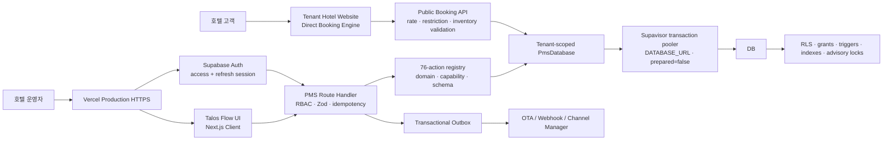
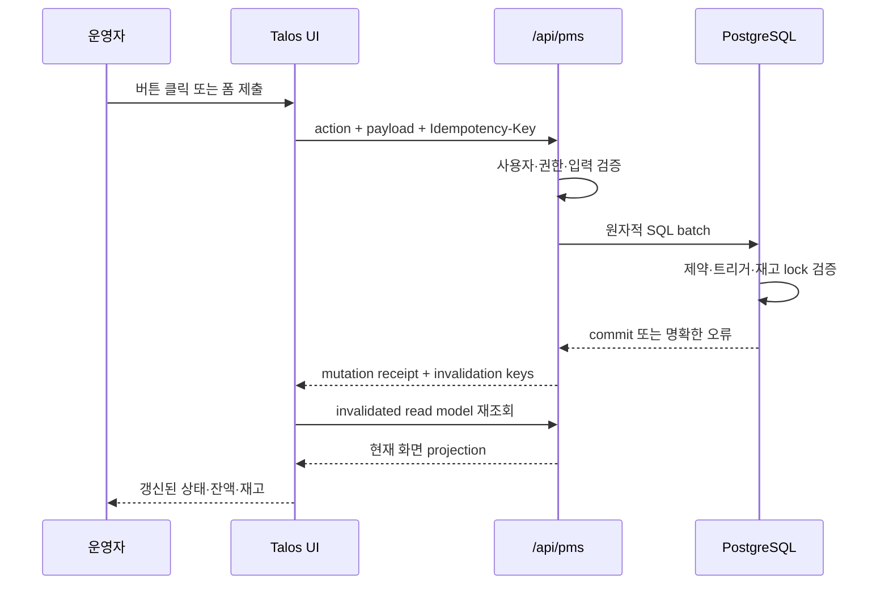
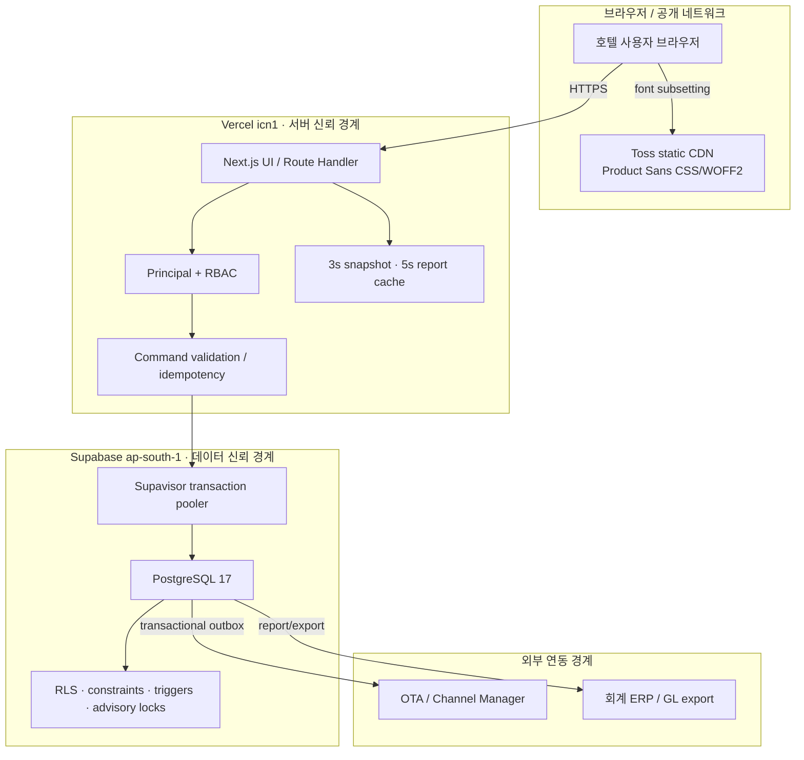
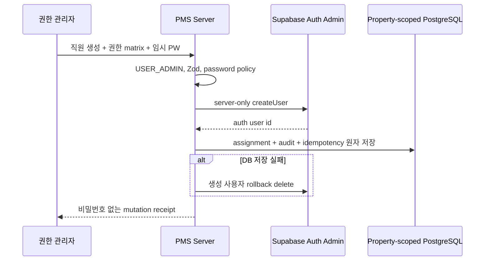

# Talos PMS 아키텍처와 설계 결정

## 제품 목표

Talos PMS는 호텔 운영자가 여러 시스템을 오가며 같은 정보를 반복 입력하는 문제를 줄이고, 다음 질문에 즉시 답할 수 있도록 설계했습니다.

- 오늘 도착·재실·출발 고객은 누구인가?
- 어떤 객실이 판매 가능하고 어떤 객실이 청소·점검·판매 중지 상태인가?
- 객실 타입별 날짜 재고와 판매 제한, 요금은 어떻게 설정되어 있는가?
- 개별 예약과 그룹 블록이 실제 하우스 재고에 어떤 영향을 주는가?
- 고객 폴리오와 회사 후불 매출채권의 잔액은 정확히 일치하는가?
- 누가 어떤 예약, 객실, 재고, 정산 데이터를 변경했는가?
- OTA 메시지나 Webhook 전송이 실패했을 때 안전하게 재처리할 수 있는가?
- 예약·점유율·ADR·RevPAR·정산·감사 데이터를 필터링하고 Excel로 받을 수 있는가?

## 핵심 설계 원칙

### 1. 데이터베이스가 마지막 방어선이다

UI 검증에만 의존하지 않습니다. 중복 객실, 초과 판매, 중복 픽업, 원장 수정, 중복 야간 전기처럼 재무·재고 무결성을 깨뜨릴 수 있는 동작은 PostgreSQL 제약조건, 트리거, 원자적 배치와 advisory lock으로 다시 검증합니다.

### 2. 기록은 수정하지 않고 반대 기록을 추가한다

폴리오와 AR 원장은 append-only입니다. 잘못된 전표를 `UPDATE`나 `DELETE`하지 않고 반대전표, 환불, 재전기 항목을 추가해 원인과 결과를 모두 보존합니다.

### 3. 모든 외부 연동은 재시도 가능해야 한다

OTA 메시지는 Message ID와 revision으로 순서를 검증하고, 처리 실패는 DLQ 성격의 수신 원장에 남깁니다. 코어 트랜잭션 이후 외부 전송은 transactional outbox에서 수행해 외부 장애가 예약 저장을 롤백시키지 않도록 분리합니다.

### 4. 역할과 권한은 서버에서 다시 확인한다

버튼 노출 여부는 편의 기능일 뿐입니다. 모든 쓰기 요청은 서버에서 현재 사용자의 역할과 capability를 검증합니다.

### 5. 사용자는 다음 행동을 고민하지 않아야 한다

각 화면은 현재 상태, 필요한 조치, 결과를 한 문장 안에서 설명합니다. 주요 행동은 강한 버튼, 보조 행동은 약한 버튼으로 구분하고 완료·실패·차단 상태를 즉시 보여줍니다.

## 전체 아키텍처

### 요청 처리 흐름

### 런타임 계층

| 계층 | 책임 |
| --- | --- |
| `app/login/page.tsx` | Supabase Auth 로그인, 실패·대기 상태, 세션 진입점 |
| `app/supabase-session.ts` | access token 검증, refresh, HttpOnly/Secure/SameSite cookie, logout |
| `app/page.tsx` | `/overview`로 보내는 제품 루트 redirect |
| `app/(pms)/*/page.tsx` | 14개 실제 업무 URL; 새로고침·북마크·딥링크·라우트 단위 진입 지원 |
| `app/(pms)/_components/pms-shell.tsx` | 공통 shell, 예약 Drawer와 업무 Modal, 상태 기반 CTA |
| `app/pms-navigation.ts` | 역할 우선순위와 페이지 권한을 결합한 그룹 메뉴·모바일 핵심 업무 |
| `app/global-pms-search.tsx` | 250ms debounce, 키보드 이동, 권한별 도메인 결과를 제공하는 통합 검색 |
| `app/frontdesk-workbench.tsx` | 서버 업무 큐·복합 필터·저장 보기·20건 페이지네이션 |
| `app/reservation-wizard.tsx` | 실시간 가용성부터 원자 예약 확정까지의 4단계 직원 예약 흐름 |
| `app/reservation-detail-panel.tsx` | 예약자/투숙자, 운영 옵션, 일자별 요금·취소정책, 연계·복사와 4종 인라인 로그 |
| `app/inventory-window.ts` | 장기 선택에서 14/30일 read/render 창과 벌크 영향 셀을 계산하는 순수 함수 |
| `app/pms-action-context.tsx` | 모든 workspace가 공유하는 command/busy Context; prop drilling 제거 |
| `app/query-provider.tsx` | TanStack Query client와 읽기 모델 cache lifecycle |
| `app/hotel/page.tsx` | 테넌트 호텔 공개 홈페이지, 객실·경험·위치·예약 검색 진입점 |
| `app/homepage-manager.tsx` | 반응형 실시간 미리보기, 히어로·메뉴·섹션 visual controls, 객실 콘텐츠·게시, 타입 생성, 이미지 업로드·삭제 Website Studio |
| `app/website-editor-contract.ts` | 에디터·명령 경계·공개 renderer가 공유하는 메뉴 allowlist, CTA·색상·layout 정규화 |
| `app/hotel/book/BookingClient.tsx` | 실시간 객실 검색, 예약자 입력, 멱등 예약 확정, 기존 예약 취소 |
| `app/inventory-calendar.tsx` | 최대 730일 선택·벌크와 14/30일 bounded calendar, 타입·요일 재고, 호텔·채널 판매가와 입금가 |
| `app/inventory-workspace.tsx`, `app/rate-block-matrix.tsx` | 호텔 전체 재고와 객실×상품×채널×날짜 블럭요금의 분리된 서브뷰; 31일/5,000셀 상한 |
| `app/accounting-center.tsx` | 매출·비용·손익, 복식부기 분개, 반대전표, 채널 정산 |
| `app/channel-catalog-manager.tsx` | 채널 catalog 2열 이동, 통합/수동 lifecycle, 순서·서플라이어·상품 마감 |
| `app/channel-contracts.tsx` | 수수료/입금가 채널 계약과 정산 조건 관리 |
| `app/hotel-catalog-manager.tsx` | 성수기·휴일·편의시설·서비스·이미지 호텔별 운영 master |
| `app/reports-center.tsx` | 15개 리포트 카탈로그, 복합 필터, 입금·복구, 페이지네이션, CSV/XLSX 다운로드 |
| `app/room-master.tsx` | 객실 타입과 실물 객실 생성·수정·대량 생성 |
| `app/api/pms/route.ts` | 47줄 HTTP 경계; GET/POST를 전용 모듈로 위임 |
| `app/api/pms/auth.ts` | Supabase identity, assignment, property scope, capability principal |
| `app/api/pms/action-registry.ts` | 모든 action의 도메인·필요 capability·Zod 입력 스키마 |
| `app/api/pms/command-gateway.ts` | command 실행, strict idempotency receipt, 감사·Outbox 기록 |
| `app/api/pms/read-model.ts` | core/full projection과 압축·짧은 읽기 cache |
| `app/api/pms/frontdesk-read.ts` | 권한 인식 통합 검색, 프런트 페이지, 예약 가용성·달력·단건 상세·인라인 로그 projection |
| `app/api/pms/voucher-service.ts` | tenant-scoped 예약·숙박객·상품·일자 요금의 바우처 전용 bounded projection |
| `app/api/pms/voucher-document.ts` | 국문/영문 HTML·PDF·XLSX 렌더링과 금액 표시 정책; PDF에 Noto Sans KR subset 임베딩 |
| `app/api/pms/hotelstory-catalog-service.ts` | 채널/상품 마감, 4축 블럭요금 projection·bulk command, 운영 카탈로그 CRUD |
| `app/api/pms/final-operations-service.ts` | 연회·당일 체크인/체크아웃·18일 점유·호텔/웹 회원의 bounded read와 원자 command |
| `app/hotelstory-final-operations.tsx` | 독립 URL 업무 큐, 연회 월 캘린더, 예약 CSV dry-run, 회원 관리 UI |
| `app/api/pms/reservation-imports/route.ts` | `RESERVATION_WRITE`·DATA_IMPORT entitlement·분산 rate limit을 적용한 operational import boundary |
| `app/api/pms/error-map.ts` | 안정된 DB 오류 코드/패턴을 HTTP 상태와 사용자 메시지로 매핑 |
| `app/api/booking/service.ts` | 공개 판매 타입, 투숙 제한, 일별 가용재고·요금 재계산, 예약·취소 원자 처리 |
| `app/api/booking/website-service.ts` | CMS에서 공개 승인된 호텔·객실·미디어만 읽는 서버 projection |
| `app/api/booking/*/route.ts` | 공개 availability와 reservation HTTP 계약, 분산 rate limit·same-origin 방어 |
| `app/api/rate-limit.ts` | Vercel 전체 instance가 공유하는 HMAC key 기반 PostgreSQL 원자 카운터 |
| `app/api/health/route.ts` | secret을 노출하지 않는 데이터베이스 readiness/latency probe |
| `app/api/pms/extended.ts` | 장기 벌크 재고, 채널 요금·계약·정산, 복식부기 회계 서비스 |
| `app/api/pms/reporting.ts` | 서버 사이드 리포트 쿼리, 필터, 요약, 마스킹, 행 제한 |
| `db/pms-database.ts` | `SET LOCAL ROLE aurora_app` + `app.property_id`를 매 transaction에 설정하는 PostgreSQL adapter |
| `supabase/migrations/` | 유일한 스키마 원본: PostgreSQL DDL, RLS, 함수, 트리거, 인덱스 |
| `scripts/qa-full-workflow.mjs` | 더미데이터 기반 전체 업무 Loop QA |

### 시스템 경계와 신뢰 경계

- 브라우저에는 Supabase Secret Key, DB URL, 직접 SQL 실행 권한을 제공하지 않습니다.
- 런타임은 server-only `DATABASE_URL`로만 SQL을 실행하며 SQL text를 받는 `SECURITY DEFINER` RPC는 migration `202607170009`에서 revoke 후 삭제합니다.
- UI에서 버튼을 숨기더라도 서버가 capability를 다시 검사하므로 클라이언트 변조가 권한 상승으로 이어지지 않습니다.
- 외부 채널 전송과 회계 ERP export는 코어 원장의 결과를 소비하는 경계이며, 코어 예약 트랜잭션을 외부 응답 성공 여부에 묶지 않습니다.

### 읽기 모델과 쓰기 모델

Talos PMS는 초기 운영 복잡도를 줄이기 위해 단일 API route를 사용하지만, 내부적으로 읽기와 쓰기의 책임을 분리합니다.

| 모델 | 진입점 | 특징 |
| --- | --- | --- |
| Core Snapshot | `GET /api/pms?view=core` | 오늘 도착·현재 재실·오늘 체크아웃과 객실·14일 재고만 제공; 과거 전체 예약은 제외 |
| 프런트 페이지 | `GET /api/pms?view=frontdesk` | 업무 큐·복합 필터·정렬·최대 50행 server pagination |
| 통합 검색 | `GET /api/pms?view=search` | 현재 직원이 열 수 있는 예약·객실·AR 도메인만 각각 8/6/6건 반환; AR 잔액은 청구서의 저장 값이 아니라 원장 debit-credit 합계로 계산 |
| 예약 가용성 | `GET /api/pms?view=reservation_availability` | 최대 30박의 타입 재고·블록 hold·Rate Plan·MLOS·CTA·CTD·일자 요금 계산 |
| 예약 달력 | `GET /api/pms?view=reservation_calendar` | 한 상품·한 달의 일자별 타입 가격과 잔여/전체 재고를 고정 배치로 계산 |
| 예약 상세 | `GET /api/pms?view=reservation_detail` | 단일 예약의 예약자/투숙자, 상품 snapshot, 일자 요금, 연계예약과 200건 이하 분류 로그 |
| 채널 설정 | `GET /api/pms?view=channel_catalog` | 카탈로그·호텔 설정·연결·상품 마감을 4개 고정 쿼리로 projection |
| 블럭요금 | `GET /api/pms?view=rateblock` | 최대 31일, 활성 채널/매핑, 객실·예약·그룹 hold와 날짜별 override를 4개 고정 쿼리로 projection |
| 운영 카탈로그 | `GET /api/pms?view=hotel_catalogs` | 성수기·휴일·편의시설·서비스·이미지를 5개 고정 쿼리로 projection |
| 예약 바우처 | `GET /api/pms?view=reservation_voucher` | 단일 예약의 KR/EN 확인서; JSON preview와 export 권한을 적용한 HTML/PDF/XLSX 문서 |
| 당일 운영 | `GET /api/pms?view=stay_operations&mode=checkin|checkout|occupancy` | 기준일·복합필터의 체크인/아웃 queue와 정확히 18일 객실 timeline |
| 연회 | `GET /api/pms?view=banquet&month=YYYY-MM` | 한 달의 연회장 master·행사와 검색/장소/상태 필터 |
| 회원 | `GET /api/pms?view=hotel_members` | 최대 500명의 서버 필터 회원 projection; 지원 principal은 PII 마스킹 |
| 예약 가져오기 | `GET/POST /api/pms/reservation-imports` | 이력, dry-run, 원자 commit/replay와 변경되지 않은 entity rollback |
| 장기 재고 | `GET /api/pms?view=inventory` | 선택은 730일까지 허용하되 UI가 한 요청당 14/30일만 조회 |
| 회계 센터 | `GET /api/pms?view=accounting` | 기간별 journal, settlement, account, P/L summary를 별도 조회 |
| 리포트 | `GET /api/pms?view=report` | 필터·정렬·페이지네이션·마스킹이 적용된 서버 읽기 모델 |
| Command | `POST /api/pms` | action별 capability·Zod·상태·멱등 키를 검증하고 원자 batch 실행 후 작은 receipt만 반환 |

### 원자성 단위

- 예약 생성: guest + reservation + folio window + 타입/객실 night + audit + outbox가 하나의 batch입니다.
- 예약 상세: staying guest + booker/option reservation update + version mutation + audit + outbox + idempotency가 하나의 batch입니다.
- 예약 바우처 메일: immutable document snapshot + delivery + `VOUCHER_EMAIL` worker job + audit + idempotency가 하나의 batch입니다.
- 연회 예약: venue/day advisory lock 아래 overlap trigger + 예약 + before/after audit + idempotency가 하나의 batch입니다.
- 회원 저장·활성·비밀번호: 회원 projection + redacted audit + idempotency가 하나의 batch이며 비밀번호 원문은 transaction 경계를 넘지 않습니다.
- 예약 CSV: commit job + 내장 guest/mapping + reservation/folio/night + import entity + audit + dry-run 완료 전이가 하나의 batch입니다.
- 그룹 픽업: block pickup night + reservation night + rooming 상태가 같은 트랜잭션에서 이동합니다.
- AR 이관: invoice debit + folio direct-bill payment + window 상태 전이가 함께 commit됩니다.
- 회계 수기 전표: journal header + 모든 debit/credit line + audit + idempotency가 함께 commit됩니다.
- 채널 정산: settlement + 회계 journal + audit + idempotency가 함께 commit됩니다.
- 반대전표: 원전표 `REVERSED` 전환 + 반대 journal + audit가 함께 commit됩니다.

## 아키텍처 결정 기록

| ADR | 결정 | 이유 | 결과/트레이드오프 |
| --- | --- | --- | --- |
| ADR-001 | 모듈러 모놀리스와 단일 `/api/pms` HTTP endpoint | PMS 업무는 강하게 연결되어 있어 분산 트랜잭션보다 한 배포 단위가 안전함 | HTTP는 하나지만 auth/read/command/registry/error/domain 모듈은 분리 |
| ADR-002 | `supabase/migrations/`를 유일한 schema source로 사용 | runtime DDL, SQLite mirror, 정규식 dialect 변환 사이 drift 제거 | 로컬 검증도 PostgreSQL service에서 실제 migration을 실행 |
| ADR-003 | Vercel은 Supavisor transaction-mode `DATABASE_URL` 사용 | 임의 SQL RPC라는 단일 장애점을 없애면서 serverless 연결을 pooler로 수렴 | `postgres` prepared statement를 끄고 짧은 connection lifetime을 사용 |
| ADR-004 | `reservation_nights`와 `reservation_type_nights` 분리 | 실물 객실 중복과 객실 타입 overbooking은 서로 다른 제약 문제 | 저장량은 늘지만 배정 전 예약과 배정 후 객실을 모두 정확히 보호 |
| ADR-005 | 폴리오·AR·회계 line append-only | 재무 기록의 변경 이력을 없애지 않고 감사 가능하게 유지 | 정정은 반드시 reversal workflow를 사용 |
| ADR-006 | 채널 mapping과 commercial contract 분리 | 외부 Room/Rate ID 변경이 수수료·입금가 계산과 과거 정산을 훼손하지 않게 함 | 운영자가 기술 매핑과 계약 조건을 각각 관리해야 함 |
| ADR-007 | 계약 조건을 settlement에 snapshot | 계약 변경 뒤에도 과거 판매가·수수료·입금가 재현 | 중복 데이터가 생기지만 역사적 정확성이 우선 |
| ADR-008 | 장기 캘린더·회계를 전용 range view로 분리 | 기본 대시보드 payload와 장기 조회 비용을 분리 | 화면마다 별도 loading/error 상태가 필요 |
| ADR-009 | Snapshot gzip + 짧은 in-memory cache | 422KB 수준의 운영 응답을 동시 전송할 때 발생한 p95 병목 제거 | instance 간 cache는 공유되지 않지만 쓰기 직후 전체 invalidation 수행 |
| ADR-010 | Vercel Seoul `icn1` + Fluid Compute | 한국 호텔 사용자의 read-heavy snapshot·인증·정적 응답을 현지 처리하고 instance 공유로 cold start 완화 | DB miss·쓰기는 Supabase `ap-south-1`까지 한 번의 리전 간 왕복이 필요 |
| ADR-011 | Toss Product Sans를 공식 CDN에서 runtime 로드 | 실제 Toss 타이포그래피를 적용하면서 폰트 파일을 저장소에 재배포하지 않음 | 외부 CDN 가용성과 사용 조건 확인이 필요 |
| ADR-012 | 인증·멱등성·rate limit을 DB 불변식으로 승격 | Host·instance memory·사전 조회는 production 보안 경계가 될 수 없음 | demo는 명시 token, 금전 receipt는 strict unique insert, rate limit은 공유 UPSERT |
| ADR-013 | transaction-local tenant context + NOBYPASSRLS app role | 문자열 `replaceAll`로 property literal을 치환하면 누락 쿼리를 정적으로 보장할 수 없음 | adapter가 매 statement/batch에 `aurora_app`과 `app.property_id`를 설정하고 DB가 교차 접근 거부 |
| ADR-014 | 실제 workspace URL + action Context | `useState` 화면 전환은 새로고침과 딥링크가 깨지고 공통 props가 전 컴포넌트로 전파됨 | 13개 App Router 경로와 공용 command context 사용 |
| ADR-015 | command receipt + TanStack Query invalidation | 객실 1실 변경에도 30개 쿼리 snapshot을 재계산·재렌더하던 God payload 제거 | POST는 변경 참조만 반환하고 UI가 관련 projection cache를 무효화 |
| ADR-016 | PostgreSQL service 기반 CI behavior gate | 소스 정규식과 테스트 내부 SQLite trigger는 운영 schema drift를 잡지 못함 | PR마다 빈 PostgreSQL 17에 전체 migration을 적용하고 실제 RLS·trigger·경합 실행 |
| ADR-017 | 예약자와 투숙자를 다른 운영 개념으로 저장 | 여행사·회사·가족 예약에서는 결제/연락 주체와 실제 투숙자가 다름 | booker는 예약 snapshot, guest는 투숙자 profile이며 상세 화면과 감사에 함께 투영 |
| ADR-018 | 취소정책·일자요금 예약 시점 snapshot | 상품 master 변경이 과거 바우처·취소수수료·정산 근거를 바꾸면 안 됨 | JSONB cancellation terms와 immutable night rates를 상세/바우처가 우선 사용 |
| ADR-020 | 바우처 문서 snapshot과 비동기 전달 분리 | 문서 생성 뒤 예약이 바뀌거나 메일 제공자가 느려도 사용자 요청과 전달 증빙이 일관돼야 함 | queue 시점 payload를 JSONB로 고정하고 worker가 provider idempotency key로 전달; PAN·내부 메모는 projection에서 제외 |
| ADR-021 | 채널 catalog와 기술 연결을 분리 | 호텔 운영자가 OTA 목록·수기 채널·노출 순서를 외부 adapter ID와 혼동하지 않게 함 | catalog→property setting→connection→mapping 계층, 설정 비활성 시 API와 worker의 ARI 대상에서 즉시 제외 |
| ADR-022 | 채널 블럭요금을 독립 4축 원장으로 저장 | 전체 호텔 재고와 채널 할당·입금가·판매제약은 수명과 전송 대상이 다름 | `channel_rate_overrides`의 mapping/date unique upsert와 DB trigger, 같은 transaction의 ARI·Outbox 사용 |
| ADR-023 | 연회 중복을 venue/day advisory lock과 trigger로 방어 | API 사전 조회만으로는 두 요청이 같은 빈 시간대를 동시에 통과함 | 활성 가예약/확정만 시간 교집합을 검사하고 완료/취소는 시간을 해제 |
| ADR-024 | 호텔 회원과 직원 권한 계정을 분리 | 고객·웹 회원을 `role_assignments`에 넣으면 PMS 접근 권한과 개인정보 생명주기가 혼합됨 | `hotel_members`는 고객 master이며 Supabase 직원 Auth·workspace capability와 독립 |
| ADR-025 | 예약 import를 검증 job과 commit job으로 분리 | Excel 행 오류가 일부만 반영되거나 네트워크 재시도로 중복 예약이 생기면 복구가 어려움 | content hash dry-run, 전량 원자 commit, commit replay와 변경 여부를 확인한 rollback |
## 직원 계정·권한 아키텍처

Supabase Auth는 이메일/비밀번호 검증과 세션만 담당합니다. 권한은 변경 가능한 `user_metadata`가 아니라 tenant table인 `role_assignments`의 `property_id`, `active`, `workspace_permissions`, `can_export`, `must_change_password`에서 해석합니다. Root DB는 인증 직후 닫힌 `findActiveRoleAssignments(authUserId, email)` capability로 Auth user ID와 이메일이 모두 일치하는 배정만 읽습니다. 연결되지 않은 레거시 이메일 행은 권한으로 승격되지 않으며, 이후 직원 목록·변경·업무 데이터는 모두 property-scoped adapter와 RLS를 통과합니다.

페이지 `WRITE`는 도메인 capability 묶음으로 변환되고, action registry가 매 요청에서 이를 다시 확인합니다. 페이지 `READ`는 해당 GET projection만 허용합니다. 최초 로그인/관리자 PW 재설정 후에는 `must_change_password`가 모든 PMS GET/command를 `428`로 막고 비밀번호 교체 endpoint만 허용합니다.

### ADR-019 · 역할 템플릿 + 사용자별 권한 matrix

고정 역할만 사용하면 같은 프런트 직무에서도 폴리오를 입력할 사람과 예약만 조회할 사람을 구분할 수 없습니다. 반대로 capability를 사용자 화면에 직접 노출하면 운영자가 이해하기 어렵습니다. 따라서 직무는 초기 템플릿, 14개 페이지의 없음/조회/입력은 영속 권한, capability는 서버가 계산하는 실행 권한으로 분리했습니다. 이 구조는 사용자 친화성과 서버 강제를 동시에 유지합니다.
