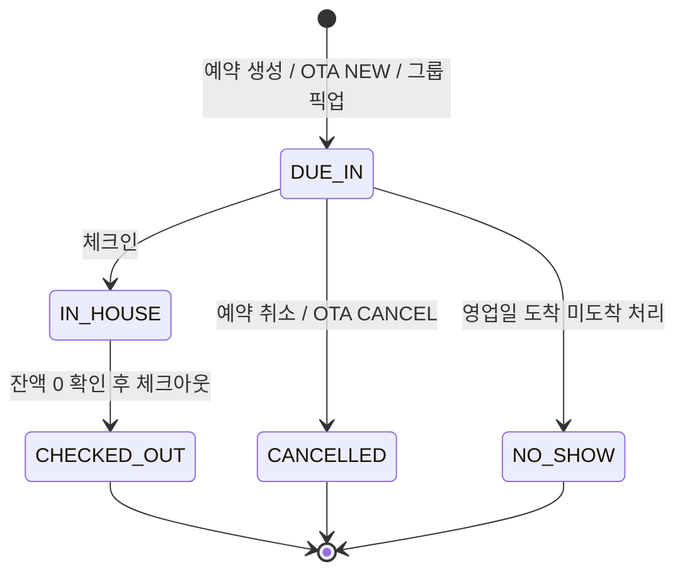
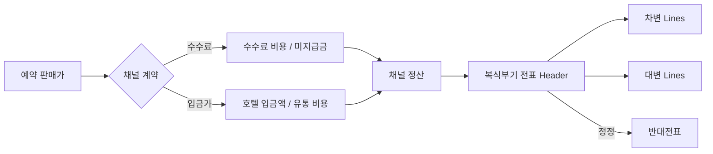
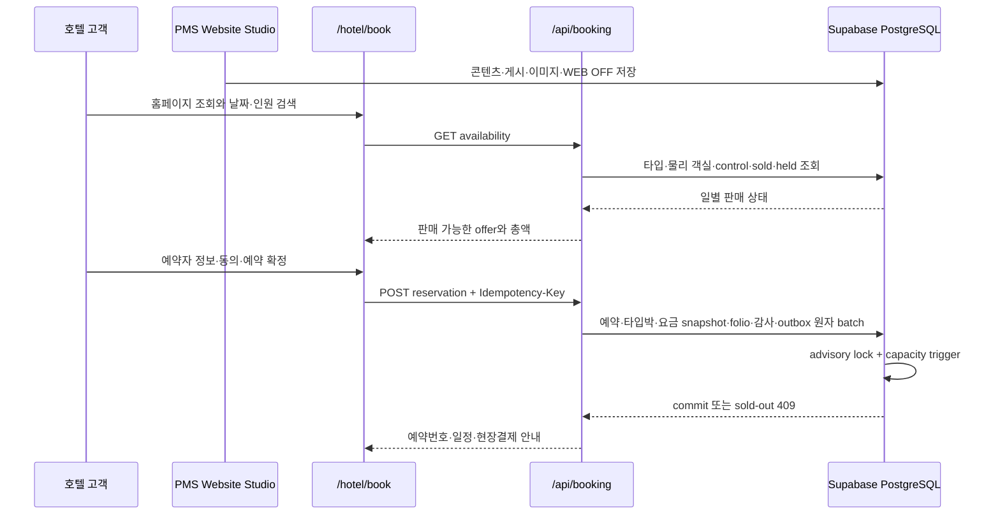

# Talos PMS 기능 및 업무 명세

## 화면 및 기능 명세

### 1. 오늘의 오퍼레이션

- 오늘 도착 건수와 객실 배정 완료 수
- 현재 투숙 건수와 VIP 고객 수
- 물리 객실 기준 실시간 점유율
- 오늘 투숙 예약 기준 예상 객실 매출과 ADR
- ETA 기반 도착 플로우와 예약 상세 진입
- 청소/점검 완료, 청소 필요, 판매 중지 객실 현황
- 객실 준비 우선순위를 안내하는 운영 인사이트
- 알림 패널에서 도착, 객실, 인터페이스 문제 화면으로 즉시 이동

### 2. 프런트 데스크

- 고객명, 예약번호, 전화, 이메일, 채널 예약번호, 객실번호를 찾는 권한 인식 전역 검색
- 오늘 업무/전체/도착 예정/재실/오늘 출발/미배정/잔액 있음의 실행 큐
- 날짜 기준·기간·상태·채널·객실 타입·배정·잔액·정렬의 서버 필터와 20건 페이지네이션
- 호텔·기기별 최대 8개의 저장 보기
- HotelStory형 와이드 예약 상세 Drawer: 좌측 예약·상품·일자별 요금·취소정책, 우측 예약자/투숙자·옵션·메모
- 예약자 이름·전화·이메일과 실제 투숙자 정보를 별도 저장하고 서로 다른 경우도 정상 처리
- 고객요청/호텔응답, 관리자메모/호텔메모, 예약 확인, 결제구분, 서비스 요금 포함, 얼리체크인/레이트체크아웃 시간
- 원문 카드번호 대신 PG token 또는 마스킹된 Card Info 참조만 저장; 공백·하이픈 등 구분자를 제외한 숫자가 12자리 이상이면 서버와 DB에서 거부
- 예약변경·연계예약·예약복사·상세저장·취소접수 동작과 동반/연박/그룹 연계 목록
- 예약 상세 하단의 연동로그/수정로그/요금로그/블럭로그; actor·시각·before/after와 immutable 일자 요금 표시
- 예약 바우처 dialog에서 국문/영문, 금액 표시/숨김, 제목·수신자를 선택하고 PDF·Excel·인쇄·메일 전송
- `/frontdesk/checkin`과 `/frontdesk/checkout` 전용 URL에서 기준일·고객·예약·전화·객실·채널·객실타입·판매상품 필터와 예약 상세 딥링크
- `/frontdesk/occupancy`에서 객실 행×18일 날짜 열 점유 timeline, 상품·채널·객실타입 선택과 예약 cell 상세 이동
- `/frontdesk?view=board&from=YYYY-MM-DD&days=7|14|30`에서 실제 객실×숙박일 배정 보드, sticky 객실/날짜 축, 미배정 tray, 내부 가로 스크롤과 공유 가능한 딥링크
- 보드의 빈 셀은 날짜·객실타입·실물 객실을 새 예약에 미리 채우고, 예약 막대는 상세 Drawer·전체 숙박일 재배정·선택일 이후 룸 무브·배정 해제로 연결
- 드래그가 어려운 운영자를 위해 모든 배정에 `객실 선택` 키보드 동선을 제공하고, 타입 불일치·DIRTY 객실은 확인 후 감사 로그에 override 사유를 남김
- `/frontdesk/imports`에서 Excel용 CSV 양식 다운로드, 2,000행 dry-run, 행 오류, 원자 반영, 같은 파일 replay와 안전 rollback 이력; 모든 변경 요청은 Supabase AAL2 MFA 세션을 기본 요구
- 예약 import의 commit/rollback은 요청 job이 `RESERVATIONS` 종류인지 서버에서 다시 확인해 다른 데이터 이관 job ID 오용을 차단
- import한 예약은 CSV의 flat nightly rate를 숙박일별 immutable `reservation_rate_nights`로 생성해 예약·매출·리포트가 같은 야간 원장을 사용
- PDF는 한글 글꼴을 문서에 subset 임베딩하고, 금액 숨김은 HTML·PDF·XLSX 모두 동일한 서버 정책을 사용
- 메일은 예약 시점 문서 snapshot을 durable worker에 넣고 delivery ID 멱등 키로 중복 발송을 방지하며 PAN·관리자/호텔 내부 메모를 포함하지 않음
- 예약 일정·객실 타입·인원·요금·ETA 수정
- 미배정 예약의 전 숙박일 물리 객실 배정; `reservation_type_nights`의 타입 재고 차감은 그대로 유지
- 체크인, 체크아웃, 노쇼, 예약 취소
- 선택일을 포함한 이후 숙박일만 이동하는 룸 무브와 사유 기록; 대표 `room_id`는 호텔 영업일의 실제 객실을 가리킴
- 캐셔 세션이 열린 경우 비용 전기와 결제
- `Cmd/Ctrl + K`로 검색창 즉시 포커스
- 새 예약은 HotelStory형 `목록으로 찾기 / 달력으로 찾기`에서 상품·일정·인원을 고른 뒤, 실시간 객실·요금, 고객·배정, 검토·확정의 4단계로 진행
- 목록은 객실종류·조식여부·기준/최대인원·총액·예약 선택을 한 행에서 비교하고, 달력은 월 이동·상품·인원 필터와 일자별 가격·잔여/전체 객실을 표시
- 목록과 달력은 동일한 고정 배치 projection을 사용해 물리 객실, 판매 한도, 확정 예약, deduct block, 판매 중지, 상품 일자·인원 요금을 일관되게 계산
- 예약 확정 시 모든 숙박일의 가용 재고·판매 제한·MLOS·CTA·CTD를 서버에서 다시 검증
- 확정 당시의 요금제·통화·일별 판매가를 `reservation_rate_nights`에 보존

### 3. 재고 & 요금

- HotelStory식 판매 상품 master: 상품 코드·이름·설명·식사·패키지·포함사항·판매 시각·투숙 유효일·정렬 순서
- 부모 상품의 객실/일자 요금을 금액 또는 비율로 상속하는 파생 상품
- 상품별 기준/최대 인원과 인원별 추가요금; PostgreSQL 함수가 일자 override·부모 요금·인원 요금을 한 번에 산출
- 예약 생성 시 상품 ID, 이름, 식사, 패키지, 포함사항, 취소/보증 정책과 예약 인원을 JSONB snapshot으로 고정
- 30/90/180/365일 프리셋과 임의 시작·종료일을 지원하는 최대 730일 선택 범위
- 장기 범위를 선택해도 API·화면은 14일 또는 30일 창만 읽고 렌더링하는 날짜 페이지
- 객실 타입 검색과 페이지당 10개 타입 제한, 재고/요금제/채널 세부 모드 분리
- 객실 타입·요일·기간을 선택하는 최대 5,000셀 벌크 변경
- 물리 객실, 예약, 그룹 hold를 반영한 가용 수량
- 날짜별 판매 한도(sell limit)
- 판매 중지(stop-sell)
- 최소 숙박(MLOS)
- CTA/CTD
- PMS 호텔 판매가와 날짜별 요금 override
- 채널 매핑별 고객 판매가와 호텔 입금가
- 수수료 계약의 판매가 대비 수수료율 동시 표시
- 날짜·객실 타입 sticky header와 가로 스크롤 캘린더
- 예약 수량 아래로 판매 한도를 내리는 잘못된 변경 차단
- 50개가 넘는 타입·일자 셀을 변경할 때 계산된 영향 범위의 명시적 재확인
- `블럭요금관리` 서브뷰의 Today/1W/2W/4W/Month 프리셋, 채널·객실 필터와 객실>상품 sticky 행
- 셀/일괄 편집의 채널 할당, 판매가, 입금가, Closed, MLOS, CTA, CTD 및 요일 선택
- 최대 31일 조회·5,000셀 저장 상한, 물리 객실 초과 할당 DB trigger, 활성 채널·상품·계약 재검증
- 날짜 루프당 네트워크 왕복을 만들지 않고 물리/예약/hold/revision을 고정 batch로 읽은 뒤 override·ARI·Outbox를 chunked multi-row insert

판매 상품 editor는 운영자가 긴 자유문자를 기억하지 않도록 `기본 정보 → 판매·숙박 조건 → 가격 상속·인원별 요금` 순으로 배치한다. 상품 card에는 판매 상태, 식사, 기준/최대 인원, 숙박 범위, 포함사항을 노출한다. 1:1 이식 범위와 남은 단계는 [HotelStory 벤치마크 추적표](hotelstory-parity.md)에서 관리한다.

### 2-1. 연회 예약

- `/groups/banquet` 월 캘린더에서 연회장·상태·행사명·담당자·전화 검색
- 연회장 코드·이름·수용 인원·위치·시설과 활성 상태 master
- 행사일·연회장·시작/종료 시각·행사명·담당자·연락처·예상 인원·요금·상태·메모 등록/편집
- 같은 연회장과 날짜의 가예약/확정 시간대가 겹치면 DB가 병렬 요청까지 차단

### 2-2. 호텔·홈페이지 회원

- `/users/members`에서 이름·전화·로그인 ID·회사·회원코드 통합검색과 호텔/홈페이지/통합 회원 필터
- 회원코드, 회원 구분, 이름, 전화, 이메일, 회사, 등급, 관리자 유형, 가입일, 활성 상태 등록/수정
- 12자·문자군 3종 이상의 비밀번호 변경; random salt를 적용한 scrypt 해시만 저장
- 지원 계정의 개인정보 마스킹과 호텔별 FORCE RLS 격리

### 4. 그룹 & 세일즈

- 회사, 여행사, Source, 그룹 프로필 생성
- 현금/후불 승인 상태와 협상 요금 코드
- Tentative/Definite 비즈니스 블록 생성
- Deduct/Non-deduct 블록
- 날짜·객실 타입별 original/current/picked-up 수량
- Rooming list 등록
- Rooming entry를 실제 예약으로 원자 픽업
- Cutoff 시 미픽업 수량 자동 반환

### 5. 폴리오 & AR

- Guest ledger, AR ledger, gross revenue, net payments 요약
- 예약별 다중 폴리오 창
- 고객/회사/여행사/그룹 payee
- 거래 코드별 폴리오 라우팅
- 세금·봉사료 포함 금액 분해
- 전표 분할, 반대전표, 결제 환불
- 회사 후불 AR 이관과 청구서 생성
- 신용 한도 검증
- AR 부분/전액 수납과 완납 처리

### 6. 회계 & 손익

- 계정과목표(Chart of Accounts), 계정 코드, 부서·코스트센터
- 기간별 총매출, 총비용, 영업손익, 채널 미수금, 채널 유통 비용 KPI
- 한 전표 안에서 차변·대변 합계가 일치하는 복식부기 분개
- 객실 매출, 기타 매출, 운영 비용, 유통 비용, 현금, 미수금, 미지급금 기본 계정
- 수기 매출·비용·조정 전표와 거래처·적요 기록
- 확정 원장 line 수정·삭제 금지
- 잘못된 전표는 동일 금액의 차변·대변을 뒤집은 반대전표로만 정정
- 채널 정산 발생과 입금·지급 완료 시 회계 전표 자동 생성
- 전표별 상세 line drill-down과 원전표/반대전표 상태 추적

### 7. 채널 허브

- 아고다·부킹닷컴·익스피디아·야놀자·여기어때·마이리얼트립·네이버·올마이투어·직판·전화·워크인·기업 채널 기본 카탈로그
- 설정 가능/설정 완료 2열 검색, 드래그 등록·정렬, 사용/중지·수정·삭제와 별도관리 채널 생성
- 연동채널/자체채널 배지, 외부 호텔 ID, 서플라이어명·코드·JSON 설정, 채널 기본 D-n 마감
- 상품별 D-n·마감시각 override; 채널 중지는 신규 수동 ARI, 블럭요금 projection과 worker 전달 대상에서 즉시 제외
- 저장한 채널 순서는 채널 허브·대시보드 채널 구성·채널 정산 리포트에 반영
- 샌드박스 채널 연결
- 연결별 수수료 계약/입금가 계약, 유효 기간, 정산 주기, 지급 조건
- 수수료형: 판매가 × 수수료율을 채널 유통 비용과 미지급금으로 인식
- 입금가형: 판매가 − 호텔 입금가를 채널 유통 비용으로 인식
- 예약별 총 판매가, 채널 비용, 호텔 입금가, 만기일, 지급 상태 대사
- 외부 Room/Rate ID와 내부 객실 타입/요금제 매핑
- 날짜별 ARI delta 생성
- `roomstosell`, closed, MLOS, CTA, CTD, rate payload
- ACK와 장애 주입
- NEW/MODIFY/CANCEL 예약 메시지
- Message ID 멱등 처리와 revision 순서 검증
- 실패 메시지 격리와 DLQ 재처리
- Outbox 전송 실패와 재전송

### 7-1. 숙소 운영 카탈로그

- 성수기: 최성수기/성수기/준성수기/비수기/이벤트 기간과 금액·비율 조정
- 휴일: 공휴일/호텔 휴일/지역행사를 native `date`로 관리
- 편의시설: 호텔별 코드·분류·아이콘·정렬·활성 상태
- 서비스: 식음·교통·스파·이벤트·객실 서비스와 포함/고정/인당/박당 가격
- 이미지: 홈페이지 CMS의 호텔·객실 이미지를 같은 운영 카탈로그 탭에서 확인하고 편집기로 연결

### 8. 룸 & 하우스키핑

- 전체/청소 필요/청소 완료/점검 완료 필터
- 공실·재실 상태와 하우스키핑 상태 동시 표시
- 담당자와 작업 상태 표시
- 청소 완료, 점검 완료 처리
- 체크아웃·룸 무브 발생 시 출발 객실 자동 Dirty 처리
- 판매 중지 객실의 예약 배정 차단

### 9. 리포트 센터

- 표준 리포트 15종: 기존 예약·점유·재무·회계·채널정산·AR·객실·그룹·연동·감사·마스터와 예약곡선·채널입금·후불정산·전년비
- 예약 상세의 property timezone 기준 리드타임과 0–6/6–12/12–18/18–24시 예약 시간대
- 월별 BOOK/REV 전년 대비, 후불 계정의 최종 수납일·연체일
- 채널 미입금만 보기, 수기·현장결제 제외, 권한 기반 입금처리·입금복구
- 입금일·메모·호텔 입금가·회계 전표와 불변 RECEIPT/RESTORE 이력
- 키워드, 기간, 상태, 채널, 객실 타입 복합 필터
- 서버 페이지네이션과 요약 KPI
- 권한에 따른 개인정보 마스킹
- CSV와 실제 `.xlsx` 워크북 다운로드
- 감사 가능한 export history 기록
- 카탈로그 업무 그룹, 즐겨찾기, 최근 사용 5개
- 조회 조건 이름 저장·재적용·삭제와 활성 필터 chip
- 오늘/최근 7일/최근 30일 프리셋, 객실 타입 검색, 페이지당 25/50/100행
- CSV/XLSX 생성 전 리포트·기간·행 수·개인정보 정책 확인 팝업

### 10. 객실 마스터

- 객실 타입 생성·수정·활성화
- 실물 객실 생성·수정·활성화
- 연속 객실번호 최대 500실 대량 생성
- 중복 객실번호가 하나라도 있으면 전체 작업 차단
- 미래 예약이 연결된 타입/객실의 위험한 비활성화 차단
- 재실 객실 비활성화 차단
- 편집 모달 높이를 뷰포트에 제한하고 입력 영역만 스크롤
- 저장·취소 action bar를 하단 고정해 작은 화면에서도 항상 노출

### 11. 매출 & 인사이트

- 7일 객실료 순매출
- 반대전표 반영
- 예약 채널별 생산 비중
- 원장과 동일한 데이터를 사용한 시각화

### 12. 야간 감사

- 미처리 도착, 열린 캐셔, 실패 인터페이스, 판매 중지 객실 검증
- 차단 항목에서 해당 업무 화면으로 이동
- 재실 객실의 미전기 객실료 미리보기
- 영업일별 중복 객실료 전기 차단
- 조건 충족 시 객실료 전기, 블록 cutoff, 영업일 전환을 원자 실행

### 전역 검색·버튼·오버레이 UX 규약

Talos PMS의 대량 목록 검색은 공용 `ListSearch` 컴포넌트를 사용합니다. 입력 즉시 클라이언트 목록을 필터링하고 현재 결과 건수를 `aria-live`로 알리며, 검색어가 있을 때만 지우기 버튼을 노출합니다. 서버 집계가 필요한 리포트는 필터 입력과 `조회`를 분리하고 `초기화`로 영업일 기본값을 복원합니다.

검색 문자열은 PostgreSQL과 브라우저에서 NFKC·공백·대소문자를 공통 정규화하고, 전화번호는 하이픈 없이 입력해도 일치합니다. 고객명은 화면 표기 순서뿐 아니라 한국어의 `성+이름` 순서로도 조회하며 `%`, `_`, `\`는 SQL 와일드카드가 아닌 리터럴로 처리합니다. 한국어 초성(`ㄷㄹㅅ` → `디럭스`)과 토큰 순서가 다른 복합 검색을 지원하고, 원 검색이 0건일 때만 보수적인 두벌식 교정을 시도해 `rlaalswl`을 `김민지`로 찾습니다. 일반 영문 이름은 임의로 한글로 바꾸지 않습니다.

통합 검색 랭킹은 정확 token → 접두 → 부분 → 초성 → `pg_trgm` 유사도 순이며, 동일 품질에서는 최근 변경 1/7/30일 가중치와 안정된 ID 순서를 사용합니다. `pms_search_documents`와 `pms_search_terms`는 예약·고객·객실·객실타입·채널 예약번호·AR 변경 trigger가 즉시 갱신하고, `property_id` 복합 GIN과 FORCE RLS로 호텔 범위를 DB에서 강제합니다. 도메인별 query-bound keyset cursor에는 검색어 원문이 없으며 랭킹·기준시각·ID 이후 결과를 이어 읽어 데이터가 커져도 offset 중복·누락이 없습니다.

사용자가 실제로 연 검색 결과만 4시간 동안 `sessionStorage`에 보존해 최근/빈번 엔터티를 제안합니다. 저장 key는 호텔과 로그인 identity를 SHA-256으로 분리하고 로그아웃 때 전부 제거하며, 검색어 자체는 저장하지 않습니다. 서버의 `pms_search_quality_daily`도 검색어·hash·사용자·entity를 갖지 않고 query 길이, 문자군, 교정 여부, 결과·지연 bucket과 횟수만 원자 집계합니다.

통합검색의 객실·AR 결과는 `focus` 딥링크로 대상 카드를 필터보다 우선 노출하고 스크롤·포커스·강조하며, 프런트와 리포트의 적용 조건은 URL에 보존되어 새로고침과 공유가 가능합니다. 통합검색 combobox는 활성 option을 `aria-activedescendant`로 알리고, 1자 입력·0건·오류·교정·이어보기 상태를 명시적으로 안내합니다.

로컬 검색은 화면마다 문자열 비교를 재구현하지 않습니다. `lib/pms-search.ts`가 객실·재고·채널·그룹·세일즈·폴리오·AR·홈페이지·직원·예약 상품의 검색 문서를 정의하고, 모든 문서는 `lib/search.ts`의 동일한 정규화·compact·초성 엔진을 호출합니다. `tests/pms-search-engine.test.mjs`는 화면이 실제 사용하는 도메인 함수를 더미 데이터로 실행해 전각문자, 이름 역순, 구두점 제거, 초성, 무결과를 검증합니다.

| 화면 | 검색·필터 대상 | 검색 결과와 빈 상태 |
| --- | --- | --- |
| 프런트 데스크 | 고객명, 예약번호, 객실번호 | 전체/도착/재실 상태와 조합, 결과 0건 안내 |
| 재고 & 요금 | 객실 타입 코드·이름 | 선택 기간은 유지하고 캘린더 행만 즉시 축소 |
| 홈페이지 관리 | 타입 코드·객실명·홈페이지 노출 상태 | 편집 대상 목록과 결과 건수 동기화 |
| 그룹 & 세일즈 | 블록 코드·명칭·계정·상태·일자, 세일즈 계정·외부 ID·신용 상태 | 블록과 계정 검색 상태를 독립 관리 |
| 폴리오 & AR | 고객·예약번호·폴리오 창·청구서 | 폴리오와 AR 양쪽의 합산 결과 건수 표시 |
| 회계 & 손익 | 전표번호·적요·거래처 | 총계정원장 행과 결과 건수 동기화 |
| 채널 허브 | 채널·연결명·계약 유형·계약 상태·판매가 수수료·호텔 입금가 | 상업 계약 카드와 미설정 계약을 함께 검색 |
| 룸 & 하우스키핑 | 객실번호·타입·층·담당자 | 청소 상태 필터와 조합 가능 |
| 리포트 센터 | 리포트별 키워드·기간·상태·채널/사용자·객실 타입·미입금·현장결제 제외 | 리포트별 검색 대상 안내, 대소문자 무관 exact source, URL 재현, 채널 입금 처리·복구 dialog 제공 |
| 객실 마스터 | 타입 코드·명칭·설명 또는 객실번호·타입·층 | 타입/실물 객실 탭에 맞춰 placeholder와 건수 전환 |

팝업과 Drawer는 다음 접근성·가시성 규약을 공유합니다.

1. 열기 직전 포커스를 저장하고, 팝업이 열리면 첫 편집 필드로 포커스를 이동합니다.
2. 편집 필드가 없는 안내 팝업만 닫기 버튼 또는 dialog 자체를 포커스 fallback으로 사용합니다.
3. `Tab`/`Shift+Tab`은 최상단 팝업 안에서 순환하고 `Escape`는 중첩된 최상단 팝업 하나만 닫습니다.
4. 닫힌 뒤 포커스는 해당 팝업을 연 버튼으로 복원됩니다. 중첩 팝업도 각 origin을 별도로 보존합니다.
5. 제목과 닫기 버튼에는 dialog label과 `aria-label`을 보강하고, 배경 클릭은 최상단 overlay만 닫습니다.
6. 긴 폼은 본문만 스크롤하고 제목과 저장/취소 action bar는 고정합니다. 작은 객실 타입 폼은 콘텐츠 높이만 차지합니다.
7. 760px 이하에서는 중앙 모달을 최대 `92dvh` 하단 시트로 전환하고 safe-area를 포함한 action bar를 항상 화면 안에 둡니다.
8. CSP는 Production에서 `unsafe-eval`을 허용하지 않습니다. React 개발 진단이 QA 클릭을 방해하지 않도록 로컬 development에서만 제한적으로 추가합니다.

### 전역 가독성 디자인 시스템

`app/styles/readability-system.css`는 인증된 PMS의 최종 우선순위 스타일 계약입니다. 과거 화면별 CSS에 남은 5–11px 축소 텍스트를 화면마다 임시 수정하지 않고, 모든 업무 모듈이 아래 규칙을 공유하도록 통제합니다.

| 계층 | 기준 | 적용 대상 |
| --- | --- | --- |
| 보조 정보 | 12px / line-height 1.5 | 상태, 날짜, 표 헤더, 도움말, 보조 설명 |
| 업무 본문 | 14px / line-height 1.5 | 예약, 객실, 금액, 전표, 검색 결과 |
| 강조 본문 | 15px 이상 | 고객명, 전표 핵심 값, 카드 제목 |
| 섹션 제목 | 20px 이상 | 패널·업무 섹션 제목 |
| 페이지 제목 | 24–32px 반응형 | 각 URL workspace의 최상위 제목 |
| 조작 영역 | 44px 이상 | 버튼, 입력, 선택, 날짜, 핵심 인라인 액션 |
| 장문 폭 | 최대 66ch | 설명, 도움말, 오류와 안내 문구 |

색상은 본문 `#191F28`, 보조 본문 `#4E5968`, 비핵심 정보 `#657181`을 기본으로 사용합니다. 얇은 글꼴을 사용하지 않고, 숫자·상태·조작 요소는 굵기와 색상만으로 의미를 전달하지 않도록 텍스트 레이블을 유지합니다. 키보드 포커스는 3px 외곽선으로 표시하고 `prefers-reduced-motion`에서는 애니메이션과 전환 시간을 제거합니다.

데스크톱은 264px 업무 내비게이션, 44px 검색·주요 액션, 64–80px 데이터 행을 사용합니다. 표는 열을 축소해 글자를 작게 만들지 않고 해당 패널 안에서 수평 스크롤합니다. 재고 캘린더는 객실 타입 168px, 타입·일자 셀 156px 이상을 확보합니다.

760px 이하에서는 다음 모바일 전용 정보 구조를 사용합니다.

1. 하단 내비게이션은 safe-area를 포함하고 항목당 92×68px 이상의 조작 영역을 제공합니다.
2. 예약 목록은 숨겨진 열을 제거하는 대신 `투숙 일정`, `객실`, `예약 경로`, `미결제` 레이블이 있는 카드로 재구성합니다.
3. KPI와 객실 카드는 390px에서 한 열, 넓은 모바일에서는 두 열로 전환합니다.
4. 팝업과 Drawer는 하단 시트로 바뀌며 제목·닫기·저장 영역을 고정하고 입력 글자를 16px로 확대합니다.
5. 회계·폴리오·정산처럼 열 정합성이 중요한 표는 글자를 축소하지 않고 내부 수평 스크롤을 유지합니다.

헤드리스 Chromium QA는 1440×1000과 390×844에서 14개 URL workspace를 로그인 후 실데이터로 순회합니다. 각 화면에서 루트 수평 넘침, 12px 미만 leaf text, 24px 미만 WCAG 포인터 대상, 44px 미만 핵심 조작 영역을 수집하고 화면 캡처로 배치와 잘림을 함께 확인합니다. `tests/readability-system.test.mjs`는 이 최종 스타일이 import 순서에서 밀리거나 12px 미만 선언이 다시 들어오는 회귀를 CI에서 차단합니다.

2026-07-18 최종 계측 결과:

| Viewport | 1차 shell 계측의 12px 미만 leaf text | 44px 미만 조작 대상 | 루트 수평 넘침 화면 |
| --- | ---: | ---: | ---: |
| Desktop 1440×1000 | 1,795 → **0** | 88 → **0** | **0 / 14** |
| Mobile 390×844 | 1,551 → **0** | 56 → **0** | **0 / 14** |

프런트 데스크만 보면 데스크톱 1,208개, 모바일 698개였던 12px 미만 텍스트가 모두 0개가 됐습니다. 룸 & 하우스키핑도 데스크톱 401개, 모바일 398개에서 모두 0개로 줄었습니다. 이 수치는 화면에 실제 표시된 leaf text와 조작 대상만 집계하며 숨김 요소와 로딩 전 DOM은 제외합니다.

별도 데이터 요청이 끝난 뒤 다시 측정하는 loader-complete QA도 수행합니다. 이 검증에서 재고 캘린더는 viewport당 5,000개가 넘는 표시 텍스트 중 남아 있던 1,631개, 홈페이지 편집기는 최대 51개 텍스트와 15개 조작 대상을 추가로 발견했고 모두 0개로 수정했습니다. 따라서 최종 판정은 shell 계측과 loader-complete 계측이 모두 통과해야 합니다.

## 업무 도메인 상세

### 예약 상태 모델



예약 변경, 객실 배정과 룸 무브는 `expectedVersion`을 사용합니다. 다른 운영자가 먼저 변경한 경우 `409 Conflict`를 반환하고 최신 화면으로 다시 확인하도록 안내합니다.

물리 객실 배정은 타입 재고와 별도 원장입니다. `reservation_type_nights`는 판매 가능한 객실 타입 수량을 보호하고, `reservation_nights`는 `(property_id, room_id, stay_date)` 고유 제약으로 같은 실물 객실·같은 밤의 이중 배정을 막습니다. 배정·이동·해제는 예약 version mutation, 물리 객실 박, `room_moves`, 감사 로그, Outbox, idempotency 영수증을 하나의 PostgreSQL transaction에서 처리합니다. `IN_HOUSE` 예약의 배정 해제와 `OUT_OF_SERVICE` 객실 배정은 차단하며, 마지막 한 객실을 동시에 배정하는 요청은 정확히 한 건만 성공합니다.

예약 상세 저장도 같은 version contract를 사용합니다. `reservation_mutations`의 예약·기대 버전 unique key가 사전 조회 뒤 발생하는 경쟁까지 차단하므로, 투숙자와 예약자·메모·시간 옵션·확인 상태·감사 로그가 하나의 원자 batch로 반영됩니다. 예약 당시 상품의 구조화된 취소 조건은 `rate_plan_snapshot.cancellationTerms`에 고정되며 이후 상품 master 변경으로 소급 변경되지 않습니다.

### 객실 타입 재고 계산

날짜별 판매 가능 수량은 다음 의미를 갖습니다.

```text
물리 판매 객실 = active 객실 - OUT_OF_SERVICE 객실
하우스 재고 사용 = 확정 예약 객실박 + deduct 블록 미픽업 hold
판매 가능 = closed ? 0 : max(0, sellLimit - 하우스 재고 사용)
```

예약과 블록이 동시에 같은 마지막 객실을 가져가는 경쟁 조건은 PostgreSQL advisory lock과 트리거에서 직렬화합니다.

### 그룹 블록과 픽업

- Rooming list 등록만으로 예약 재고를 추가 차감하지 않습니다.
- Deduct 블록은 `current_rooms - picked_up`만큼 이미 하우스 재고를 hold합니다.
- 픽업 시 block hold가 감소하고 예약 객실박이 증가하므로 전체 하우스 사용량은 보존됩니다.
- 예약 취소 시 그룹 픽업 박과 예약 박을 함께 해제합니다.
- Cutoff는 `current_rooms = picked_up`으로 만들어 미픽업 hold만 반환합니다.

### 폴리오 계산 규칙

| 종류 | Guest ledger 영향 |
| --- | ---: |
| `CHARGE` | `+amount` |
| `PAYMENT` | `-amount` |
| `CHARGE_REVERSAL` | `-amount` |
| `PAYMENT_REVERSAL` | `+amount` |
| `REFUND` | `+amount` |

체크아웃은 위 합계의 절대값이 `0.01` 이하인 경우에만 허용됩니다.

### AR 원장

- 폴리오 창 잔액이 양수이고 계정이 `DIRECT_BILL` 승인 상태여야 합니다.
- 기존 AR 잔액과 신규 이관액이 신용 한도를 초과하면 차단합니다.
- AR 이관 시 invoice debit과 폴리오 `DIRECT_BILL` payment를 같은 트랜잭션으로 기록합니다.
- AR 수납은 ledger credit을 추가하고 남은 잔액이 0이면 invoice를 `PAID`로 전환합니다.

### OTA 및 Outbox

| 계약 | 보호 장치 |
| --- | --- |
| ARI | 날짜·매핑별 revision, Delta 전송, ACK/FAILED 기록 |
| Inbound NEW | 외부 Room/Rate 매핑 검증 후 예약 생성 |
| Inbound MODIFY | 기존 링크와 증가 revision 검증 후 예약 변경 |
| Inbound CANCEL | 예약·객실박·타입박 해제 |
| Message ID | 연결별 유일성으로 중복 수신 멱등 처리 |
| Revision | 현재 revision 이하 메시지 거부 |
| DLQ | payload와 오류를 보존하고 동일 계약으로 재처리 |
| Outbox | 코어 commit 이후 PENDING/FAILED/PUBLISHED 상태로 전달 |

### 채널 상업 계약과 가격 모델

채널 매핑은 기술적인 Room/Rate ID 연결이고, 채널 계약은 금액 계산 규칙입니다. 두 개를 분리해 외부 ID 변경이 과거 계약·정산 금액을 훼손하지 않도록 했습니다.

| 계약 | 계산 | 회계 인식 |
| --- | --- | --- |
| `COMMISSION` | `채널 비용 = 총 판매가 × 수수료율`, `호텔 순액 = 총 판매가 - 채널 비용` | 채널 미수금·객실 매출과 유통 비용·수수료 미지급금 |
| `NET_RATE` | `채널 비용 = 총 판매가 - 투숙일별 호텔 입금가 합계` | 호텔 입금액만 채널 미수금, 차액은 유통 비용 |

- 계약에는 유효 시작/종료일, 건별/주간/월간 주기, 지급 조건 일수와 버전을 저장합니다.
- `channel_rate_overrides`는 채널 매핑·투숙일별 고객 판매가와 호텔 입금가를 보존합니다.
- 입금가 계약의 예약 정산은 모든 투숙일에 입금가가 있어야만 확정됩니다.
- 예약·채널 조합별 정산은 한 번만 발생하며 `ACCRUED → PAID` 상태를 추적합니다.
- 계약을 나중에 편집해도 이미 확정한 `gross_sell_amount`, `channel_cost_amount`, `hotel_net_amount`는 다시 계산하거나 덮어쓰지 않습니다.

### 호텔 회계 원장



- `accounting_journal_entries`는 전표번호, 영업일, 유형, 출처, 적요, 거래처, 상태를 저장합니다.
- `accounting_journal_lines`는 계정과목별 차변 또는 대변 한쪽만 양수로 기록합니다.
- 서버는 전표 확정 전에 차변 합계와 대변 합계의 0.01원 단위 균형을 검증합니다.
- PostgreSQL trigger가 line의 `UPDATE`/`DELETE`를 금지하고, header는 `POSTED → REVERSED` 상태 전이 외 변경을 거부합니다.
- 수기 비용 예: `차변 호텔 운영 비용 / 대변 현금 및 예금`.
- 입금가 정산 발생 예: `차변 채널 미수금 + 채널 유통 비용 / 대변 객실 매출`.
- 수수료 정산 발생 예: `차변 채널 미수금 + 채널 유통 비용 / 대변 객실 매출 + 수수료 미지급금`.
- 지급 완료 시 현금·채널 미수금과, 수수료 계약이면 미지급금·현금을 함께 대체합니다.

## 호텔 홈페이지와 직접 예약 엔진

Talos 공개 호텔 사이트는 PMS와 별도 콘텐츠·객실·가격·재고 원장을 유지하지 않습니다. PMS의 `홈페이지 관리`가 소개와 이미지를 관리하고, `/hotel`의 검색 조건은 `/hotel/book`으로 전달됩니다. 공개 API는 매 조회·확정 시점에 PMS의 게시 객실, 물리 객실, 판매 제한, 확정 예약, deduct block hold와 일별 요금을 다시 계산합니다. 공개 layout은 PMS CSS·Query Provider와 격리되며, CMS projection은 60초 cache 후 재검증됩니다. 페이지는 첫 요청에서 렌더링하므로 배포 빌드가 대상 DB migration 순서에 결합되지 않습니다.

### 홈페이지 관리 기능

| 관리 영역 | PMS 입력 | 공개 사이트 반영 |
| --- | --- | --- |
| 호텔 기본 | 호텔명, 브랜드 문구, 메인 제목·설명, 체크인·체크아웃 | 내비게이션, Hero, 검색 기본 정보 |
| 히어로 디자인 | 이미지 선택/즉시 첨부, LEFT/CENTER/SPLIT 배치, 0~90% 오버레이, 520~960px 높이, CTA명·연결 | 선택 이미지 우선 렌더링, 반응형 텍스트 정렬과 안전한 섹션/예약 링크 |
| 메뉴 디자인 | 객실·경험·위치 순서, 1~24자 라벨, 노출 토글, 예약 버튼명, `#RRGGBB` 강조색 | 상단 메뉴와 본문 섹션을 동일한 순서·노출로 렌더링하고 CTA·검색·섹션에 강조색 적용 |
| 호텔 소개 | 객실 섹션, 경험 섹션, 위치 섹션 제목·본문, 주소·전화·이메일 | `/hotel`의 소개·경험·위치·Footer |
| 객실 콘텐츠 | 게시 여부, 노출 순서, 마케팅명, 짧은/상세 소개, 편의시설 | 홈페이지 객실 카드와 `/hotel/book` 판매 offer |
| 객실 타입 | 코드, 타입명, 기준가, 기준 인원, 기본 설명 | `room_types` 생성 후 CMS 콘텐츠·게시 설정 가능 |
| 이미지 | 호텔/객실 연결, HERO/CARD/GALLERY 역할, alt text, 정렬 순서 | Hero 배경, 객실 카드, 예약 offer 이미지 |
| 전체 공개 | `website_settings.published` | 끄면 공개 호텔 route는 `notFound` 처리 |
| 타입 공개 | `room_type_website.published` | 끄면 해당 타입은 홈페이지와 직접 예약 검색에서 제외 |
| 일자 공개 | `inventory_controls.website_closed` | 해당 타입·숙박일만 공식 홈페이지 판매 중지; OTA 전체 stop-sell과 독립 |

이미지는 브라우저가 Supabase service key를 받지 않습니다. PMS 서버가 MIME(JPEG/PNG/WebP)과 decode 후 3MB 애플리케이션 상한을 검사하고 `hotel-media` Storage bucket에 업로드한 다음 `website_media`에 공개 URL·object path·alt text를 기록합니다. 명령 스키마는 base64 오버헤드를 고려해 4.2MB까지만 수락합니다. 비주얼 에디터의 즉시 첨부는 client UUID로 이미지를 생성한 뒤 같은 version의 설정에서 선택하므로 생성 ID를 추측하지 않습니다. 선택된 이미지를 삭제하면 `hero_media_id`도 같은 트랜잭션에서 해제되어 역할 기반 fallback이 적용됩니다. Bucket은 공개 읽기 전용 용도로 사용하고 쓰기는 서버 service role만 수행합니다.

콘텐츠 저장은 `website_settings.version`과 `room_type_website.version`의 낙관적 버전을 확인합니다. 오래 열린 편집 화면의 저장은 `409`로 차단되어 다른 관리자의 최신 변경을 덮어쓰지 않습니다.

비주얼 에디터는 좌측 control과 우측 sticky 미리보기로 구성됩니다. 데스크톱/모바일 canvas를 전환할 수 있고 입력 변경은 로컬 draft에만 적용됩니다. `변경사항 저장` 전에는 공개 projection이 바뀌지 않습니다. 메뉴 JSON은 임의 URL을 저장하지 않으며 `stay`, `experience`, `location` 세 ID를 정확히 한 번씩 포함하고 최소 한 섹션이 노출되어야 합니다. 공개 renderer와 에디터가 같은 정규화 계약을 사용합니다.



### 공개 판매 계산

각 객실 타입과 숙박일의 가용 수량은 다음 식을 사용합니다.

```text
physical = active rooms excluding OUT_OF_SERVICE
effective sell limit = min(physical, configured sell_limit) or physical
available = max(0, effective sell limit - confirmed type nights - deduct block holds)
stay availability = minimum available across all stay nights
```

서버는 최대 30박, 객실 기준 인원, 영업일 이전 날짜, 전체 stop-sell, 홈페이지 전용 `website_closed`, MLOS, 도착일 CTA, 출발일 CTD를 검증합니다. 요금은 날짜별 `price_override`가 있으면 이를, 없으면 객실 타입 기준가를 사용하며 브라우저가 보낸 금액은 신뢰하지 않습니다. 공개 판매 대상은 코드 하드코딩이 아니라 `room_type_website.published=1`인 활성 타입입니다. 초기 migration은 `DLX`, `TWN`, `STE`만 게시하고 나머지 QA/신규 타입은 관리자가 검토해 개별 게시하도록 합니다.

### 홈페이지 검색 안정성

- 서울 기준 다음 날을 최초 체크인으로 사용하고 과거 날짜는 URL로 직접 입력해도 안전한 기본값으로 교정합니다.
- 체크인을 체크아웃 이상으로 변경하면 체크아웃을 자동으로 체크인 다음 날로 보정합니다.
- 체크아웃은 체크인 다음 날부터 최대 30박까지 `min`/`max`와 서버 검증을 함께 적용합니다.
- `/hotel/book` URL의 날짜·인원은 허용 형식과 범위로 정규화한 뒤 첫 검색을 실행합니다.
- 이전 availability 요청은 `AbortController`로 중단하고 sequence가 최신인 응답만 화면에 반영하여 느린 이전 응답이 새 검색을 덮지 못하게 합니다.
- 예약 확정 시 availability를 서버에서 다시 계산하므로 검색 후 재고·요금·게시 상태가 바뀌면 `OFFER_CHANGED 409`를 반환합니다.

### 예약 원자성·재시도·초과 판매 방지

- 모든 예약 확정은 8~200자의 `Idempotency-Key`가 필요합니다.
- `booking_requests(property_id,idempotency_key)` unique index가 브라우저 재시도와 동시 중복 제출을 하나의 예약으로 수렴시킵니다.
- 고객, 예약, 기본 folio window, `reservation_type_nights`, `reservation_rate_nights`, booking request, 감사 로그, Outbox event를 하나의 PostgreSQL transaction으로 commit합니다.
- 동일 객실 타입·날짜의 insert는 `pms_lock_inventory` advisory lock과 `pms_reservation_capacity_guard`를 거치므로 서로 다른 고객의 동시 확정도 물리·판매 재고를 초과할 수 없습니다.
- 예약 당시 일별 판매가는 `reservation_rate_nights`에 immutable snapshot으로 남고 야간 감사 객실료는 snapshot을 우선 사용합니다.

### 온라인 취소

웹 예약 취소는 예약번호, 예약 이메일 SHA-256 검증값, 성을 함께 확인합니다. `DUE_IN`이고 호텔 영업일 기준 도착일 전인 예약만 허용합니다. 취소 상태 전이, 타입박·객실박 반환, 감사 로그와 Outbox를 원자 처리하며 일별 요금 snapshot은 감사 근거로 보존합니다. 반복 취소 요청은 이미 취소된 동일 결과를 반환합니다.

### 결제 경계

현재 부킹 엔진은 결제대행사 자격증명이 없으므로 `현장 결제`만 명시합니다. 카드번호·CVV를 수집하거나 성공한 것처럼 가장하지 않습니다. 향후 PG를 연결할 때는 PMS가 카드 원문을 저장하지 않는 hosted/tokenized checkout과 payment webhook idempotency를 사용해야 합니다.

### 공개 Booking API

| Method | Route | 책임 |
| --- | --- | --- |
| `GET` | `/api/booking/availability?arrival&departure&adults&children` | 안전한 공개 필드만 포함한 실시간 offer 반환, IP별 read rate limit |
| `POST` | `/api/booking/reservations` | same-origin·payload 제한·write rate limit·멱등 예약 확정 |
| `DELETE` | `/api/booking/reservations` | 예약번호·이메일·성 검증 후 온라인 취소·재고 복원 |

## 리포트와 Excel 내보내기

### 표준 리포트

| Key | 리포트 | 주요 데이터 |
| --- | --- | --- |
| `reservations` | 예약 상세 | 고객, 일정, 객실, 상태, 채널, 요금, 잔액 |
| `occupancy` | 점유율·ADR·RevPAR | 날짜/타입별 판매 객실, 점유율, 객실 매출 |
| `financials` | 정산·전표 | charge, payment, refund, reversal, 세금 |
| `accounting_journal` | 회계 분개장·손익 | 계정과목, 부서, 차변, 대변, 매출, 비용, 반대전표 |
| `channel_settlements` | 채널 판매가·입금가 | 계약 유형, 판매가, 채널 비용, 호텔 입금, 만기, 상태 |
| `ar` | 매출채권·미수금 | 거래처, 청구서, 만기일, 수납, 잔액 |
| `housekeeping` | 객실·하우스키핑 | 객실 상태, 청소 상태, 담당자, 작업 |
| `groups` | 그룹·블록 | 일정, 할당, 픽업, 잔여 수량, 요금 |
| `channels` | 채널·인터페이스 | inbound/outbound, provider, 시도, 오류 |
| `audit` | 감사 로그 | actor, action, entity, before/after |
| `room_inventory` | 객실 마스터 | 객실 타입, 객실번호, 층, 운영/청소 상태 |

### 조회 제한

- 한 번의 조회 기간: 최대 367일
- 화면 페이지 크기: 최대 100행
- 내보내기: 최대 25,000행
- 검색어: 최대 120자
- 개인정보: `REPORT_EXPORT` 권한이 없는 사용자는 고객명·이메일·전화번호 마스킹
- Excel: 숫자, 통화, 백분율, 날짜 열 형식과 요약 시트 포함
### 13. 직원 & 권한

- 한 호텔에 여러 이메일 로그인 ID 생성
- 9개 직무 템플릿 적용 후 14개 페이지별 `접근 없음`·`조회`·`입력/수정` 개별 지정
- 리포트 조회와 개인정보 포함 CSV/XLSX 내보내기 권한 분리
- 이름·이메일·직무 검색, 활성/중지/최초 비밀번호 변경 대기 상태 표시
- 임시 비밀번호 생성·재설정과 최초 로그인 강제 변경
- 본인 권한·활성 상태·임시 비밀번호 변경 차단
- 클라이언트 메뉴 필터와 서버 GET/action 권한의 이중 강제
- 생성·권한 변경·비활성화·재활성화·비밀번호 이벤트 감사 기록

권한 저장 단위는 직무 문자열이 아니라 완전한 workspace matrix입니다. 예를 들어 회계 직원에게 `accounting=WRITE`, `finance=READ`, `reports=READ`, `can_export=false`를 부여하면 회계 전표는 입력할 수 있지만 폴리오 변경과 파일 출력은 서버에서 거절됩니다.

### 14. 룸 보드 동시 작업 회복

- 객실 배정·이동·해제 요청 중에는 해당 예약 카드가 `처리 중` 상태로 전환되고 드래그와 버튼 입력이 차단됩니다.
- 다른 단말이 먼저 예약을 변경해 `409 Conflict`가 발생하면 활성 룸 보드와 예약 상세 projection을 즉시 다시 조회합니다.
- 재조회가 끝난 뒤 최신 `version`으로 다시 시도할 수 있으므로 같은 오래된 버전으로 반복 실패하지 않습니다.
- 성공한 명령도 예약 상세 prefix를 무효화하여 폴리오·연동 기록처럼 예약 버전이 바뀌지 않는 부수효과가 열린 상세 화면에 반영됩니다.

### 15. 데이터 임포트 보안 경계

- `RESERVATIONS` dry-run·commit·rollback은 `RESERVATION_WRITE`와 검증된 Supabase identity/MFA를 요구합니다.
- 객실 타입·객실·고객 마스터 이관은 `USER_ADMIN`과 동일한 identity/MFA 정책을 요구합니다.
- `/api/pms/reservation-imports`와 `/api/platform/imports`는 같은 kind 기반 정책 함수만 호출하므로 진입점에 따라 권한이 달라지지 않습니다.
- `channel_rate_overrides.rate_plan_id`는 필수이며 채널 매핑의 Rate Plan과 일치하지 않는 행은 DB trigger/FK/NOT NULL 계약에서 거부됩니다.

### 16. 회계 반제·요금 상속·예약 계약 불변성

- 채널 입금 `RESTORE` 이벤트는 참조하는 `RECEIPT`의 호텔·정산·저널뿐 아니라 금액까지 정확히 같아야 합니다.
- 파생 Rate Plan은 부모가 다시 파생 상품이어도 루트부터 순서대로 OFFSET/PERCENT를 적용하며, 64단계 초과 또는 순환 체인은 가격을 반환하지 않습니다.
- 예약 상품 snapshot은 예약 생성 또는 명시적인 `rate_plan_id` 변경 때만 생성됩니다. `{}` 재설정과 직접 JSON 변경은 DB trigger가 거부합니다.
- 과거 자유 텍스트 요금제는 현재 상품으로 바꾸지 않고 예약 헤더를 명시적인 legacy snapshot으로 보존하고 migration 감사 로그를 남깁니다.
- 룸 보드의 이미 배정된 객실·일자 셀은 비활성화되어 카드 여백을 클릭해도 신규예약 화면이 열리지 않습니다.
- 플랫폼·임포트 라우트의 예상하지 못한 오류는 일반 문구와 오류 ID만 응답하며 DB·드라이버 원문은 서버 로그에만 기록합니다.

### 17. 대형 호텔 품질·접근성·재시도 계약

- 채널 연결과 채널 매핑 생성도 도메인 쓰기와 같은 transaction에 `idempotency_keys` 영수증을 기록하여 동일 키 재시도는 새 행을 만들지 않습니다.
- 룸 이동 시작일이 예약 도착일이면 UI와 command가 모두 전체 숙박일 배정으로 승격합니다. 중간 날짜만 기존 객실을 유지하는 부분 이동으로 표시됩니다.
- 리포트 필터는 고정 열 개수 대신 `auto-fit/minmax`로 컨테이너 폭에 맞춰 재배치되며 넓은 검색 필드는 한 행 전체를 사용합니다.
- 새 예약의 검토 총액과 전송 `nightlyRate/rateOverride`는 같은 순수 계산 함수를 사용합니다.
- 대형 객실 목록은 TanStack Virtual로 현재 viewport와 overscan 행만 렌더링하면서 sticky 날짜·객실 축을 유지합니다. 리포트 데이터는 기존 25/50/100행 서버 페이지 경계를 유지합니다.
- CMS 이미지 URL은 공개 호텔·부킹·관리자 미리보기에서 동일한 quoted CSS serializer를 통과하여 괄호·따옴표·제어문자가 CSS token을 종료하지 못합니다.
- voucher 메일 재시도는 delivery ID를 provider body `messageId`와 `Idempotency-Key`에 동일하게 사용합니다. 승인된 adapter가 이 키를 보존하지 않으면 운영 연결을 허용하지 않습니다.
