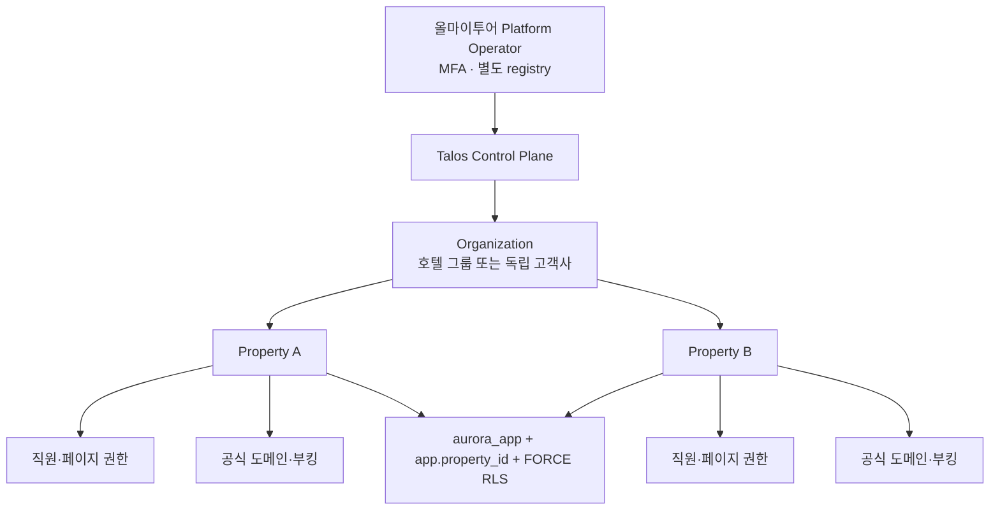
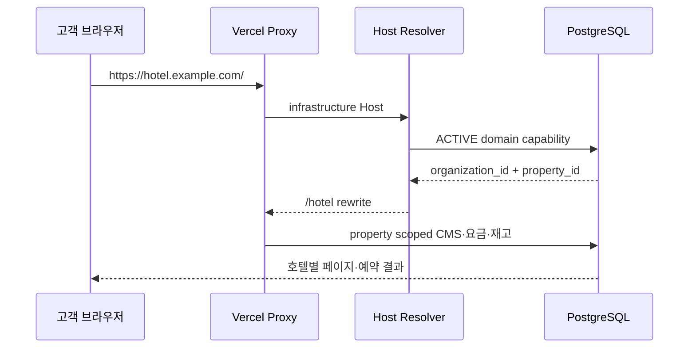

# Talos PMS 멀티호텔 SaaS 운영 설계

이 문서는 Talos PMS를 여러 독립 호텔과 호텔 그룹에 제공하기 위한 기술 계약입니다. Supabase 서울 리전 이전, 향후 올마이투어 자체 DB 전환, 요금제 가격·계약·개인정보 법무 정책은 별도 결정 사항이며 여기서는 특정 공급자에 종속되지 않는 실행 기반을 정의합니다.

## 1. 테넌트 계층과 격리 경계



- `organizations`는 계약·소유의 기술적 최상위 경계입니다.
- `properties`는 실제 PMS 데이터 격리 단위입니다. 한 조직은 여러 호텔을 가질 수 있습니다.
- `organization_memberships`는 조직 Owner/Admin/Analyst를 Auth UUID와 이메일의 이중 일치로 연결합니다.
- `role_assignments`는 호텔별 직무와 14개 workspace의 `NONE/READ/WRITE`, export 권한을 보관합니다.
- 66개 tenant policy와 `FORCE ROW LEVEL SECURITY`가 앱 실수나 누락 SQL의 교차 호텔 접근을 DB에서 거부합니다.
- 루트 연결은 자유 SQL을 허용하지 않습니다. 인증 조회, 도메인 해석, 프로비저닝, worker claim처럼 입력 구조가 고정된 capability만 제공합니다.

## 2. Control Plane과 프로비저닝

`/platform`은 로그인한 조직 관리자에게 다음 기능을 제공합니다.

- 접근 가능한 모든 호텔의 객실·사용자 사용량, 구독 상태, 작업 backlog, 장애, 도메인 상태 조회
- 호텔 전환: HttpOnly 선택 쿠키 저장 후 React Query cache를 비우고 hard navigation
- 같은 조직의 신규 호텔 원자적 생성
- custom domain DNS TXT 검증 시작
- 백업·호텔 export·복구 리허설 요청
- CSV 데이터 이관 dry-run, commit, rollback

신규 고객의 첫 조직과 호텔은 일반 UI가 아닌 검토 가능한 운영 명령으로 만듭니다. 대상 Owner는 Supabase Auth에 먼저 존재해야 하며 Auth UUID와 이메일이 일치해야 합니다. 실행자는 `platform_operators`의 활성 `SUPPORT_ADMIN` 또는 `SECURITY_ADMIN`이어야 합니다.

```powershell
# 실제 값은 shell secret 또는 일회성 운영 환경에서만 주입합니다.
$env:AURORA_TENANT_PROVISION_CONFIRM="AURORA_TENANT_PROVISION"
$env:AURORA_TENANT_PROVISIONED_BY="operator@example.com"
$env:AURORA_TENANT_ORGANIZATION_ID="org-customer-code"
$env:AURORA_TENANT_ORGANIZATION_NAME="Customer Hotel Group"
$env:AURORA_TENANT_ORGANIZATION_SLUG="customer-hotel-group"
$env:AURORA_TENANT_OWNER_USER_ID="00000000-0000-4000-8000-000000000000"
$env:AURORA_TENANT_OWNER_EMAIL="owner@example.com"
$env:AURORA_TENANT_OWNER_NAME="Customer Owner"
$env:AURORA_TENANT_HOTEL_NAME="Customer Seoul Hotel"
$env:AURORA_TENANT_HOTEL_CODE="CSH"
$env:AURORA_TENANT_HOTEL_SLUG="customer-seoul"
$env:AURORA_TENANT_BASE_DOMAIN="hotels.example.com"
npm run ops:tenant:provision
```

명령은 재실행 가능하며 조직·membership를 먼저 정합화한 뒤 호텔, Owner role, 구독, 10개 entitlement, 도메인, 회계 계정, 거래 코드, 홈페이지 CMS, Rate Plan을 생성합니다. 중간 실패로 조직만 남은 경우 같은 입력으로 다시 실행합니다. 모든 결과는 `audit_logs`에 남습니다.

## 3. 구독과 서버 기능 게이트

`property_subscriptions`는 plan, 상태, 객실 수·사용자 수 한도를 보관하고 `property_entitlements`는 기능을 분리합니다.

| entitlement | 강제 지점 |
| --- | --- |
| `CORE_PMS` | 모든 PMS workspace |
| `DIRECT_BOOKING` | 공개 availability·예약 서비스 |
| `WEBSITE_CMS` | 공개 게시 상태·PMS website workspace |
| `REPORT_EXPORT` | 서버 export capability |
| `ACCOUNTING` | finance·accounting·revenue workspace |
| `CHANNEL_HUB` | channel workspace |
| `GROUP_SALES` | group workspace |
| `STAFF_ACCESS` | 직원·권한 workspace |
| `DATA_IMPORT` | migration API |
| `SUPPORT_ACCESS` | JIT support principal 생성 |

`SUSPENDED`와 `CANCELLED`는 PMS 권한을 서버에서 닫습니다. `PAST_DUE` 처리는 추후 상품 정책에 따라 entitlement 변경으로 제어합니다. 객실과 사용자 한도는 UI precheck에 더해 subscription row lock을 사용하는 DB trigger가 병렬 초과 생성을 막습니다.

## 4. 호텔 전환과 cache 격리

서버는 `x-aurora-property-id` 또는 서명된 세션과 함께 사용하는 HttpOnly 선택 쿠키를 읽되, 사용자의 활성 assignment 목록에 존재할 때만 선택을 수락합니다. principal cache key에는 Auth UUID, 호텔 ID, MFA assurance level이 포함됩니다. 브라우저는 호텔 전환 후 전체 query cache를 제거하고 새 URL을 로드하므로 이전 호텔 응답이 다음 호텔 화면에 남지 않습니다.

## 5. 도메인 기반 홈페이지와 직접 예약

공개 API는 브라우저가 전송한 property ID를 받지 않습니다. Vercel의 신뢰된 forwarding host 또는 직접 Host를 정규화하고 `property_domains.status='ACTIVE'`인 행을 root capability로 해석합니다.



custom domain은 생성 시 `PENDING`이며 `_aurora.<hostname>` TXT가 발급 토큰과 일치한 뒤 worker가 `ACTIVE`로 전환합니다. 플랫폼 host는 `/hotel`, custom host는 `/`와 `/book`을 사용합니다. CMS는 60초 재검증 cache를 사용하고 예약 확정은 매번 최신 inventory와 Rate Plan을 다시 검사합니다.

## 6. JIT 지원 접근

지원 담당자는 호텔 직원 계정을 공유하지 않습니다.

1. 운영자 Auth 계정을 `ops:platform-operator`로 별도 등록합니다.
2. 호텔 관리자가 ticket, 사유, workspace, READ/WRITE, 개인정보 MASKED/FULL, 만료 시각을 승인합니다.
3. 지원 세션은 반드시 `aal2` MFA여야 하며 활성 grant와 `SUPPORT_ACCESS` entitlement를 요청마다 재검증합니다.
4. READ grant는 저장된 permission에 WRITE가 있어도 서버가 READ로 낮춥니다.
5. MASKED principal은 고객명·이메일·전화·메모·payload를 read model cache 저장 전에 마스킹하고 export를 허용하지 않습니다.
6. 요청·쓰기 횟수, 작업명, request ID, PII mode를 `support_sessions`와 `audit_logs`에 기록합니다.
7. revoke는 열려 있는 session을 종료하고 다음 요청부터 즉시 거부합니다.

## 7. 데이터 이관

지원 형식은 `ROOM_TYPES`, `ROOMS`, `GUESTS`, `RESERVATIONS` CSV이며 순서대로 이관합니다.

- 업로드 상한: 2MB, 2,000행
- dry-run: RFC4180 인용 필드 파싱, 헤더·형식·참조·중복·날짜·금액 검증
- 원본 CSV 미보관: SHA-256 content hash, 정규화 행, 오류 요약만 저장
- commit: 오류 0건인 VALIDATED job만 한 transaction으로 반영
- reconciliation: source key와 생성 entity ID를 `data_import_entities`에 연결
- rollback: 생성 후 예약 상태·version·folio가 바뀌지 않은 경우만 역순 삭제
- 보호: `USER_ADMIN`, `DATA_IMPORT`, same-origin, 분산 rate limit, MFA aal2

실제 전환은 객실 타입 → 객실 → 고객 → 예약 순서로 dry-run 결과를 고객과 대조하고, 쓰기 중지 창에서 최종 delta를 반영한 뒤 객실 수·예약 수·room nights·금액 합계를 구 시스템과 맞춥니다.

## 8. 비동기 worker, 재시도와 DLQ

성공한 PMS·공식 홈페이지 예약 요청은 응답 후 `AURORA_WORKER_URL`을 즉시 호출합니다. 독립적인 GitHub Actions scheduler가 5분마다 누락·재시도 job을 회수하고, Vercel의 일 1회 Cron은 scheduler 장애에 대비한 마지막 안전망입니다. 두 호출 모두 `CRON_SECRET` Bearer 인증을 사용하며 `FOR UPDATE SKIP LOCKED` claim으로 여러 instance가 같은 job을 처리하지 않습니다. Vercel Pro를 사용할 경우 `vercel.json`을 `* * * * *`로 바꾸면 1분 안전 sweep도 병행할 수 있습니다.

GitHub 저장소에는 production Vercel과 같은 값을 `AURORA_CRON_SECRET` secret으로, 정확한 HTTPS worker 주소를 `AURORA_WORKER_URL` variable로 등록합니다. URL은 `/api/internal/worker` 고정 경로만 허용하며 비밀값은 로그에 출력하지 않습니다.

| job | 처리 |
| --- | --- |
| `OUTBOX_WEBHOOK` | HMAC 서명, event ID, HTTPS 전송 |
| `ARI_DELIVERY` | provider별 endpoint·secret adapter, idempotency key |
| `DOMAIN_VERIFY` | DNS TXT 확인 후 domain 활성화 |
| `BACKUP_VERIFY` | 외부 backup orchestrator 요청과 checksum receipt 확인 |
| `USAGE_ROLLUP` | 호텔별 객실·사용자·예약·report 사용량 집계 |

실패는 지수 backoff 후 재시도하며 최대 횟수에 도달하면 `DEAD`와 CRITICAL `service_incidents`를 만듭니다. outbound endpoint는 HTTPS, 선택적 host allowlist, DNS private-address 차단, 10초 timeout, redirect 금지를 적용합니다. 운영에서는 DNS rebinding까지 차단하는 고정 egress proxy를 추가합니다.

## 9. 백업과 복구

Talos PMS는 특정 DB 공급자의 backup API를 코드에 고정하지 않습니다. `AURORA_BACKUP_ORCHESTRATOR_URL`이 Supabase PITR, logical export 또는 향후 올마이투어 DB backup을 수행하고 다음 receipt를 반환하는 계약입니다.

```json
{"storageReference":"immutable://...","checksum":"sha256:...","sizeBytes":123456}
```

receipt가 없으면 성공으로 기록하지 않습니다. `DATABASE_SNAPSHOT`, `PROPERTY_EXPORT`, `RESTORE_REHEARSAL`을 구분하고 완료·검증 시각과 checksum을 보관합니다. 복구 리허설은 격리 DB에 restore → migration history 확인 → tenant count·금액 합계·RLS smoke → 폐기 순서로 수행합니다.

## 10. 관제와 기술 SLO

- `/api/health`: schema contract, DB readiness, latency, 배포 환경을 secret 없이 반환
- Control Plane: pending/retry/dead job, backup, incident, 구독 사용량 표시
- worker: job별 attempt, HTTP status, duration, error code와 error message 저장
- Vercel: 함수 5xx, p50/p95, cold start, cron 실패 alert
- DB: connection saturation, lock wait, slow query, dead tuple, storage, replication/PITR alert
- 외부 uptime: 로그인 페이지, health, 대표 custom domain, availability synthetic probe

권장 초기 기술 목표는 월 가용성 99.9%, PMS warm API p95 500ms 이하, 공개 availability p95 800ms 이하입니다. 실제 SLA·RPO·RTO는 상품·계약 결정 후 문서화합니다.

## 11. 올마이투어 DB 전환 준비

애플리케이션 DB 경계는 `DATABASE_URL`/`DIRECT_URL`, PostgreSQL 17 표준 SQL, migration 파일, `PmsDatabase` adapter입니다. Supabase 전용 의존은 Auth Admin과 Storage CMS에 제한되어 있습니다.

전환 순서:

1. 대상 PostgreSQL에 `anon`, `authenticated`, `service_role` 호환 역할 또는 migration 보정 계층을 준비합니다.
2. 전체 migration을 빈 DB에 적용하고 runtime contract·RLS·trigger integration을 통과시킵니다.
3. Supabase Auth를 유지할지 별도 IdP로 교체할지 결정하고 JWT 검증 adapter만 교체합니다.
4. `website_media` object path와 Storage adapter를 새 object storage로 이관합니다.
5. logical snapshot + CDC/delta로 데이터를 복제하고 property별 count·checksum·금액을 대조합니다.
6. 읽기 shadow와 booking 동시성 테스트 후 짧은 쓰기 중지 창에서 최종 delta를 반영합니다.
7. 연결 문자열 전환, smoke, synthetic booking, rollback 조건을 확인합니다.

## 12. 배포 검증 순서

```bash
npm run lint
npx tsc --noEmit
npm run test:unit
npm run db:test:bootstrap
npm run db:supabase:migrate
npm run test:integration
npm run db:contract:verify
npm run db:supabase:smoke
npm run build
```

PostgreSQL integration은 20개 동시 마지막 1실 예약 중 정확히 1건 성공, 분산 rate limit, RLS 교차 호텔 차단, worker 중복 claim 차단, 병렬 객실 한도, JIT revoke, import commit/rollback을 실제 migration에서 검증합니다.
